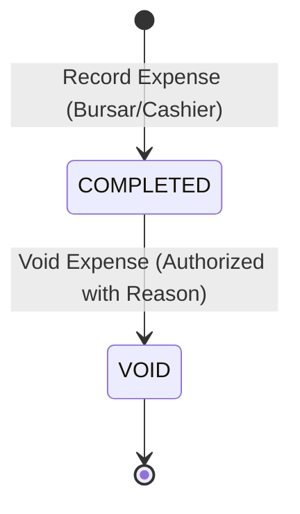

# NOVA — FINANCE PHASE 3.1D ARCHITECTURE SPECIFICATION
**Subsystem**: Operational Expenses, Cash Flow & Executive Financial Analytics  
**Status**: Ready for Implementation  
**Target Milestone**: Phase 3.1D  
**Author**: Antigravity Core Architecture Team  
**Date**: September 2026  

---

## 1. EXECUTIVE SUMMARY & SUBSYSTEM BOUNDARIES

NOVA Finance Phases 3.1A, 3.1B, and 3.1C established an authoritative, multi-tenant Accounts Receivable (AR) engine comprising Fee Configuration, Invoicing & Billing, Student Subsidiary Ledger, Payment Capture, FIFO Allocations, and Dedicated Receipts.

**Phase 3.1D** establishes the operational expenditure and executive reporting engine for NOVA:
1. **Operational Expenses Subsystem (Cash Outflows)**: A dedicated, branch-isolated operational cash-outflow tracking system capturing expenditures, categories, payment methods, payee metadata, and sequential voucher numbering.
2. **Executive Financial Analytics & Reporting Engine**: Authoritative, real-time aggregation across billing, collections, subledger balances, and operational expenses to produce:
   - **Executive Revenue & Collection KPIs** (Gross Billed, Bursary Discounts, Net Billed, Total Collected, Outstanding AR, Collection Rate %).
   - **Class & Term Collection Matrices** (Performance breakdown by class and academic term).
   - **12-Month Net Cash Flow** (Comparative cash inflows from completed fee payments vs cash outflows from operational expenses).
   - **Top Debtors & Defaulters Ledger Report** (Ranked student debt list derived strictly from AR subledger balances).
   - **Payment Channel Breakdown** (Distribution across Cash, MoMo, Bank, Airtel Money, SchoolPay).

### 1.1 Explicit Architectural Guardrails
- **No General Ledger Confusion**: `StudentLedgerEntry` remains **strictly an Accounts Receivable (AR) Student Subsidiary Ledger**. It does NOT track general school expenses, vendor liabilities, or payroll. Expenses are tracked in a dedicated `Expense` domain model.
- **Zero Second Balance Authority**: Financial analytics never store or mutate cached totals. All KPI metrics, collection rates, and debtor balances are calculated dynamically from authoritative source records (`Invoice`, `PaymentAllocation`, `Payment`, `StudentLedgerEntry`, and `Expense`).
- **Exact Monetary Precision**: All monetary values use PostgreSQL `DECIMAL(12,2)` / Prisma `Decimal`. Zero binary floating-point representation (`Float`).
- **Multi-Tenant Branch Isolation**: All queries, sequences, categories, expenses, and report aggregations are strictly filtered by `branchId`. Cross-branch data leakage is structurally impossible.

---

## 2. EXPENSE SUBSYSTEM ARCHITECTURE & LIFECYCLE

### 2.1 Expense Domain Concept
School expenses represent operational cash disbursements (e.g., generator fuel, utility bills, food/rations for boarding students, examination printing supplies, facility repairs, teacher transport allowances).

### 2.2 Expense Lifecycle State Machine
An Expense voucher follows a strictly controlled, non-destructive 2-state lifecycle:



1. **`COMPLETED` (Posted & Active)**:
   - Created atomically with a sequential voucher number (`VOUCH-2026-00001`).
   - Amount is active and included in all operational expenditure totals and cash-flow outflow calculations.
   - **Immutability Rule**: Once created, all financial and classification fields (`amount`, `categoryId`, `paymentMethod`, `vendorName`, `expenseDate`, `voucherNumber`, `branchId`) are **permanently immutable**.
2. **`VOID` (Cancelled & Inactive)**:
   - A posted expense is never deleted from the database.
   - Voiding requires an explicit permission (`fees:expenses:void`) and a mandatory `voidReason`.
   - The record captures `voidedAt`, `voidedById`, and `voidReason`.
   - Voided expenses are immediately excluded from all active expenditure totals, monthly summaries, and cash-flow outflow calculations.
   - The historical voucher number and audit record are permanently preserved for forensic accounting.

### 2.3 Voucher Number Generation & Concurrency
Expense voucher numbers (`VOUCH-YYYY-00001`) are generated transactionally using atomic PostgreSQL upsert on `ExpenseSequence`:

```sql
INSERT INTO "ExpenseSequence" ("id", "branchId", "year", "lastValue", "updatedAt")
VALUES ($id, $branchId, $year, 1, NOW())
ON CONFLICT ("branchId", "year")
DO UPDATE SET "lastValue" = "ExpenseSequence"."lastValue" + 1, "updatedAt" = NOW()
RETURNING "lastValue";
```
- **Concurrency Safety**: Atomic database increment eliminates race conditions under concurrent cashier submissions.
- **No Gapless Guarantee**: As with `InvoiceSequence` and `ReceiptSequence`, sequence numbers are monotonic and collision-safe, but transactional aborts or database rollbacks may create non-reusable sequence gaps. Gaplessness is explicitly not guaranteed.

### 2.4 Expense Idempotency
To prevent double-posting from network retries or cashier double-clicks:
- Every expense creation request accepts an optional `idempotencyKey` (or generates a deterministic client key).
- Unique database constraint: `@@unique([branchId, idempotencyKey])`.
- If a request with an existing `idempotencyKey` is received, `ExpenseDAO.createExpense` returns the existing expense record with `{ isReplay: true }` and HTTP 200 without creating duplicate vouchers or inflating expense totals.

---

## 3. FINANCIAL ANALYTICS & REPORTING ENGINE

### 3.1 Exact Accounting Metric Formulas & Reconciliation Rules

Every metric exposed in the Executive Financial Reports is defined with mathematical rigor below:

```
┌─────────────────────────────────────────────────────────────────────────────────────────────┐
│ 1. GROSS BILLED (Accrual Basis)                                                             │
│    Source: "Invoice" WHERE branchId = :branchId AND status != 'VOID'                        │
│    Formula: ∑(Invoice.grossAmount)                                                          │
│    Scope: Filtered by academicYearId and optional termId                                    │
├─────────────────────────────────────────────────────────────────────────────────────────────┤
│ 2. BURSARY CONCESSIONS / DISCOUNTS (Accrual Basis)                                          │
│    Source: "Invoice" WHERE branchId = :branchId AND status != 'VOID'                        │
│    Formula: ∑(Invoice.discountAmount)                                                       │
│    Scope: Filtered by academicYearId and optional termId                                    │
├─────────────────────────────────────────────────────────────────────────────────────────────┤
│ 3. NET BILLED (Accrual Basis - Total School Receivables Demanded)                           │
│    Source: "Invoice" WHERE branchId = :branchId AND status != 'VOID'                        │
│    Formula: ∑(Invoice.netAmount) ≡ Gross Billed - Bursary Discounts                         │
│    Scope: Filtered by academicYearId and optional termId                                    │
├─────────────────────────────────────────────────────────────────────────────────────────────┤
│ 4. TERM COLLECTED (Cash Allocation Basis - Money Applied to Term Invoices)                   │
│    Source: "PaymentAllocation" JOIN "Invoice"                                               │
│            WHERE PaymentAllocation.status = 'ACTIVE'                                        │
│              AND Invoice.branchId = :branchId AND Invoice.status != 'VOID'                  │
│              AND Invoice.academicYearId = :academicYearId [AND Invoice.termId = :termId]    │
│    Formula: ∑(PaymentAllocation.amount)                                                     │
├─────────────────────────────────────────────────────────────────────────────────────────────┤
│ 5. OUTSTANDING RECEIVABLES (Accrual Net Outstanding on Term Billing)                        │
│    Formula: Net Billed - Term Collected                                                    │
├─────────────────────────────────────────────────────────────────────────────────────────────┤
│ 6. COLLECTION RATE (%)                                                                      │
│    Formula: IF Net Billed > 0 THEN (Term Collected / Net Billed) * 100 ELSE 100.0%          │
├─────────────────────────────────────────────────────────────────────────────────────────────┤
│ 7. TOTAL FEE INFLOWS (Pure Cash-Basis Inflow)                                               │
│    Source: "Payment" WHERE branchId = :branchId AND status = 'COMPLETED'                    │
│            AND paymentDate BETWEEN :startDate AND :endDate                                  │
│    Formula: ∑(Payment.amount)                                                               │
│    Note: Captures all money actually received in the period, including unallocated advances.│
├─────────────────────────────────────────────────────────────────────────────────────────────┤
│ 8. TOTAL OPERATIONAL EXPENSES (Pure Cash-Basis Outflow)                                     │
│    Source: "Expense" WHERE branchId = :branchId AND status = 'COMPLETED'                    │
│            AND expenseDate BETWEEN :startDate AND :endDate                                  │
│    Formula: ∑(Expense.amount)                                                               │
│    Note: Excludes status = 'VOID'.                                                          │
├─────────────────────────────────────────────────────────────────────────────────────────────┤
│ 9. NET OPERATING CASH FLOW (Pure Cash-Basis Net Inflow/Outflow)                             │
│    Formula: Total Fee Inflows - Total Operational Expenses                                  │
│    Sign: Positive indicates Net Cash Surplus; Negative indicates Net Cash Deficit.         │
└─────────────────────────────────────────────────────────────────────────────────────────────┘
```

### 3.2 Accrual-Basis vs. Cash-Basis Separation
- **Academic Term Performance Reports** (Class Breakdown, Term Breakdown, Debtors) operate on an **Accrual / Allocation Basis**: Invoices represent legal term demands; collections represent active payments allocated against those specific invoices.
- **12-Month Rolling Cash Flow Chart** operates on a **Pure Cash-Basis**: Inflows represent actual cash received at the cashier desk/gateway in month $M$ (`Payment.paymentDate`), and Outflows represent actual cash paid out for operational expenses in month $M$ (`Expense.expenseDate`).

### 3.3 Class & Term Attribution (Historical Placement Integrity)
- Invoices are permanently linked to `enrollmentId` (which captured the student's specific `classId` and `streamId` at billing time).
- Class-level collection summaries query `Invoice.enrollment.classId`, ensuring that if a student is promoted from Senior 1 to Senior 2 next year, historical 2026 Senior 1 billing and collection metrics remain 100% stable and uncorrupted.

### 3.4 Top Debtors & Defaulters Auditing Rules
- **Authoritative Balance Source**: Debtors are identified strictly via the AR Student Subledger:
  $$\text{Student Balance} = \sum_{E \in \text{StudentLedgerEntry}} (\text{if DEBIT then } +E.\text{amount} \text{ else } -E.\text{amount})$$
- **Debtor Eligibility**: A student is included in the Debtors Report if and only if $\text{Student Balance} > 0.00$.
- **Credit Balance Exclusion**: Students with overpayment / advance credit balances ($\text{Student Balance} < 0.00$) are excluded from the Debtors Report (and displayed on an optional "Advance Credits" view).
- **Void/Reversal Integrity**:
  - `PAYMENT_REVERSAL` is a `DEBIT` entry on the subledger, which automatically restores the student's debtor balance.
  - `INVOICE_VOID_REVERSAL` is a `CREDIT` entry on the subledger, which automatically clears the billed debt.
- **Filtering Options**: Filterable by `classId`, minimum balance threshold (e.g., $> \text{UGX } 100,000$), and search query (name / admission number).

### 3.5 Payment Channel Distribution Analytics
- Aggregates completed fee payments grouped by `PaymentMethod` (`CASH`, `BANK_TRANSFER`, `MTN_MOMO`, `AIRTEL_MONEY`, `CHEQUE`, `CARD`, `SCHOOLPAY`).
- Returns:
  1. Transaction Count per channel.
  2. Total Amount collected per channel.
  3. Percentage share of total collections.
- Reversed payments (`status = REVERSED`) are excluded from total collection figures.

---

## 4. SCHEMA & DATA MODEL SPECIFICATION

```prisma
// ==========================================
// FINANCE: EXPENSES & CASH OUTFLOWS (PHASE 3.1D)
// ==========================================

enum ExpenseStatus {
  COMPLETED
  VOID
}

model ExpenseCategory {
  id          String    @id @default(cuid())
  branchId    String
  name        String    // e.g., "Utilities", "Repairs & Maintenance", "Staff Meals", "Academic Supplies"
  code        String    // e.g., "UTIL", "REPAIR", "MEALS", "SUPPLIES"
  description String?
  isActive    Boolean   @default(true)
  createdAt   DateTime  @default(now())
  updatedAt   DateTime  @updatedAt

  branch      Branch    @relation(fields: [branchId], references: [id], onDelete: Cascade)
  expenses    Expense[]

  @@unique([branchId, name])
  @@unique([branchId, code])
  @@index([branchId, isActive])
}

model Expense {
  id                String         @id @default(cuid())
  branchId          String
  categoryId        String
  idempotencyKey    String
  voucherNumber     String         // e.g., "VOUCH-2026-00001"
  title             String         // e.g., "Umeme Electricity Bill - Aug 2026"
  amount            Decimal        @db.Decimal(12, 2)
  expenseDate       DateTime       @default(now())
  paymentMethod     PaymentMethod  // CASH, BANK_TRANSFER, MTN_MOMO, AIRTEL_MONEY, CHEQUE, CARD, etc.
  vendorName        String?        // e.g., "Umeme Uganda Ltd"
  receiptRef        String?        // Vendor invoice/receipt/EFRIS reference
  notes             String?
  status            ExpenseStatus  @default(COMPLETED)
  voidedAt          DateTime?
  voidReason        String?
  voidedById        String?
  recordedById      String         // User.id of cashier/bursar
  createdAt         DateTime       @default(now())
  updatedAt         DateTime       @updatedAt

  branch            Branch          @relation(fields: [branchId], references: [id], onDelete: Cascade)
  category          ExpenseCategory @relation(fields: [categoryId], references: [id], onDelete: Restrict)

  @@unique([branchId, idempotencyKey])
  @@unique([branchId, voucherNumber])
  @@index([branchId, expenseDate])
  @@index([branchId, categoryId])
  @@index([branchId, status])
}

model ExpenseSequence {
  id        String   @id @default(cuid())
  branchId  String
  year      Int
  lastValue Int      @default(0)
  updatedAt DateTime @updatedAt

  branch    Branch   @relation(fields: [branchId], references: [id], onDelete: Cascade)

  @@unique([branchId, year])
}
```

### 4.1 Modifications to Existing Schema Models
- **`Branch` model**:
  Add back-relations:
  ```prisma
  expenseCategories ExpenseCategory[]
  expenses          Expense[]
  expenseSequences  ExpenseSequence[]
  ```
- **Zero changes** to `Invoice`, `InvoiceItem`, `Payment`, `PaymentAllocation`, `StudentLedgerEntry`, or `Receipt`.

---

## 5. RBAC & PERMISSIONS MATRIX

| Permission String | Description | Default Role Assignments |
| :--- | :--- | :--- |
| `fees:expenses:read` | View expenses catalog, monthly/yearly totals, and category breakdown. | `Admin`, `Bursar`, `Accountant`, `Auditor`, `Director` |
| `fees:expenses:write` | Record new operational expenses and create/edit expense categories. | `Admin`, `Bursar`, `Accountant` |
| `fees:expenses:void` | Void an existing posted expense voucher with mandatory reason. | `Admin`, `Bursar` |
| `fees:reports:read` | View executive financial reports, collection matrices, and cash flow charts. | `Admin`, `Bursar`, `Headteacher`, `Director`, `Auditor` |
| `fees:debtors:export` | Export top debtors and defaulters lists to CSV / Print format. | `Admin`, `Bursar`, `Headteacher` |

---

## 6. AUDIT & FORENSIC LOGGING

All state-changing operations in Phase 3.1D emit structured JSON audit entries via `AuditService.log`:
1. `CREATE_EXPENSE_CATEGORY`: `{ categoryId, name, code, isActive }`
2. `UPDATE_EXPENSE_CATEGORY`: `{ categoryId, name, code, isActive }`
3. `CREATE_EXPENSE`: `{ expenseId, voucherNumber, amount, categoryId, paymentMethod, vendorName, expenseDate }`
4. `VOID_EXPENSE`: `{ expenseId, voucherNumber, amount, voidReason }`
5. `EXPORT_DEBTORS_REPORT`: `{ classId, minDebt, totalDebtors, totalDebtAmount }`
6. `EXPORT_EXPENSES_REPORT`: `{ categoryId, startDate, endDate, totalAmount, recordCount }`

---

## 7. API & USER INTERFACE SPECIFICATION

### 7.1 REST API Routes
- **`GET /api/expenses`**: List expenses with pagination, search, date range, category, payment method, and status filters.
- **`POST /api/expenses`**: Record new expense with idempotency replay handling.
- **`GET /api/expenses/[id]`**: Inspect single expense voucher details.
- **`POST /api/expenses/[id]/void`**: Void expense voucher with mandatory reason.
- **`GET /api/expense-categories`**: List active expense categories with expense count.
- **`POST /api/expense-categories`**: Create new expense category.
- **`PUT /api/expense-categories/[id]`**: Edit expense category name/description/active status.
- **`GET /api/finance-reports/summary`**: Aggregate executive KPIs (Gross/Net Billed, Collected, Outstanding, Collection Rate %, Total Expenses, Net Cash Flow).
- **`GET /api/finance-reports/collection-by-class`**: Class-by-class collection performance matrix for selected academic term.
- **`GET /api/finance-reports/collection-by-term`**: Term-by-term collection matrix for selected academic year.
- **`GET /api/finance-reports/cash-flow`**: 12-month rolling cash flow comparison (Fees Inflows vs Expense Outflows).
- **`GET /api/finance-reports/payment-channels`**: Payment method distribution (counts, amounts, percentages).
- **`GET /api/finance-reports/debtors`**: Ranked list of indebted students with subledger balances and class filtering.
- **`GET /api/finance-reports/debtors/export`**: CSV export stream of debtor defaulters.

### 7.2 UI Pages & Components
1. **`/finance/expenses` (Expenses Management)**:
   - Monthly & Yearly Outflow Metric Cards.
   - Filter Toolbar: Category Select, Payment Method Select, Date Range Pickers, Search input, Add Expense Button.
   - Expense Table: Voucher #, Title, Category Badge, Date, Payment Method Badge, Amount (formatted in red), Status Pill, Void Action.
   - Component: `ExpenseList.tsx`, `ExpenseCaptureModal.tsx`.
2. **`/finance/reports` (Executive Financial Analytics Hub)**:
   - Header with Academic Year & Term dropdown switchers.
   - Top KPI Ribbon: Net Billed, Collected, Outstanding AR, Collection Rate %, Expenses, Net Cash Flow.
   - Tab / Section 1: **Collection by Class & Term** (Interactive tables showing student counts, billed, collected, balance, and collection progress bars).
   - Tab / Section 2: **12-Month Cash Flow & Channel Breakdown** (Visual bar chart comparing monthly inflows vs outflows; payment channel pie/progress breakdown).
   - Tab / Section 3: **Top Debtors & Defaulters** (Debtor table with search, class filter, quick link to student ledger, and "Export CSV" trigger).
   - Components: `FinancialReportsDashboard.tsx`, `CashFlowChart.tsx`, `ClassCollectionTable.tsx`, `DebtorsReportTable.tsx`.
3. **Navigation Updates**:
   - Add "Expenses" and "Financial Reports" links to `/finance` hub cards and the main dashboard sidebar under the "Finance" section.

---

## 8. TEST & INVARIANT VERIFICATION MATRIX

The Phase 3.1D test suite (`expense.dao.test.ts` and `finance-report.dao.test.ts`) must explicitly verify:

| Test ID | Test Scenario / Invariant | Expected Behavior |
| :--- | :--- | :--- |
| **EXP-01** | Create Expense with Category & Voucher Number | Creates `COMPLETED` expense, generates sequential `VOUCH-YYYY-00001`, persists exact Decimal(12,2). |
| **EXP-02** | Duplicate Expense Submission Idempotency | Replaying exact `idempotencyKey` returns existing record with `isReplay: true` and creates 0 duplicate vouchers. |
| **EXP-03** | Void Expense Voucher | Updates status to `VOID`, records `voidReason`, preserves immutable historical record, excludes from active expense totals. |
| **EXP-04** | Expense Monthly & Yearly Aggregations | Sums `COMPLETED` expenses accurately across current month and year boundaries, excluding `VOID` expenses. |
| **EXP-05** | Branch Isolation on Expenses & Categories | Branch A cannot view, edit, or aggregate expenses belonging to Branch B. |
| **REP-01** | Executive Revenue KPIs Reconciliation | `Net Billed == Gross Billed - Bursary Discounts`; `Outstanding == Net Billed - Term Collected`. |
| **REP-02** | Collection Rate % Calculation | Validates exact percentage calculation, handles zero-billing division edge cases cleanly. |
| **REP-03** | Class-Level Collection Attribution | Accurately aggregates billing and payment allocations by `Invoice.enrollment.classId`. |
| **REP-04** | Term-Level Collection Attribution | Accurately aggregates billing and payment allocations by `Invoice.termId`. |
| **REP-05** | 12-Month Net Cash Flow Integration | Reconciles `Fee Inflows (Payments)` minus `Expense Outflows (Expenses)` across all 12 monthly buckets. |
| **REP-06** | Debtor Report AR Subledger Reconciliation | Every debtor's balance matches `LedgerDAO.getBalance()` exactly; excludes students with $\le 0.00$ balance. |
| **REP-07** | Payment Channel Distribution | Correctly groups completed payments by method and excludes reversed payments. |
| **REP-08** | Debtors CSV Export & Authorization | Generates valid CSV format, enforces branch scoping, rejects unauthorized roles. |

---

## 9. EXPLICIT OUT-OF-SCOPE BOUNDARIES

To preserve development momentum and modularity, the following enterprise accounting domains remain strictly **out of scope for Phase 3.1D**:
1. **Automated HR Payroll Disbursement**: (Payroll structures exist in HR Core, but automated bank disbursement sync is Phase 3.3).
2. **General Ledger (GL) / Chart of Accounts (COA)**: (No complex double-entry account trees or Balance Sheet synthesis; AR Subledger + Expense Ledger are sufficient).
3. **Automated Bank Statement Feeds & Reconciliation**: (No automated MT940 / Open Banking scraping).
4. **Budgeting & Variance Projections**: (No forward-looking departmental budget allocations).
5. **Multi-Stage Procurement / Purchase Orders**: (Direct operational expense recording only).
6. **Statutory Tax Accounting**: (No automated VAT / Withholding Tax filing).

---

## 10. CONCLUSION & GATE STATUS

All architectural considerations, database models, accounting formulas, lifecycle states, idempotency rules, and test matrices have been resolved with mathematical precision.

```text
STATUS: READY FOR IMPLEMENTATION
```
