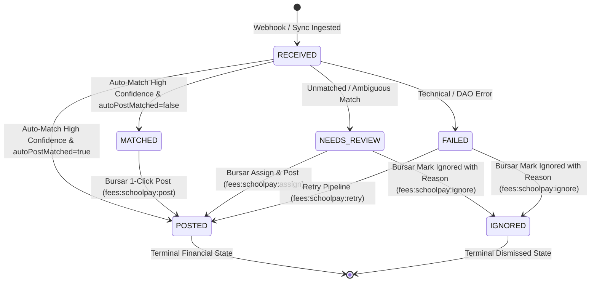

# NOVA — FINANCE PHASE 3.1E ARCHITECTURE SPECIFICATION
**Target Subsystem**: SchoolPay Uganda Gateway Integration & Real-Time Payment Reconciliation Engine  
**Author**: Antigravity Core Architecture Team  
**Date**: September 2026  
**Status**: Ready for Implementation (Design Approved)  

---

## EXECUTIVE SUMMARY & DOMAIN CONTEXT

In Uganda, school fee collection is dominated by the **SchoolPay** aggregator (`support@schoolpay.co.ug`). Over 85% of fee payments across private and public primary/secondary institutions are deposited through commercial bank partner branches (Stanbic, Centenary, Absa, DFCU, PostBank, Equity) and mobile money networks (MTN MoMo `*165*4*3#`, Airtel Money `*185*4*3#`) using unique 10-digit student payment codes.

This document establishes the architecture for **NOVA Finance Phase 3.1E**:
1. Ingest real-time payment webhooks from SchoolPay safely and idempotently.
2. Stage transactions durably in an immutable audit table before accounting execution.
3. Deterministically match transactions to enrolled students by authoritative payment code or admission number.
4. Seamlessly invoke the authoritative **Phase 3.1C** `PaymentDAO.recordPayment` pipeline to update the AR Student Subsidiary Ledger (`StudentLedgerEntry`), allocate payments via FIFO to active invoices, and issue sequential receipts (`REC-YYYY-00001`).
5. Provide a Bursar Reconciliation Workstation for managing ambiguous/unmatched payments, fuzzy candidate reviews, and batch polling syncs.

---

## 1. SECURITY & SECRET MANAGEMENT (GATE 1)

### 1.1 Secret Storage & Encryption
- **Prohibition of Plaintext Storage**: Gateway credentials (`apiPassword`, `channelKey`, `webhookSecret`) must **never** be stored in plaintext in the database or logs.
- **Symmetric Encryption**: Secrets are encrypted at rest using **AES-256-GCM** authenticated encryption with a dedicated master key (`FINANCE_ENCRYPTION_KEY` or `APP_SECRET`).
- **Storage Format**: `enc:<iv_hex>:<auth_tag_hex>:<ciphertext_hex>`.
- **Zero Client Exposure**: Secrets are decrypted on-demand only in protected backend service contexts (DAO/Service layer). REST API endpoints never serialize decrypted secrets to the browser.
  - The configuration API returns masked descriptors: `{ hasApiPassword: true, hasWebhookSecret: true, maskedSchoolCode: "100234..." }`.

### 1.2 Webhook Signature Verification & Replay Protection
- **Cryptographic Signature Verification**:
  - SchoolPay webhooks pass authentication headers:
    - `X-SchoolPay-Signature`: Hex-encoded HMAC-SHA256 signature.
    - `X-SchoolPay-Timestamp`: Epoch millisecond or ISO timestamp.
  - Verification formula:
    $$\text{HMAC-SHA256}(\text{timestamp} + "." + \text{rawBody}, \text{webhookSecret})$$
- **Clock Drift & Replay Window**:
  - The webhook handler strictly rejects requests where:
    $$|\text{now} - \text{timestamp}| > 300\text{ seconds (5 minutes)}$$
- **Defense in Depth**:
  - Configurable IP whitelisting (`allowedIps`) provides an additional network perimeter check, but **cryptographic HMAC verification is mandatory**. Requests failing HMAC are immediately dropped with HTTP 401.

---

## 2. TENANCY & BRANCH RESOLUTION (GATE 2)

- **Strict Multi-Tenancy**: All SchoolPay configurations and staged transactions are strictly scoped by `branchId`.
- **Deterministic School Code Resolution**:
  - The public webhook receiver endpoint is:
    `POST /api/schoolpay/webhook/[schoolCode]`
  - Upon invocation, the system queries `SchoolPayConfig` where `schoolCode = params.schoolCode` and `enabled = true`.
  - If the `schoolCode` is unknown, disabled, or not found, the request is rejected with HTTP 404/401 (`UNAUTHORIZED_GATEWAY_TENANT`). Zero money or transaction staging occurs.
- **Cross-Branch Prevention**:
  - Student lookups, matching, payment recording, and ledger postings are locked to the resolved `branchId`. A payment arriving for School Code A can never match or allocate to a student in School Code B.

---

## 3. STAGING FIRST ARCHITECTURE (GATE 3)

To prevent dropped webhook deliveries or partial financial mutations during network dropouts, webhook ingestion follows a **Staging First** pattern:

```text
┌────────────────────────────────────────────────────────┐
│ 1. Gateway Event (POST /api/schoolpay/webhook/:code)   │
└───────────────────────────┬────────────────────────────┘
                            │
┌───────────────────────────▼────────────────────────────┐
│ 2. Authenticate: HMAC Signature + Timestamp Drift Check│
└───────────────────────────┬────────────────────────────┘
                            │
┌───────────────────────────▼────────────────────────────┐
│ 3. Resolve Tenant & Validate SchoolCode                │
└───────────────────────────┬────────────────────────────┘
                            │
┌───────────────────────────▼────────────────────────────┐
│ 4. Persist Staged Record: SchoolPayTransaction         │
│    Status: RECEIVED, rawPayload: JSON, amount: Decimal │
└───────────────────────────┬────────────────────────────┘
                            │
┌───────────────────────────▼────────────────────────────┐
│ 5. Immediate Acknowledge: HTTP 200 OK                  │
└───────────────────────────┬────────────────────────────┘
                            │
┌───────────────────────────▼────────────────────────────┐
│ 6. Asynchronous / Decoupled Matching & Posting Pipeline│
│    (Match Student -> PaymentDAO -> Ledger -> Status)   │
└────────────────────────────────────────────────────────┘
```

**Invariant**: Accounting operations (`PaymentDAO.recordPayment`, `StudentLedgerEntry`, invoice allocations) never run inline before durable staging.

---

## 4. DETERMINISTIC IDEMPOTENCY & IDENTITY (GATE 4)

- **Authoritative Identity**:
  - Primary Gateway Identity: `[branchId, schoolPayReceiptNo]` (SchoolPay unique receipt/ticket number, e.g. `SP2609028912`).
  - Secondary Gateway Identity: `[branchId, transactionId]` (Bank/Telco network reference, e.g. `MP260902.1245.H10234`).
- **Database-Level Unique Constraints**:
  - `@@unique([branchId, schoolPayReceiptNo])`
  - `@@unique([branchId, transactionId])`
- **Replay & Duplicate Handling**:
  - If a duplicate webhook arrives with an existing receipt number:
    1. The receiver detects the unique constraint conflict.
    2. Reads the existing `SchoolPayTransaction`.
    3. Returns HTTP 200 `{ status: "ALREADY_PROCESSED", isReplay: true, transactionId: existing.id }`.
    4. Produces:
       - **0** duplicate staged transactions
       - **0** duplicate `Payment` records
       - **0** duplicate `StudentLedgerEntry` rows
       - **0** duplicate `PaymentAllocation` records
       - **0** duplicate `Receipt` documents.

---

## 5. MATCHING SAFETY & CONFIDENCE TIERS (GATE 5 & GATE 10)

Automatic financial posting requires unambiguous, high-confidence identification. NOVA establishes a strict 4-tier matching hierarchy:

```text
Incoming SchoolPay Code
       │
       ▼
[Tier 1: Exact Match on Student.schoolPayCode in Branch?]
       ├────────► YES (Single Active Student) ──► HIGH_CONFIDENCE_STUDENT_CODE ──► Auto-Post Eligible
       ▼ NO
[Tier 2: Exact Match on Student.admissionNo in Branch?]
       ├────────► YES (Single Active Student) ──► HIGH_CONFIDENCE_ADMISSION_NO ──► Auto-Post Eligible
       ▼ NO
[Tier 3: Multiple Matches / Inactive Student?]
       ├────────► YES ──► AMBIGUOUS ──► Status: NEEDS_REVIEW (No Auto-Post)
       ▼ NO
[Tier 4: Unknown Code / No Record Found]
       └────────► NO_MATCH ──► Status: NEEDS_REVIEW (No Auto-Post)
```

### Safety Rules:
1. **Never Silently Guess**: Auto-post (`autoPostMatched == true`) is **only** permitted for Tier 1 or Tier 2.
2. **Fuzzy Name Matching is Candidate-Only**:
   - Payer name string similarity (e.g. Trigram / Levenshtein distance) between `payerName` and `Student.firstName + ' ' + Student.lastName` is computed **exclusively** for rendering visual suggestion badges in the Bursar Reconciliation UI (e.g. *"Name looks like Kato John Bosco — S.2"*).
   - Fuzzy scores are **never** used for automated accounting decisions.

---

## 6. PAYMENT CREATION & ACCOUNTING PIPELINE (GATE 6)

NOVA does not introduce a secondary financial ledger for gateway payments. All posted SchoolPay transactions execute the established **Phase 3.1C** `PaymentDAO.recordPayment` pipeline inside an isolated database transaction:

```typescript
// Payment posting execution from SchoolPayTransaction:
const payment = await PaymentDAO.recordPayment(ctx, {
  studentId: matchedStudent.id,
  amount: new Prisma.Decimal(tx.amount),
  paymentDate: tx.paymentDate,
  paymentMethod: PaymentMethod.SCHOOLPAY,
  externalReference: tx.transactionId,
  payerName: tx.payerName,
  payerPhone: tx.payerPhone,
  receiptNotes: `SchoolPay Receipt: ${tx.schoolPayReceiptNo} | Channel: ${tx.channel}`,
  idempotencyKey: `SPAY_${tx.branchId}_${tx.schoolPayReceiptNo}`
});
```

### Cascading Atomic Effects:
1. **`Payment`**: Created with sequential `paymentNumber`.
2. **`PaymentAllocation`**: Created via FIFO allocation settling oldest unpaid `Invoice` line items (and holding surplus as unallocated student credit).
3. **`Receipt`**: Issued with immutable sequential voucher (`REC-YYYY-00001`).
4. **`StudentLedgerEntry`**: Credited to the student's subledger (`referenceType: PAYMENT`, `direction: CREDIT`).
5. **`SchoolPayTransaction`**: Updated to `status: POSTED`, `paymentId: payment.id`, `studentId: matchedStudent.id`, `resolvedAt: new Date()`.

---

## 7. GATEWAY TRANSACTION LIFECYCLE & STATE MACHINE (GATE 7)



### Permitted Transitions & Triggers:
| Current State | Next State | Permitted Trigger | Required Permission |
| :--- | :--- | :--- | :--- |
| `RECEIVED` | `POSTED` | System Auto-Post (`HIGH_CONFIDENCE` + `autoPostMatched`) | System Automated |
| `RECEIVED` | `MATCHED` | System Match (`HIGH_CONFIDENCE` + `autoPostMatched=false`) | System Automated |
| `RECEIVED` | `NEEDS_REVIEW` | System Match (`AMBIGUOUS` or `NO_MATCH`) | System Automated |
| `RECEIVED` | `FAILED` | System Exception during processing | System Automated |
| `MATCHED` | `POSTED` | Bursar 1-Click "Post to Ledger" button | `fees:schoolpay:post` |
| `NEEDS_REVIEW` | `POSTED` | Bursar manual student assignment modal | `fees:schoolpay:assign` |
| `NEEDS_REVIEW` | `IGNORED` | Bursar manual ignore action with reason | `fees:schoolpay:ignore` |
| `FAILED` | `POSTED` | Manual retry button or scheduled retry worker | `fees:schoolpay:retry` |
| `POSTED` | `REVERSED` | Formal Phase 3.1C Payment Reversal workflow | `fees:payments:reverse` |

---

## 8. RETRIES & FAILURE RECOVERY (GATE 8)

1. **Webhook Ingestion Failure**:
   - If database staging fails (e.g. database connection blip), the webhook returns HTTP 500. SchoolPay will retry the delivery according to its exponential backoff policy.
2. **Matching / Processing Failure**:
   - If `PaymentDAO.recordPayment` fails (e.g. temporary table lock), the transaction transitions to `FAILED` with `errorMessage`.
   - The transaction can be retried at any time via the UI or background worker (`fees:schoolpay:retry`).
3. **Eventual Convergence**:
   - Because `PaymentDAO` enforces `idempotencyKey = "SPAY_" + branchId + "_" + schoolPayReceiptNo`, multiple retries converge safely to exactly one financial payment record.

---

## 9. BATCH SYNC & POLLING FALLBACK (GATE 9)

- **Purpose**: Reconcile missed webhooks, network outages, or historical batch imports.
- **Parameters**: `from: Date`, `to: Date`, `schoolCode`.
- **Pagination & Chunking**: Fetches in batches of 100 transactions from SchoolPay REST API `GET /api/v1/transactions`.
- **Overlap Window**: Automated sync jobs execute with a **1-hour lookback window** to prevent boundary dropouts.
- **Cursor Checkpoint**: `SchoolPayConfig.lastSyncedAt` records successful batch sync timestamp.
- **Deduplication Engine**: Batch items are deduplicated against existing `SchoolPayTransaction` records by `[branchId, schoolPayReceiptNo]`. Existing records in `POSTED` or `IGNORED` state are skipped; existing records in `NEEDS_REVIEW` or `FAILED` are updated if new metadata is supplied.
- **Audit Logging**: `SchoolPaySyncLog` captures total fetched, new received, auto-posted, queued for review, and skipped counts.

---

## 10. RECONCILIATION WORKSTATION UI & CONTROLS (GATE 11)

- **Dashboard Route**: [`/finance/schoolpay`](file:///c:/Users/USER/Desktop/school_management_system/nova/src/app/(dashboard)/finance/schoolpay/page.tsx).
- **Metric Cards**:
  - `Posted to Ledger` (Green): Transaction count & total UGX posted.
  - `Needs Review` (Amber): Unmatched transactions requiring bursar attention.
  - `Matched Unposted` (Blue): High-confidence matches waiting for 1-click posting.
  - `Ignored` (Slate): Dismissed test/erroneous items.
- **Interactive Datatable**:
  - Search by Payer, Phone, Receipt No, Student Code, Admission No.
  - Filter by Status (`All`, `Needs Review`, `Posted`, `Matched`, `Ignored`, `Failed`) and Channel.
- **Student Assignment Modal**:
  - Raw payment summary (Amount, Date, Channel, Payer Name, Payer Phone).
  - Fuzzy candidate suggestion badge (*"Name looks like Kato John Bosco — S.2"* with 1-click pick).
  - Searchable student selector (instant search across Name, Admission No, Class).
  - Checkbox: `Link this student to SchoolPay Code for future automatic matching` (`linkSchoolPayCode: boolean`).
  - Action button: `Confirm & Post to Ledger`.
- **Ignore Dialog**:
  - Requires mandatory `ignoreReason` (minimum 5 characters).
  - Emits `AuditService.log("FINANCE_SCHOOLPAY_IGNORED", ...)`.
- **Immutability Invariant**: Once `POSTED`, a transaction's assigned student cannot be edited without executing a formal payment reversal.

---

## 11. MONEY & CURRENCY VALIDATION (GATE 12)

- **Type Precision**: `amount @db.Decimal(12,2)`.
- **Currency Enforcement**: Strict `UGX` (Uganda Shillings).
- **Validation Rules**:
  - `amount > 0.00` (strictly positive).
  - If a foreign currency is passed in the payload (e.g. `USD`), status becomes `NEEDS_REVIEW` with `reviewNotes: "Foreign currency rejected. Expected UGX."`.

---

## 12. PAYMENT REVERSAL & DISHONORED PAYMENTS (GATE 13)

When a bank/telco revokes a payment or a fraudulent deposit is identified:
1. The Bursar navigates to the linked `Payment` or uses the "Reverse Payment" action in the reconciliation workstation.
2. Invokes Phase 3.1C `PaymentDAO.reversePayment(ctx, paymentId, reason)`:
   - Sets `Payment.status = REVERSED`.
   - Reverses invoice allocations (`AllocationStatus.REVERSED`) and restores invoice balances.
   - Posts a balancing `DEBIT` reversal entry to `StudentLedgerEntry`.
   - Voids the receipt (`ReceiptStatus.VOID`).
3. `SchoolPayTransaction` is updated with `reviewNotes: "Reversed via Payment Reversal: " + reason`.
4. **Destruction Prohibition**: Zero records are deleted. Complete financial and gateway history is preserved.

---

## 13. RBAC & PERMISSION MATRIX (GATE 14)

| Permission | Description | Allowed Roles |
| :--- | :--- | :--- |
| `fees:schoolpay:read` | View SchoolPay dashboard, reconciliation table, transaction payloads. | Admin, Bursar, Accountant, Auditor |
| `fees:schoolpay:write` | Configure school code, API credentials, auto-post settings, IP whitelist. | Admin, Chief Accountant |
| `fees:schoolpay:post` | 1-Click post for `MATCHED` transactions. | Admin, Bursar, Accountant |
| `fees:schoolpay:assign`| Manually match and post `NEEDS_REVIEW` transactions from the modal. | Admin, Bursar, Accountant |
| `fees:schoolpay:ignore`| Mark transactions as `IGNORED` with mandatory reason. | Admin, Bursar, Accountant |
| `fees:schoolpay:retry` | Retry processing for `FAILED` transactions. | Admin, Bursar, Accountant |
| `fees:schoolpay:sync`  | Trigger manual date-range batch sync from SchoolPay REST API. | Admin, Bursar, Accountant |
| `fees:schoolpay:export`| Export reconciliation datatable to CSV. | Admin, Bursar, Accountant, Auditor |

---

## 14. AUDIT SERVICE INTEGRATION (GATE 15)

Structured audit records emitted via `AuditService.log`:
- `FINANCE_SCHOOLPAY_CONFIG_UPDATED`: Settings changed (logs `branchId`, `schoolCode`, `autoPostMatched`; **NEVER** secrets or passwords).
- `FINANCE_SCHOOLPAY_WEBHOOK_RECEIVED`: Inbound webhook staged (logs `receiptNo`, `amount`, `channel`, `status`).
- `FINANCE_SCHOOLPAY_AUTO_POSTED`: Inbound transaction auto-posted (logs `receiptNo`, `studentId`, `paymentId`, `amount`).
- `FINANCE_SCHOOLPAY_MANUALLY_ASSIGNED`: Manual assignment (logs `transactionId`, `studentId`, `paymentId`, `linkSchoolPayCode`, `resolvedById`).
- `FINANCE_SCHOOLPAY_IGNORED`: Transaction ignored (logs `transactionId`, `reason`, `resolvedById`).
- `FINANCE_SCHOOLPAY_SYNC_RUN`: Batch sync completed (logs `dateFrom`, `dateTo`, `totalFetched`, `postedCount`, `reviewCount`).
- `FINANCE_SCHOOLPAY_REVERSED`: Payment reversed (logs `transactionId`, `paymentId`, `reason`).

---

## 15. SCHOOLPAY API BOUNDARY & ADAPTER INTERFACE (GATE 16)

```typescript
export interface SchoolPayInboundDTO {
  schoolPayReceiptNo: string; // e.g. "SP2609028912"
  transactionId: string;      // e.g. "MP260902.1245.H10234"
  schoolPayCode: string;      // e.g. "1002345678"
  amount: number | string;    // e.g. 850000
  feeAmount?: number | string;
  payerName?: string;
  payerPhone?: string;
  channel: SchoolPaySourceChannel;
  paymentDate: Date;
  rawPayload: Record<string, unknown>;
}

export interface ISchoolPayGatewayAdapter {
  verifyWebhookSignature(headers: Record<string, string>, rawBody: string, secret: string): boolean;
  parseWebhookPayload(rawBody: string): SchoolPayInboundDTO;
  fetchTransactions(config: { schoolCode: string; apiPassword: string }, from: Date, to: Date, page?: number): Promise<{ transactions: SchoolPayInboundDTO[]; hasMore: boolean }>;
  testConnection(config: { schoolCode: string; apiPassword: string }): Promise<{ success: boolean; message: string }>;
}
```

---

## 16. DATA MODELS & SCHEMA DESIGN (GATE 17)

```prisma
// ============================================================================
// FINANCE PHASE 3.1E — SCHOOLPAY GATEWAY & RECONCILIATION
// ============================================================================

enum SchoolPayTxStatus {
  RECEIVED        // Staged from webhook/sync, awaiting processing
  MATCHED         // High-confidence match identified, waiting for 1-click post
  POSTED          // Successfully posted via PaymentDAO to student subledger
  NEEDS_REVIEW    // Unmatched, ambiguous match, or validation issue; in review queue
  IGNORED         // Non-financial, test, or dismissed transaction
  FAILED          // Processing error during PaymentDAO execution; retryable
}

enum SchoolPaySourceChannel {
  STANBIC_BANK
  CENTENARY_BANK
  ABSA_BANK
  DFCU_BANK
  POST_BANK
  EQUITY_BANK
  MTN_MOMO
  AIRTEL_MONEY
  OTHER_BANK
  UNKNOWN
}

model SchoolPayConfig {
  id                String    @id @default(cuid())
  branchId          String    @unique
  schoolCode        String    @unique // Official SchoolPay school code
  apiPasswordEnc    String?   // AES-256-GCM encrypted API password
  channelKeyEnc     String?   // AES-256-GCM encrypted channel key
  webhookSecretEnc  String?   // AES-256-GCM encrypted webhook secret
  enabled           Boolean   @default(false)
  autoPostMatched   Boolean   @default(true) // Automatically post high-confidence matches
  allowedIps        String?   // Optional comma-separated IP whitelist
  lastSyncedAt      DateTime?
  createdAt         DateTime  @default(now())
  updatedAt         DateTime  @updatedAt

  branch            Branch    @relation(fields: [branchId], references: [id], onDelete: Cascade)
  syncLogs          SchoolPaySyncLog[]

  @@index([branchId])
  @@index([schoolCode])
}

model SchoolPayTransaction {
  id                    String                 @id @default(cuid())
  branchId              String
  schoolPayReceiptNo    String                 // SchoolPay receipt number (SP...)
  transactionId         String                 // Bank / Telco transaction reference
  schoolPayCode         String                 // 10-digit student payment code submitted
  amount                Decimal                @db.Decimal(12, 2)
  feeAmount             Decimal?               @db.Decimal(12, 2)
  payerName             String?
  payerPhone            String?
  channel               SchoolPaySourceChannel @default(UNKNOWN)
  paymentDate           DateTime
  status                SchoolPayTxStatus      @default(RECEIVED)
  
  // Student & Payment Linkage
  studentId             String?
  paymentId             String?                @unique
  
  // Metadata & Resolution
  rawPayload            Json?
  reviewNotes           String?
  errorMessage          String?
  resolvedById          String?
  resolvedAt            DateTime?
  
  createdAt             DateTime               @default(now())
  updatedAt             DateTime               @updatedAt

  branch                Branch                 @relation(fields: [branchId], references: [id], onDelete: Cascade)
  student               Student?               @relation(fields: [studentId], references: [id], onDelete: SetNull)
  payment               Payment?               @relation(fields: [paymentId], references: [id], onDelete: SetNull)
  resolvedBy            User?                  @relation(fields: [resolvedById], references: [id], onDelete: SetNull)

  @@unique([branchId, schoolPayReceiptNo])
  @@unique([branchId, transactionId])
  @@index([branchId, status])
  @@index([branchId, schoolPayCode])
  @@index([branchId, paymentDate])
}

model SchoolPaySyncLog {
  id                String          @id @default(cuid())
  branchId          String
  configId          String
  dateFrom          DateTime
  dateTo            DateTime
  totalFetched      Int             @default(0)
  newReceived       Int             @default(0)
  autoPosted        Int             @default(0)
  needsReview       Int             @default(0)
  skippedExisting   Int             @default(0)
  status            String          // "SUCCESS", "PARTIAL", "FAILED"
  errorMessage      String?
  syncedById        String?
  createdAt         DateTime        @default(now())

  config            SchoolPayConfig @relation(fields: [configId], references: [id], onDelete: Cascade)

  @@index([branchId, createdAt])
}
```

### Schema Updates to Existing Models:
- **`Student`**: Add `schoolPayCode String?` and `@@unique([branchId, schoolPayCode])`.
- **`Branch`**: Add `schoolPayConfig SchoolPayConfig?`, `schoolPayTransactions SchoolPayTransaction[]`.

---

## 17. FINANCIAL REPORTING & ANALYTICS INTEGRATION (GATE 18)

- **Zero Secondary Balance Authority**:
  - `SchoolPayTransaction` is an audit staging record; it carries **no financial balance authority**.
  - Unposted / Needs Review transactions do not alter revenue or debtor figures.
- **Phase 3.1D Seamless Analytics**:
  - Once posted, payments carry `paymentMethod: PaymentMethod.SCHOOLPAY`.
  - Automatically reflected in Phase 3.1D:
    - **Payment Channel Distribution**: Tracked under `SCHOOLPAY` volume and market share %.
    - **12-Month Cash Flow**: Tracked under cash fee inflows.
    - **Debtor Reports**: Immediately credited against student arrears.

---

## 18. TEST MATRIX (GATE 19)

| Test ID | Test Category | Description & Verification |
| :--- | :--- | :--- |
| **SPAY-01** | **HMAC Security** | Valid signature passes; invalid/tampered signature or clock drift > 5 min returns HTTP 401. |
| **SPAY-02** | **Tenant Isolation** | Unknown or disabled `schoolCode` returns HTTP 404; cross-branch student posting is impossible. |
| **SPAY-03** | **Staging Ingestion** | Valid webhook persists `SchoolPayTransaction` (`RECEIVED`) with full `rawPayload` before ledger processing. |
| **SPAY-04** | **Idempotency** | Duplicate webhook with same `schoolPayReceiptNo` returns HTTP 200 `{ isReplay: true }` without duplicate payment or ledger entries. |
| **SPAY-05** | **Exact Code Match** | High-confidence match on `Student.schoolPayCode` auto-posts to `PaymentDAO`, settling oldest invoice via FIFO. |
| **SPAY-06** | **Admission No Fallback** | Fallback match on `Student.admissionNo` auto-posts when configured. |
| **SPAY-07** | **Ambiguous Match** | Multiple matching students or inactive student routes to `NEEDS_REVIEW` (no auto-post). |
| **SPAY-08** | **No Match Routing** | Unknown student code routes to `NEEDS_REVIEW` queue. |
| **SPAY-09** | **Manual Assignment** | Bursar selects student in modal, checks "Link Code", posts payment, and updates `Student.schoolPayCode`. |
| **SPAY-10** | **Manual Ignore** | Bursar marks invalid transaction `IGNORED` with mandatory audit reason. |
| **SPAY-11** | **Payment Reversal** | Reversing a SchoolPay payment un-allocates invoices, posts DEBIT reversal to ledger, and voids receipt. |
| **SPAY-12** | **Secret Encryption** | Secrets in `SchoolPayConfig` are encrypted at rest with AES-256-GCM and never returned in API responses. |
| **SPAY-13** | **Batch Sync Deduplication**| Batch sync polling deduplicates against staged records and updates `lastSyncedAt`. |
| **SPAY-14** | **Currency Precision** | Decimal(12,2) amounts enforced; non-UGX currency routes to `NEEDS_REVIEW`. |
| **SPAY-15** | **Failure Recovery** | Simulated `PaymentDAO` failure transitions status to `FAILED`; subsequent retry completes payment cleanly. |
| **SPAY-16** | **Audit Logging** | Verifies `AuditService.log` emits events for config updates, auto-posts, assignments, and ignores without logging secrets. |

---

## 19. OUT OF SCOPE (GATE 20)

The following items are strictly out-of-scope for Phase 3.1E:
1. Direct merchant bank payouts/disbursements from school bank accounts.
2. General ledger double-entry journal exports to external ERP systems.
3. Staff HR Payroll generation.
4. Non-Ugandan payment aggregators (Pesapal, Flutterwave, DPO).
5. Direct bank open API integrations bypassing SchoolPay.

---

STATUS: READY FOR IMPLEMENTATION
