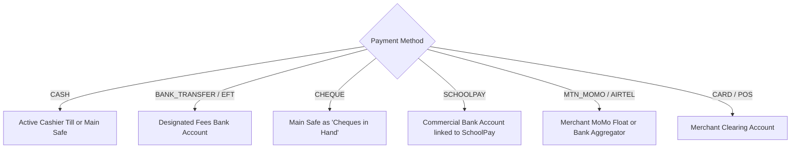
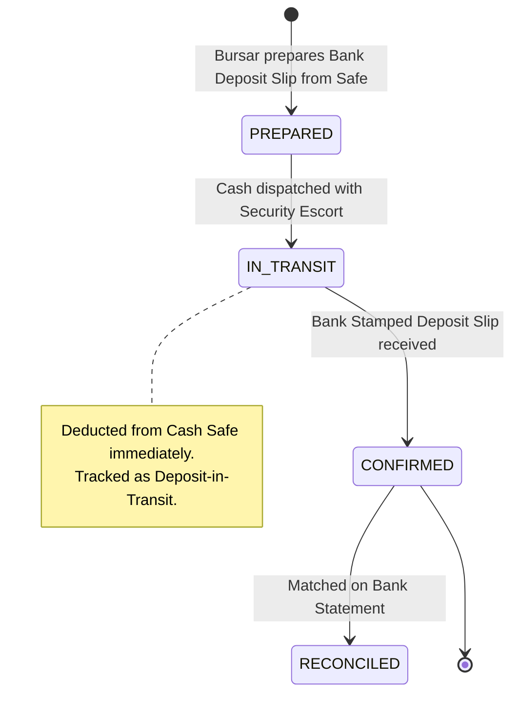

# NOVA — FINANCE PHASE 3.1K FINAL ARCHITECTURE SPECIFICATION
## School Treasury, Multi-Account Cashbook, Petty Cash Imprest & Bank Statement Reconciliation Engine

**Status**: READY FOR IMPLEMENTATION  
**Baseline Checkpoint**: `a44b6bd` (Phase 3.1J Approved, Closed, and Pushed)  
**Author**: Antigravity / DeepMind Advanced Agentic Coding Pair  
**Date**: September 2026  

---

## 1. Executive Summary & Domain Context

Over Finance Phases 3.1A through 3.1J, NOVA has engineered a comprehensive school financial ecosystem spanning Accounts Receivable (AR Fee Structures, Invoices, Receipts, Subledger), Operational Cash Disbursements (ExpenseDAO), SchoolPay Aggregator Webhooks, Staff Payroll & Statutory Deductions, School Budgeting with Live Variance, Student In-Kind Requirements & Clearance, Fleet Operations, and Stores/Procurement/WAC Inventory.

However, across all prior phases, **money has had no physical or banking home**. Payments and expenses were recorded against abstract strings (`CASH`, `BANK_TRANSFER`, `CHEQUE`), while physical cashier drawer balances, vault safes, petty cash floats, and commercial bank accounts remained entirely unmodeled.

**Finance Phase 3.1K: School Treasury, Multi-Account Cashbook, Petty Cash Imprest & Bank Statement Reconciliation Engine** resolves this final operational liquidity frontier:
1. **Multi-Account Treasury**: Registers commercial bank accounts, physical vault safes, cashier tills, MoMo wallets, and petty cash boxes per branch.
2. **Authoritative Cashbook Ledger (`CashbookMovement`)**: Immutable, single source of truth for liquid balance mutations with before/after audit tracking.
3. **Cashier Shift Sessions & Daily Cash Banking**: Opens and closes till drawers with denomination physical cash counts, shortage/surplus logging, and bank deposit preparation.
4. **Petty Cash Imprest Subsystem**: Governs departmental floats through multi-step voucher approvals, receipt retirements, and automated float replenishment via `ExpenseDAO` and `BudgetDAO`.
5. **Bank Statement Ingestion & 3-Way Reconciliation**: Parses CSV bank statements, matches lines deterministically or with audit justification, flags timing differences, and generates the statutory **Bank Reconciliation Statement (BRS)** with mathematical zero variance.

---

## 2. Resolution of the 20 Architecture Gates

---

### Gate 1: TREASURY AUTHORITY (Single Source of Truth)

- `TreasuryAccount.currentBalance` is the **sole authoritative field** for an account's liquid balance.
- **Relationship to Existing Authorities**:
  - `StudentLedgerEntry` remains strictly the Accounts Receivable (AR) Subsidiary Ledger for student fee liabilities.
  - `Expense` remains strictly the Operational Expenditure Ledger for budget tracking and payee details.
  - `TreasuryAccount` does **NOT** compete with or duplicate AR or Expense accounting; it tracks the **physical and institutional banking repositories** where money actually resides.
- **Atomic Update Invariant**:
  - Every mutation to `TreasuryAccount.currentBalance` MUST be executed within a database transaction utilizing PostgreSQL pessimistic row locking (`SELECT ... FOR UPDATE`).
  - The transaction MUST atomically insert a `CashbookMovement` and update `TreasuryAccount.currentBalance`.
  - Discrepancies between `TreasuryAccount.currentBalance` and the sum of `CashbookMovement` deltas are structurally impossible.

$$\text{TreasuryAccount.currentBalance} = \text{openingBalance} + \sum \text{CashbookMovement.amount}(\text{INFLOW}) - \sum \text{CashbookMovement.amount}(\text{OUTFLOW})$$

---

### Gate 2: CASHBOOK LEDGER & IMMUTABILITY

Every cashbook transaction creates an immutable `CashbookMovement` record. Movements are never updated or deleted.

#### Complete Movement Taxonomy:
| Movement Type | Direction | Triggering Domain / Action | Target / Balance Effect |
|---|---|---|---|
| `FEE_PAYMENT_RECEIPT` | `INFLOW` | `PaymentDAO.recordPayment` (Tuition, transport, etc.) | Increments Till or Bank |
| `STORE_SALE_RECEIPT` | `INFLOW` | `InventoryDAO.recordStudentSale` (Cash/MoMo POS) | Increments Cashier Till |
| `OPERATIONAL_EXPENSE` | `OUTFLOW` | `ExpenseDAO.createExpense` (Disbursement voucher) | Decrements Bank or Safe |
| `PAYROLL_DISBURSEMENT` | `OUTFLOW` | `PayrollDAO.disbursePayrollRun` (Net salary payout) | Decrements Bank Account |
| `BANK_DEPOSIT_OUT` | `OUTFLOW` | Bursar dispatches cash from Safe to Bank | Decrements Cash Office Safe |
| `BANK_DEPOSIT_IN` | `INFLOW` | Commercial bank confirms cash deposit slip | Increments Bank Account |
| `INTER_ACCOUNT_TRANSFER_OUT` | `OUTFLOW` | Fund transfer initiated from source account | Decrements `fromAccount` |
| `INTER_ACCOUNT_TRANSFER_IN` | `INFLOW` | Fund transfer completed at destination account | Increments `toAccount` |
| `PETTY_CASH_DISBURSEMENT` | `OUTFLOW` | Petty cash voucher disbursed to staff requester | Decrements Petty Cash Float |
| `PETTY_CASH_REPLENISHMENT_OUT`| `OUTFLOW` | Reimbursement drawn from Bank/Safe to restore float | Decrements Bank or Safe |
| `PETTY_CASH_REPLENISHMENT_IN` | `INFLOW` | Reimbursement received by petty cash custodian | Increments Petty Cash Float |
| `PETTY_CASH_CHANGE_RETURN` | `INFLOW` | Unspent change returned upon voucher retirement | Increments Petty Cash Float |
| `BANK_CHARGE` | `OUTFLOW` | Bank ledger fees, excise tax, statement charges | Decrements Bank Account |
| `BANK_INTEREST_CREDIT` | `INFLOW` | Bank interest earned on credit balances | Increments Bank Account |
| `PAYMENT_REVERSAL_OUT` | `OUTFLOW` | `PaymentDAO.reversePayment` executed | Decrements Till or Bank |
| `EXPENSE_VOID_IN` | `INFLOW` | `ExpenseDAO.voidExpense` executed | Re-credits Bank or Safe |
| `OPENING_BALANCE` | `INFLOW` | Initial account setup baseline | Sets starting balance |
| `AUDIT_ADJUSTMENT` | `INFLOW`/`OUTFLOW` | Authorized correction with formal justification | Adjusts balance |

#### Integration Without Duplicate Cash Recognition:
- When `PaymentDAO` or `ExpenseDAO` processes a transaction, it creates its primary record (`Payment` or `Expense`) and passes its generated ID to `TreasuryDAO.recordMovement`.
- `TreasuryDAO` checks for existing movements with that `paymentId` or `expenseId`. If one exists, the call is an idempotent replay and exits without altering balances.
- Legacy payments/expenses without an explicit account link default to the designated branch default account for that payment method.

---

### Gate 3: PAYMENT METHOD → TREASURY ACCOUNT RESOLUTION

NOVA does not assume every payment method is immediately cleared cash. The system deterministically maps payment methods to appropriate treasury accounts:



1. **`CASH`**: Routed to the cashier's active `CASHIER_TILL`. If the user has no open shift, routed to `CASH_OFFICE_SAFE`.
2. **`BANK_TRANSFER` / `EFT`**: Routed directly to the school's configured `COMMERCIAL_BANK` account. It represents book-recognized revenue; actual receipt is validated during Bank Statement Reconciliation.
3. **`CHEQUE`**: Stored as an uncleared receipt in `CASH_OFFICE_SAFE` (or direct to Bank with status `UNCLEARED`). When deposited and cleared on the bank statement, reconciliation confirms clearance. Bounced cheques trigger a non-destructive reversal.
4. **`SCHOOLPAY`**: Routed to the primary collection bank account mapped in `SchoolPayConfig` (e.g., Stanbic Collection).
5. **`MTN_MOMO` / `AIRTEL_MONEY`**: Routed to `MOBILE_MONEY_FLOAT` (if school holds a merchant SIM) or directly to the bank collection account (if SchoolPay aggregator).

---

### Gate 4: CASHIER SHIFTS & TILL BALANCING

To eliminate counter cash leakage, every cashier operating a cash drawer must execute within an audited shift session:

1. **Shift Opening**:
   - Cashier initiates a shift session on an assigned `CASHIER_TILL`.
   - Declares `openingFloat` (provided from `CASH_OFFICE_SAFE`).
   - Till balance is initialized to `openingFloat`.
2. **Active Operations**:
   - Cash fee payments and cash store sales increment `CASHIER_TILL.currentBalance`.
   - Cashier cannot process transactions outside an active, open session.
3. **Shift Close & Physical Cash Count**:
   - Cashier closes the session and inputs the physical cash count with an explicit **denomination breakdown**:
     - Notes: $50,000 \times N$, $20,000 \times N$, $10,000 \times N$, $5,000 \times N$, $2,000 \times N$, $1,000 \times N$.
     - Coins: $1,000 \times N$, $500 \times N$, $200 \times N$, $100 \times N$, $50 \times N$.
   - System calculates:
     $$\text{expectedCash} = \text{openingFloat} + \sum \text{Inflows} - \sum \text{Outflows}$$
     $$\text{cashVariance} = \text{actualCashCounted} - \text{expectedCash}$$
   - **Variance Governance**:
     - If $\text{cashVariance} < 0$: Shortage. Cashier must enter an explanatory note; supervisor witness signoff is mandatory.
     - If $\text{cashVariance} > 0$: Surplus. Logged as surplus.
4. **Safe Handover**:
   - At shift close, the system generates an atomic `TreasuryTransfer` moving collected cash from `CASHIER_TILL` to `CASH_OFFICE_SAFE`, retaining only the base opening float if configured.
5. **Reopening Rules**:
   - A closed shift cannot be reopened. If post-close errors are identified, a supervisor logs an adjusting audit movement.
   - A cashier can have at most one active shift at any given time (`@@unique([cashierId, status])` where status = `OPEN`).

---

### Gate 5: BANK DEPOSITS & DEPOSITS-IN-TRANSIT

The cash collection $\to$ safe $\to$ bank deposit pipeline is strictly tracked to eliminate theft between the school and the bank:



1. **Preparation**: Bursar bundles physical cash in `CASH_OFFICE_SAFE` and generates a `TreasuryTransfer` with method `CASH_BANKING_DEPOSIT`.
2. **In-Transit Phase**: Cash is deducted from `CASH_OFFICE_SAFE` via `BANK_DEPOSIT_OUT`. The transfer enters status `IN_TRANSIT`.
3. **Confirmation**: When the stamped bank deposit slip returns, the Bursar records `depositSlipNumber`, `bankReference`, and attaches the scanned slip, completing the transfer and crediting `COMMERCIAL_BANK` via `BANK_DEPOSIT_IN`.
4. **Deposits-in-Transit Treatment**: If month-end arrives while the deposit is in transit or pending bank clearing, it is automatically captured on the Bank Reconciliation Statement as a **Deposit in Transit** (adding to bank balance).
5. **Deduplication**: `depositSlipNumber` is uniquely constrained per branch to prevent duplicate postings.

---

### Gate 6: TREASURY TRANSFERS & FOUR-EYE APPROVAL

- Inter-account fund transfers (Till $\to$ Safe, Safe $\to$ Bank, Bank $\to$ Bank) are strictly two-legged and atomic.
- Both `fromAccount` (deduction) and `toAccount` (credit) are locked and mutated within the same database transaction. Failure of any constraint rolls back both legs completely.
- **Four-Eye Approval Threshold**:
  - Any transfer exceeding a configurable branch threshold (default: $5,000,000\text{ UGX}$) or between distinct commercial bank accounts enters status `PENDING_APPROVAL`.
  - It requires approval from a second authorized user (Bursar, Finance Director, or Headteacher).
  - Anti-self-approval rule: `approvedById !== initiatedById`.

---

### Gate 7: PETTY CASH IMPREST SUBSYSTEM

1. **Imprest Setup**:
   - Backed by a `TreasuryAccount` of type `PETTY_CASH_FLOAT`.
   - Defines `floatCeiling` (e.g., $500,000\text{ UGX}$) and `replenishmentThreshold` (e.g., $150,000\text{ UGX}$).
2. **Lifecycle**:
   $$\text{REQUEST (DRAFT)} \longrightarrow \text{SUBMITTED} \longrightarrow \text{APPROVED} \longrightarrow \text{DISBURSED} \longrightarrow \text{RETIRED}$$
3. **Voucher Retirement**:
   - Requester presents original receipts totaling $\text{spentAmount}$ and returns $\text{changeReturned}$.
   - Invariant: $\text{spentAmount} + \text{changeReturned} \equiv \text{disbursedAmount}$.
   - Scanned receipts attached. Float cash increases by $\text{changeReturned}$ via `PETTY_CASH_CHANGE_RETURN`.
4. **Automated Replenishment**:
   - When available cash drops below `replenishmentThreshold`, the Bursar initiates replenishment.
   - The system queries all `RETIRED` but unreplenished vouchers.
   - Total replenishment amount: $\sum \text{spentAmount}$.
   - System calls `ExpenseDAO.createExpense` to record operational expenses against the respective vote heads in `BudgetDAO`.
   - Transfers cash from Bank or Safe to the `PETTY_CASH_FLOAT` via `PETTY_CASH_REPLENISHMENT_IN`, restoring float exactly to `floatCeiling`.

---

### Gate 8: BANK STATEMENT IMPORT

1. **Supported Formats**: Standard CSV and TSV formats with flexible header mapping:
   - `Date` / `Value Date`
   - `Reference` / `Cheque Number`
   - `Narrative` / `Description`
   - `Debit` (Outflow) / `Credit` (Inflow)
   - `Running Balance`
2. **Raw Line Immutability**:
   - Stored in `BankStatementLine` with original raw text and parsed values.
   - Once imported, statement lines are **strictly immutable**.
3. **Deduplication Safeguards**:
   - Statement file deduplication via SHA-256 hash: `@@unique([branchId, fileHash])`.
   - Line-level duplicate detection: `@@unique([statementId, transactionDate, reference, amount, direction])`.
4. **Validation Rules**:
   - Account must be `COMMERCIAL_BANK`.
   - Currency must be `UGX`.
   - Dates must be sequential and fall within statement period.
5. **No Undocumented APIs**: Statement ingestion relies exclusively on durable file parsing and manual entry. Zero hypothetical external bank API dependencies.

---

### Gate 9: DETERMINISTIC RECONCILIATION ENGINE

The reconciliation matching engine uses strict deterministic algorithms:

1. **Credit Matching (Bank Deposit ↔ Cashbook Inflow)**:
   - **Deterministic Match 1**: Exact match on `referenceNumber` (SchoolPay TxID, bank deposit slip #) AND exact `amount`.
   - **Deterministic Match 2**: Exact match on cheque number AND exact `amount` within clearing window ($\pm 3$ days).
2. **Debit Matching (Bank Withdrawal ↔ Cashbook Outflow)**:
   - **Deterministic Match 1**: Exact match on cheque number AND exact `amount`.
   - **Deterministic Match 2**: Exact match on payroll batch reference AND exact net payroll total.
3. **Timing Differences**:
   - Unmatched cashbook outflows: Tagged as **Unpresented Cheques**.
   - Unmatched cashbook inflows: Tagged as **Deposits in Transit**.
4. **Bank Charges & Unrecorded Debits**:
   - Bank debits with narratives matching standard bank fee patterns ("LEDGER FEE", "EXCISE DUTY", "TRANSFER CHARGE") can be converted directly into an `Expense` voucher via `ExpenseDAO` and matched in one click.
5. **Manual Matching & Audit**:
   - Complex matches (e.g. bundled deposits where 3 cashier cash banking deposits appear as 1 bank credit) require manual selection by the Bursar with mandatory audit justification.
   - Fuzzy suggestions are **advisory only** and never auto-committed without human signoff.

---

### Gate 10: STATUTORY BANK RECONCILIATION STATEMENT (BRS)

The statutory BRS is calculated dynamically from authoritative source records:

$$\begin{aligned}
\text{Adjusted Bank Balance} &= \text{Bank Statement Closing Balance} \\
&\quad + \text{Total Deposits in Transit} \\
&\quad - \text{Total Unpresented Cheques} \\
&\quad \pm \text{Bank Errors} \\[1em]
\text{Adjusted Cashbook Balance} &= \text{Cashbook Closing Balance} \\
&\quad - \text{Unrecorded Bank Charges} \\
&\quad + \text{Unrecorded Bank Interest} \\
&\quad \pm \text{Cashbook Errors} \\[1em]
\text{Reconciliation Variance} &= |\text{Adjusted Bank Balance} - \text{Adjusted Cashbook Balance}|
\end{aligned}$$

- **Zero-Variance Certification Invariant**:
  - The BRS CANNOT be certified or locked unless $\text{Reconciliation Variance} \equiv 0.00\text{ UGX}$.
- **Lockdown**:
  - Once certified by the Bursar and approved by the Headteacher/Auditor, the reconciliation period is locked (`status = 'LOCKED'`). Matched movements and statement lines cannot be unmatched or edited.

---

### Gate 11: REVERSALS & NON-DESTRUCTIVE AUDITING

- Voiding an expense or reversing a payment:
  - Historical `CashbookMovement` rows are **never deleted**.
  - System inserts a non-destructive compensating movement (`PAYMENT_REVERSAL_OUT` or `EXPENSE_VOID_IN`).
  - If the original movement was part of a locked reconciliation period, the reversal movement appears in the **current active period** as an audit adjustment, preserving historical reconciliation integrity.

---

### Gate 12: CONCURRENCY & IDEMPOTENCY SAFEGUARDS

1. **Pessimistic Row Locking**: All balance mutations execute with `SELECT ... FOR UPDATE` on `TreasuryAccount`.
2. **Idempotency Keys**: Unique constraint `@@unique([branchId, idempotencyKey])` prevents double-posting from network retries.
3. **Cashbook Relational Uniqueness**:
   - `paymentId` has unique constraint on `CashbookMovement` where movement type is `FEE_PAYMENT_RECEIPT`.
   - `expenseId` has unique constraint where movement type is `OPERATIONAL_EXPENSE`.
4. **Shift Concurrency**: Cashier session close acquires a row lock; concurrent close attempts reject with `409 Conflict`.
5. **Statement Deduplication**: Duplicate statement files reject with `409 Conflict` via SHA-256 hash.

---

### Gate 13: CROSS-PHASE INTEGRATION MATRIX

```
┌─────────────────────────┬────────────────────────────────────────────────────────┐
│ Phase Domain            │ Exact Treasury Integration Point                       │
├─────────────────────────┼────────────────────────────────────────────────────────┤
│ 3.1C PaymentDAO         │ Fee payment captures -> Cashbook INFLOW (Till / Bank)  │
│ 3.1D ExpenseDAO         │ Operational disbursements -> Cashbook OUTFLOW (Safe/Bank)│
│ 3.1E SchoolPay          │ Webhooks auto-post to designated Bank Account          │
│ 3.1F Payroll            │ Salary disbursement deduction from Payroll Bank Account │
│ 3.1G BudgetDAO          │ Petty cash replenishment validates & consumes VoteHeads│
│ 3.1H Requirements       │ Monetized items recorded via PaymentDAO -> Treasury    │
│ 3.1I Transport          │ Fuel & maintenance vouchers -> Treasury Outflow        │
│ 3.1J Inventory          │ GRN payments -> Bank Outflow; POS Sales -> Till Inflow  │
└─────────────────────────┴────────────────────────────────────────────────────────┘
```
**Absolute Rule**: Zero parallel payment or expense authority. Treasury records liquidity flows resulting from upstream business events.

---

### Gate 14: BALANCE AUTHORITY DECISION

- **Architectural Determination**:
  `TreasuryAccount.currentBalance` is a **stored authoritative value**, mutated exclusively via atomic database transactions protected by pessimistic row locking (`SELECT ... FOR UPDATE`).
- **Continuous Audit Verification**:
  It is strictly verified against the immutable ledger:
  $$\text{currentBalance} \equiv \text{openingBalance} + \sum \text{INFLOW} - \sum \text{OUTFLOW}$$
  A nightly/on-demand audit job executes this query to assert zero balance drift across all accounts.

---

### Gate 15: RBAC & PERMISSIONS SPECIFICATION

| Permission Name | Operational Scope |
|---|---|
| `treasury:accounts:read` | View accounts, balances, and cashbook ledgers |
| `treasury:accounts:manage` | Create, update, or archive treasury accounts |
| `treasury:shifts:operate` | Open shift, record physical count, close till session |
| `treasury:shifts:supervise` | Witness shift close, authorize over/short variance |
| `treasury:transfers:initiate` | Initiate inter-account transfers or cash banking |
| `treasury:transfers:approve` | Approve/confirm receipt of transfers & bank deposits |
| `treasury:petty:request` | Submit petty cash voucher request |
| `treasury:petty:approve` | Approve petty cash voucher request |
| `treasury:petty:disburse` | Disburse petty cash and retire vouchers |
| `treasury:petty:replenish` | Trigger imprest float replenishment via ExpenseDAO |
| `treasury:statements:import` | Upload and parse bank statement files |
| `treasury:reconcile:match` | Perform auto-matching and manual matching |
| `treasury:reconcile:certify` | Certify, sign off, and lock Bank Reconciliation Statements |

---

### Gate 16: BRANCH ISOLATION

- Every model (`TreasuryAccount`, `CashbookMovement`, `TreasuryTransfer`, `CashierShiftSession`, `PettyCashImprest`, `PettyCashVoucher`, `BankStatement`, `BankStatementLine`, `BankReconciliation`, `TreasurySequence`) contains a mandatory `branchId`.
- Cross-branch queries or transfers are blocked at both the database foreign-key layer and DAO permission layer.
- Sequences (`CBM-`, `TRF-`, `PCV-`, `BRS-`) are strictly isolated per branch and year.

---

### Gate 17: EXECUTIVE REPORTING & METRICS

1. **Consolidated Liquidity Position**: Real-time breakdown across Banks, Vault Safe, Cashier Tills, MoMo Float, and Petty Cash.
2. **Cashbook Statement**: Complete date-filtered debit/credit transaction history per account.
3. **Cashier Shift Discrepancy Register**: Audit log of all shift variances (over/short) by cashier.
4. **Deposits-in-Transit Schedule**: Outstanding cash banking transfers pending bank credit.
5. **Unpresented Cheques Register**: Outstanding school-issued cheques pending bank debit.
6. **Petty Cash Imprest Status**: Floating balances, spent amounts, and pending reimbursements.
7. **Statutory Bank Reconciliation Statement (BRS)**: Formal audit-ready document with balance comparisons and zero variance proof.

---

### Gate 18: DATA MODELS & SCHEMA ARCHITECTURE

#### 18.1 Enums
```prisma
enum TreasuryAccountType {
  COMMERCIAL_BANK
  CASH_OFFICE_SAFE
  CASHIER_TILL
  MOBILE_MONEY_FLOAT
  PETTY_CASH_FLOAT
}

enum CashbookMovementType {
  FEE_PAYMENT_RECEIPT
  STORE_SALE_RECEIPT
  OPERATIONAL_EXPENSE
  PAYROLL_DISBURSEMENT
  BANK_DEPOSIT_OUT
  BANK_DEPOSIT_IN
  INTER_ACCOUNT_TRANSFER_OUT
  INTER_ACCOUNT_TRANSFER_IN
  PETTY_CASH_DISBURSEMENT
  PETTY_CASH_REPLENISHMENT_OUT
  PETTY_CASH_REPLENISHMENT_IN
  PETTY_CASH_CHANGE_RETURN
  BANK_CHARGE
  BANK_INTEREST_CREDIT
  PAYMENT_REVERSAL_OUT
  EXPENSE_VOID_IN
  OPENING_BALANCE
  AUDIT_ADJUSTMENT
}

enum CashDirection {
  INFLOW
  OUTFLOW
}

enum TransferMethod {
  CASH_BANKING_DEPOSIT
  BANK_TO_BANK_EFT
  BANK_WITHDRAWAL_TO_SAFE
  TILL_TO_SAFE_SWEEP
  SAFE_TO_PETTY_FLOAT
  MOMO_TO_BANK_SWEEP
}

enum TransferStatus {
  PENDING_APPROVAL
  IN_TRANSIT
  COMPLETED
  CANCELLED
}

enum SessionStatus {
  OPEN
  CLOSED
}

enum PettyVoucherStatus {
  DRAFT
  SUBMITTED
  APPROVED
  DISBURSED
  RETIRED
  REJECTED
  VOIDED
}

enum StatementLineMatchStatus {
  UNRECONCILED
  AUTO_MATCHED
  MANUALLY_MATCHED
  EXCEPTION_DISCREPANCY
  EXCLUDED
}

enum BRSStatus {
  DRAFT
  CERTIFIED
  LOCKED
}
```

#### 18.2 Models
```prisma
model TreasuryAccount {
  id                    String              @id @default(uuid())
  branchId              String
  branch                Branch              @relation(fields: [branchId], references: [id], onDelete: Cascade)
  code                  String
  name                  String
  accountType           TreasuryAccountType
  bankName              String?
  accountNumber         String?
  currency              String              @default("UGX")
  swiftCode             String?
  branchSortCode        String?
  openingBalance        Decimal             @default(0.00) @db.Decimal(12, 2)
  currentBalance        Decimal             @default(0.00) @db.Decimal(12, 2)
  openingDate           DateTime            @default(now())
  isDefaultFeeCollection Boolean            @default(false)
  isDefaultOperations   Boolean             @default(false)
  isDefaultPettyCash    Boolean             @default(false)
  isActive              Boolean             @default(true)
  custodianId           String?
  custodian             User?               @relation("AccountCustodian", fields: [custodianId], references: [id])
  movements             CashbookMovement[]
  outboundTransfers     TreasuryTransfer[]  @relation("TransferFrom")
  inboundTransfers      TreasuryTransfer[]  @relation("TransferTo")
  shiftSessions         CashierShiftSession[]
  pettyCashImprests     PettyCashImprest[]
  bankStatements        BankStatement[]
  reconciliations       BankReconciliation[]
  createdAt             DateTime            @default(now())
  updatedAt             DateTime            @updatedAt

  @@unique([branchId, code])
  @@index([branchId, accountType])
}

model CashbookMovement {
  id                String               @id @default(uuid())
  branchId          String
  branch            Branch               @relation(fields: [branchId], references: [id], onDelete: Cascade)
  accountId         String
  account           TreasuryAccount      @relation(fields: [accountId], references: [id], onDelete: Restrict)
  movementNumber    String
  movementType      CashbookMovementType
  direction         CashDirection
  amount            Decimal              @db.Decimal(12, 2)
  balanceBefore     Decimal              @db.Decimal(12, 2)
  balanceAfter      Decimal              @db.Decimal(12, 2)
  transactionDate   DateTime             @default(now())
  referenceNumber   String?
  description       String
  paymentId         String?
  expenseId         String?
  transferId        String?
  payrollRunId      String?
  storeSaleId       String?
  pettyVoucherId    String?
  isReconciled      Boolean              @default(false)
  reconciledAt      DateTime?
  statementLineId   String?
  statementLine     BankStatementLine?   @relation(fields: [statementLineId], references: [id])
  createdById       String
  createdBy         User                 @relation(fields: [createdById], references: [id])
  createdAt         DateTime             @default(now())

  @@unique([branchId, movementNumber])
  @@index([branchId, accountId, transactionDate])
  @@index([branchId, paymentId])
  @@index([branchId, expenseId])
}

model TreasuryTransfer {
  id                    String          @id @default(uuid())
  branchId              String
  branch                Branch          @relation(fields: [branchId], references: [id], onDelete: Cascade)
  transferNumber        String
  fromAccountId         String
  fromAccount           TreasuryAccount @relation("TransferFrom", fields: [fromAccountId], references: [id], onDelete: Restrict)
  toAccountId           String
  toAccount             TreasuryAccount @relation("TransferTo", fields: [toAccountId], references: [id], onDelete: Restrict)
  amount                Decimal         @db.Decimal(12, 2)
  transferMethod        TransferMethod
  depositSlipNumber     String?
  securityEscortDetails String?
  notes                 String?
  status                TransferStatus  @default(COMPLETED)
  initiatedById         String
  initiatedBy           User            @relation("TransferInitiator", fields: [initiatedById], references: [id])
  approvedById          String?
  approvedBy            User?           @relation("TransferApprover", fields: [approvedById], references: [id])
  completedAt           DateTime?
  idempotencyKey        String?
  createdAt             DateTime        @default(now())

  @@unique([branchId, transferNumber])
  @@unique([branchId, idempotencyKey])
  @@index([branchId, fromAccountId])
  @@index([branchId, toAccountId])
}

model CashierShiftSession {
  id                    String          @id @default(uuid())
  branchId              String
  branch                Branch          @relation(fields: [branchId], references: [id], onDelete: Cascade)
  cashierId             String
  cashier               User            @relation("CashierShift", fields: [cashierId], references: [id])
  tillAccountId         String
  tillAccount           TreasuryAccount @relation(fields: [tillAccountId], references: [id], onDelete: Restrict)
  openedAt              DateTime        @default(now())
  closedAt              DateTime?
  openingFloat          Decimal         @default(0.00) @db.Decimal(12, 2)
  expectedClosingBalance Decimal?       @db.Decimal(12, 2)
  actualCashCounted     Decimal?        @db.Decimal(12, 2)
  cashVariance          Decimal?        @db.Decimal(12, 2)
  denominationsJson     String?         // JSON of denomination breakdown
  varianceNotes         String?
  supervisorWitnessId   String?
  supervisorWitness     User?           @relation("ShiftSupervisor", fields: [supervisorWitnessId], references: [id])
  status                SessionStatus   @default(OPEN)
  createdAt             DateTime        @default(now())

  @@index([branchId, cashierId, status])
}

model PettyCashImprest {
  id                    String              @id @default(uuid())
  branchId              String
  branch                Branch              @relation(fields: [branchId], references: [id], onDelete: Cascade)
  accountId             String
  account               TreasuryAccount     @relation(fields: [accountId], references: [id], onDelete: Restrict)
  custodianId           String
  custodian             User                @relation(fields: [custodianId], references: [id])
  departmentId          String?
  department            Department?         @relation(fields: [departmentId], references: [id])
  name                  String
  floatCeiling          Decimal             @db.Decimal(12, 2)
  replenishmentThreshold Decimal            @db.Decimal(12, 2)
  isActive              Boolean             @default(true)
  vouchers              PettyCashVoucher[]
  createdAt             DateTime            @default(now())
  updatedAt             DateTime            @updatedAt

  @@index([branchId, custodianId])
}

model PettyCashVoucher {
  id                    String              @id @default(uuid())
  branchId              String
  branch                Branch              @relation(fields: [branchId], references: [id], onDelete: Cascade)
  imprestId             String
  imprest               PettyCashImprest    @relation(fields: [imprestId], references: [id], onDelete: Restrict)
  voucherNumber         String
  requesterId           String
  requester             User                @relation("VoucherRequester", fields: [requesterId], references: [id])
  purpose               String
  categoryId            String
  category              ExpenseCategory     @relation(fields: [categoryId], references: [id])
  voteHeadId            String?
  voteHead              VoteHead?           @relation(fields: [voteHeadId], references: [id])
  requestedAmount       Decimal             @db.Decimal(12, 2)
  approvedAmount        Decimal?            @db.Decimal(12, 2)
  disbursedAmount       Decimal?            @db.Decimal(12, 2)
  spentAmount           Decimal?            @db.Decimal(12, 2)
  changeReturned        Decimal?            @db.Decimal(12, 2)
  receiptUrl            String?
  status                PettyVoucherStatus  @default(DRAFT)
  approvedById          String?
  approvedBy            User?               @relation("VoucherApprover", fields: [approvedById], references: [id])
  disbursedAt           DateTime?
  retiredAt             DateTime?
  expenseId             String?             // Linked when replenished
  createdAt             DateTime            @default(now())

  @@unique([branchId, voucherNumber])
  @@index([branchId, imprestId, status])
}

model BankStatement {
  id                    String              @id @default(uuid())
  branchId              String
  branch                Branch              @relation(fields: [branchId], references: [id], onDelete: Cascade)
  accountId             String
  account               TreasuryAccount     @relation(fields: [accountId], references: [id], onDelete: Restrict)
  statementIdentifier   String
  startDate             DateTime
  endDate               DateTime
  openingBalance        Decimal             @db.Decimal(12, 2)
  closingBalance        Decimal             @db.Decimal(12, 2)
  fileHash              String
  importedById          String
  importedBy            User                @relation(fields: [importedById], references: [id])
  lines                 BankStatementLine[]
  reconciliations       BankReconciliation[]
  createdAt             DateTime            @default(now())

  @@unique([branchId, fileHash])
  @@unique([branchId, accountId, statementIdentifier])
}

model BankStatementLine {
  id                    String                  @id @default(uuid())
  statementId           String
  statement             BankStatement           @relation(fields: [statementId], references: [id], onDelete: Cascade)
  branchId              String
  transactionDate       DateTime
  valueDate             DateTime?
  reference             String?
  narrative             String
  amount                Decimal                 @db.Decimal(12, 2)
  direction             CashDirection
  runningBalance        Decimal?                @db.Decimal(12, 2)
  matchStatus           StatementLineMatchStatus @default(UNRECONCILED)
  matchedMovements      CashbookMovement[]
  matchNotes            String?
  matchedById           String?
  matchedAt             DateTime?
  createdAt             DateTime                @default(now())

  @@index([statementId, matchStatus])
}

model BankReconciliation {
  id                    String              @id @default(uuid())
  branchId              String
  branch                Branch              @relation(fields: [branchId], references: [id], onDelete: Cascade)
  accountId             String
  account               TreasuryAccount     @relation(fields: [accountId], references: [id], onDelete: Restrict)
  statementId           String
  statement             BankStatement       @relation(fields: [statementId], references: [id], onDelete: Restrict)
  reconciliationNumber  String
  periodStartDate       DateTime
  periodEndDate         DateTime
  statementClosingBalance Decimal           @db.Decimal(12, 2)
  cashbookClosingBalance  Decimal           @db.Decimal(12, 2)
  totalDepositsInTransit  Decimal           @default(0.00) @db.Decimal(12, 2)
  totalUnpresentedCheques Decimal           @default(0.00) @db.Decimal(12, 2)
  totalBankCharges        Decimal           @default(0.00) @db.Decimal(12, 2)
  totalBankInterest       Decimal           @default(0.00) @db.Decimal(12, 2)
  adjustedBankBalance     Decimal           @db.Decimal(12, 2)
  adjustedCashbookBalance Decimal           @db.Decimal(12, 2)
  variance                Decimal           @default(0.00) @db.Decimal(12, 2)
  status                BRSStatus           @default(DRAFT)
  certifiedById         String?
  certifiedBy           User?               @relation("ReconcileCertifier", fields: [certifiedById], references: [id])
  certifiedAt           DateTime?
  notes                 String?
  createdAt             DateTime            @default(now())

  @@unique([branchId, reconciliationNumber])
  @@index([branchId, accountId, status])
}

model TreasurySequence {
  id          String   @id @default(uuid())
  branchId    String
  prefix      String   // CBM, TRF, PCV, BRS
  year        Int
  lastValue   Int      @default(0)
  updatedAt   DateTime @updatedAt

  @@unique([branchId, prefix, year])
}
```

---

## 3. Test Matrix (Unit & Adversarial Gates)

### Unit Test Specifications (`treasury.dao.test.ts` — TR-01 to TR-20)
1. **TR-01**: Create Treasury Accounts (Commercial Bank, Safe, Till, MoMo, Petty Cash) and assert code uniqueness.
2. **TR-02**: Enforce default account designations per branch (`isDefaultFeeCollection`, `isDefaultOperations`).
3. **TR-03**: Post cash fee payment via `PaymentDAO` and verify automatic `FEE_PAYMENT_RECEIPT` cashbook inflow and balance increment.
4. **TR-04**: Post expense via `ExpenseDAO` and verify automatic `OPERATIONAL_EXPENSE` cashbook outflow and balance decrement.
5. **TR-05**: Execute two-legged inter-account transfer and verify atomic source decrement and target increment.
6. **TR-06**: Open cashier shift session with opening float and verify till balance.
7. **TR-07**: Record multiple cash sales within shift and verify expected cash accumulation.
8. **TR-08**: Close cashier shift with exact cash count and verify zero variance.
9. **TR-09**: Close cashier shift with cash shortage and verify variance calculation and notes requirement.
10. **TR-10**: Cash handover at shift close: automatic sweep from Till to Cash Office Safe.
11. **TR-11**: Cash Banking Deposit: dispatch cash from Safe to Bank (`IN_TRANSIT`) and confirm receipt.
12. **TR-12**: Setup Petty Cash Imprest with ceiling and threshold.
13. **TR-13**: Request, approve, and disburse petty cash voucher.
14. **TR-14**: Retire petty cash voucher with receipts and return unspent change.
15. **TR-15**: Replenish petty cash float: verify `ExpenseDAO` integration and float restoration to ceiling.
16. **TR-16**: Ingest CSV bank statement and verify immutable `BankStatementLine` creation.
17. **TR-17**: Run auto-reconciliation: verify deterministic matching by reference and amount.
18. **TR-18**: Identify Unpresented Cheques and Deposits in Transit as timing differences.
19. **TR-19**: Calculate Bank Reconciliation Statement: assert $\text{Adjusted Bank} \equiv \text{Adjusted Cashbook}$ and $\text{Variance} = 0.00$.
20. **TR-20**: Certify and lock BRS: verify matched movements and statement lines become immutable.

### Adversarial & Boundary Specifications (`treasury.adversarial.test.ts` — ADV-TR-01 to ADV-TR-10)
1. **ADV-TR-01 (Negative Physical Balance Guard)**: Attempting to disburse more cash than available in a Till or Safe throws a fatal error and aborts transaction.
2. **ADV-TR-02 (Transfer Four-Eye Enforcement)**: Attempting to self-approve a high-value transfer ($> 5\text{M}$) rejects with `403 Forbidden`.
3. **ADV-TR-03 (Transfer Atomic Rollback)**: If target account fails validation during a two-legged transfer, source account balance rolls back completely.
4. **ADV-TR-04 (Duplicate Payment Cashbook Guard)**: Replaying a payment with existing `paymentId` does not create duplicate cashbook movements or inflate account balances.
5. **ADV-TR-05 (Duplicate Statement Import Guard)**: Uploading the exact same bank statement CSV twice rejects with `409 Conflict` via SHA-256 deduplication.
6. **ADV-TR-06 (Concurrent Balance Mutation Lock)**: 10 concurrent payments hitting the same bank account serialize via `SELECT FOR UPDATE` without lost updates or race conditions.
7. **ADV-TR-07 (Reconciliation Variance Lockdown Block)**: Attempting to certify a BRS with non-zero variance ($\text{Variance} \ne 0.00$) throws a fatal validation error.
8. **ADV-TR-08 (Post-Lock Reconciliation Tampering)**: Attempting to unmatch a movement or edit an account balance inside a locked reconciliation period rejects with `403 Locked`.
9. **ADV-TR-09 (Reversal After Reconciliation)**: Reversing a payment matched in a locked prior period correctly enters the current active period as an audit adjustment without mutating historical reconciliation.
10. **ADV-TR-10 (Strict Branch Isolation)**: Attempting to transfer funds or reconcile accounts across distinct `branchId` boundaries throws an unauthorized tenant error.

---

## 4. Explicit Out-of-Scope Capabilities (Deferred)

The following capabilities are explicitly deferred:
- **Full Double-Entry General Ledger (GL) & Chart of Accounts (COA)**: Phase 3.1L will layer double-entry journals across AR, AP, Inventory, Payroll, and Treasury.
- **Direct Host-to-Host (H2H) Bank API Connections**: East African commercial banks mandate formal corporate VPN agreements; Phase 3.1K relies on secure statement file parsing and SchoolPay webhooks.
- **Automated External Bank Wire Execution**: System does not trigger outgoing bank wires directly.
- **Fixed Asset Capitalization & Depreciation**: Deferred to dedicated Asset Management phase.
- **Foreign Currency Exchange & Multicurrency Trading**: All accounts standardized on `UGX`.

---

STATUS: READY FOR IMPLEMENTATION
