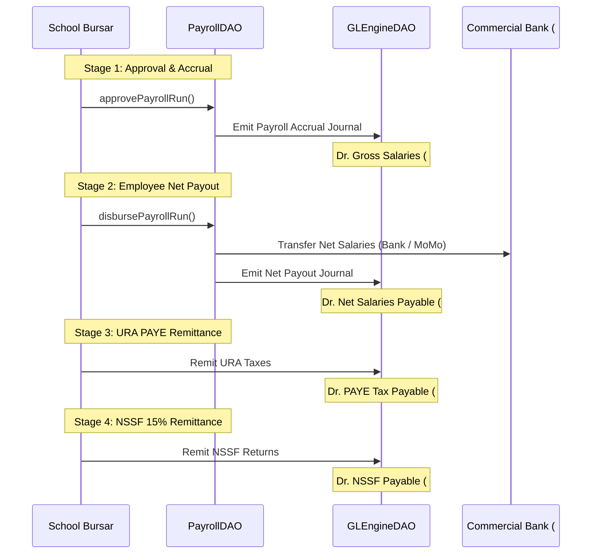

# NOVA — FINANCE PHASE 3.1L ARCHITECTURE SPECIFICATION
## General Ledger, Chart of Accounts, Double-Entry Accounting Engine & Subledger Synthesis

**Status**: READY FOR IMPLEMENTATION  
**Baseline Checkpoint**: `6bbe47e` (Phase 3.1A–3.1K Verified, Auth Hardening, 403 Graceful Handling, and Full Treasury Integrity Approved)  
**Author**: Antigravity / DeepMind Advanced Agentic Coding Pair  
**Date**: September 2026  

---

## 1. Architectural Philosophy & The Core Doctrine

Over Finance Phases 3.1A through 3.1K, NOVA has built a best-in-class operational school operating system across 11 financial and logistical modules:
1. **Phase 3.1A & 3.1B**: Fee Configuration, Billing Engine & Term Invoicing (`InvoiceDAO`).
2. **Phase 3.1C**: Student Accounts Receivable (AR) Subsidiary Ledger (`StudentLedgerEntry`), Payments, Allocations & Receipts (`PaymentDAO`, `LedgerDAO`).
3. **Phase 3.1D**: Operational Disbursements & Expense Vouchers (`ExpenseDAO`).
4. **Phase 3.1E**: SchoolPay Uganda Webhook Settlement & Gateway Reconciliation (`SchoolPayDAO`).
5. **Phase 3.1F**: Staff Compensation, Graduated PAYE & Statutory NSSF Payroll Engine (`PayrollDAO`).
6. **Phase 3.1G**: Vote-Head Budgeting, Revisions & Real-Time Variance Control (`BudgetDAO`).
7. **Phase 3.1H**: Physical Student Requirements, In-Kind Receipts, Monetization & Clearance (`RequirementsDAO`).
8. **Phase 3.1I**: Transport Routes, Fleet Telemetry, Fuel Logs & Vehicle Maintenance (`TransportDAO`).
9. **Phase 3.1J**: School Stores, Multi-Location Inventory, Procurement (PO/GRN), Requisitions & Weighted Average Cost (WAC) Valuation (`InventoryDAO`).
10. **Phase 3.1K**: Multi-Account Treasury, Till Drawer Sessions, Vault Sweeps, Petty Cash Imprest & Bank Statement Reconciliation (`TreasuryDAO`).

### The Three-Tier Matrix of Truth
To prevent ledger drift, phantom balances, or competing financial truths, Phase 3.1L enforces a strict **Three-Tier Architecture**:

```
┌────────────────────────────────────────────────────────────────────────┐
│                        TIER 1: SUBLEDGERS                              │
│                (Operational Source of Truth)                           │
│  - Student fee debt & payments  → StudentLedgerEntry                   │
│  - Liquid drawer & bank cash    → TreasuryAccount.currentBalance       │
│  - Physical stock counts & WAC  → InventoryStoreStock & Item.wac       │
│  - Staff salary & deductions    → Payslip & PayslipItem                │
└──────────────────────────────────┬─────────────────────────────────────┘
                                   │ Canonical Event Hooks
                                   ▼
┌────────────────────────────────────────────────────────────────────────┐
│                    TIER 2: GENERAL LEDGER (GL)                         │
│             (Double-Entry Accounting Representation)                   │
│  - Chart of Accounts (COA) with hierarchical classification            │
│  - Immutable, balanced double-entry JournalEntry & JournalLine records  │
│  - Control accounts (AR, AP, Cash/Bank, Inventory, Payroll Liabilities)│
└──────────────────────────────────┬─────────────────────────────────────┘
                                   │ Mathematical Summation
                                   ▼
┌────────────────────────────────────────────────────────────────────────┐
│                   TIER 3: FINANCIAL STATEMENTS                         │
│                       (Reporting Authority)                            │
│  - Trial Balance (Σ Debits ≡ Σ Credits)                                │
│  - Statement of Comprehensive Income (P&L: Revenue - Costs - Expenses) │
│  - Statement of Financial Position (Balance Sheet: Assets ≡ L + E)     │
│  - Statement of Cash Flows (Direct Method reconciled to Treasury)      │
└────────────────────────────────────────────────────────────────────────┘
```

> [!IMPORTANT]
> **Cardinal Principle of Non-Duplication**: The General Ledger holds the **monetary double-entry summation**, while subledgers hold the **transactional operational details**. Control accounts in the GL MUST reconcile exactly to the mathematical sum of their corresponding subledgers.

---

## 2. Gate 1: GL Posting Authority & Canonical Event Path

To guarantee that no operational transaction creates duplicate or competing GL journals, NOVA enforces a **Single Canonical Posting Path**:

```mermaid
flowchart TD
    subgraph Operational Action
        SRC[Source Subsystem Event: Invoice, Payment, Expense, Payroll, Stock, Transfer]
    end

    subgraph Deduplication & Authority Check
        KEY["Generate Deterministic Idempotency Key:<br/>branchId:sourceType:sourceId:eventType"]
        LOCK["Acquire Row Lock on Active FiscalPeriod<br/>Verify status == 'OPEN'"]
    end

    subgraph Atomic DB Transaction
        SUB_MUT[Mutate Subledger Record]
        GL_EMIT["GLEngineDAO.emitJournalEntry()<br/>Validate Σ Debits == Σ Credits > 0<br/>Insert JournalEntry & JournalLines"]
    end

    subgraph Replay Defense
        UNIQ{@@unique on branchId + idempotencyKey}
    end

    SRC --> KEY --> LOCK --> SUB_MUT --> GL_EMIT --> UNIQ
    UNIQ -->|First Execution| COMMIT[Commit Transaction: Journal POSTED]
    UNIQ -->|Duplicate / Replay| RET[Short-circuit: Return Existing JournalEntry]
```

### 1.1 Deterministic Idempotency Key Specification
Every programmatic journal emission requires an immutable, deterministic key adhering to:
$$\text{idempotencyKey} = \texttt{"\{branchId\}:\{sourceType\}:\{sourceId\}:\{eventType\}"}$$

| Source Subsystem | Event Type | Deterministic Key Pattern |
|---|---|---|
| **Phase 3.1B Invoice** | Billing Gross Charge | `${branchId}:INVOICE:${invoice.id}:BILLING` |
| **Phase 3.1B Invoice** | Voiding | `${branchId}:INVOICE:${invoice.id}:VOID` |
| **Phase 3.1C Payment** | Fee Receipt Collection | `${branchId}:PAYMENT:${payment.id}:RECEIPT` |
| **Phase 3.1C Payment** | Payment Reversal | `${branchId}:PAYMENT:${payment.id}:REVERSAL` |
| **Phase 3.1D Expense** | Operational Disbursement | `${branchId}:EXPENSE:${expense.id}:DISBURSEMENT` |
| **Phase 3.1D Expense** | Expense Void | `${branchId}:EXPENSE:${expense.id}:VOID` |
| **Phase 3.1F Payroll** | Payroll Run Accrual | `${branchId}:PAYROLL_RUN:${payrollRun.id}:ACCRUAL` |
| **Phase 3.1F Payroll** | Net Payout Settlement | `${branchId}:PAYROLL_RUN:${payrollRun.id}:DISBURSEMENT` |
| **Phase 3.1F Payroll** | Payroll Run Cancellation | `${branchId}:PAYROLL_RUN:${payrollRun.id}:REVERSAL` |
| **Phase 3.1J Inventory** | GRN Stock Arrival | `${branchId}:GRN:${grn.id}:RECEIPT` |
| **Phase 3.1J Inventory** | Store Sale Revenue & COGS | `${branchId}:STORE_SALE:${sale.id}:SALE` |
| **Phase 3.1J Inventory** | Departmental Store Issue | `${branchId}:STORE_REQ:${requisition.id}:ISSUE` |
| **Phase 3.1J Inventory** | Damaged Stock Write-off | `${branchId}:STOCK_WRITEOFF:${writeoff.id}:WRITEOFF` |
| **Phase 3.1K Treasury** | Pure Account Transfer | `${branchId}:TREASURY_TRANSFER:${transfer.id}:EXECUTION` |
| **Phase 3.1K Treasury** | Cash Banking Confirmation | `${branchId}:TREASURY_TRANSFER:${transfer.id}:CONFIRMATION` |
| **Phase 3.1K Treasury** | Bank Reconciliation Charges | `${branchId}:CASHBOOK_MOVEMENT:${movement.id}:BANK_CHARGE` |
| **Phase 3.1K Treasury** | Bank Reconciliation Interest | `${branchId}:CASHBOOK_MOVEMENT:${movement.id}:BANK_INTEREST` |
| **Phase 3.1L Migration** | System Opening Balance | `${branchId}:OPENING_BALANCE:${cutoffDate.toISOString()}` |

### 1.2 Replay Protection Invariant
The database schema enforces:
`@@unique([branchId, idempotencyKey])` and `@@unique([branchId, referenceType, referenceId, journalType])`.
If an operational call is retried or re-executed, the database constraint blocks duplicate insertion, and `GLEngineDAO` cleanly returns the existing `JournalEntry` without re-posting debits or credits.

---

## 3. Gate 6: Treasury Duplication Safeguards & The Canonical Ledger Path

A critical risk in integrated financial systems is **dual recognition** (e.g. `PaymentDAO` emits Dr. Cash / Cr. AR, and `TreasuryDAO` independently emits Dr. Cash / Cr. Income from the resulting `CashbookMovement`).

### The Rule of Canonical Ownership
In NOVA, **only the originating business entity emits the GL journal**:
1. **Fee Collections**: Originated by `PaymentDAO`. It emits the journal (`Dr. Cash/Bank`, `Cr. Student AR Control`). The resulting `CashbookMovement` (`movementType: FEE_PAYMENT_RECEIPT`) has `paymentId` populated and **DOES NOT emit a journal**.
2. **Operational Expenses**: Originated by `ExpenseDAO`. It emits the journal (`Dr. Expense Account`, `Cr. Bank/Safe`). The resulting `CashbookMovement` (`movementType: OPERATIONAL_EXPENSE`) has `expenseId` populated and **DOES NOT emit a journal**.
3. **Payroll Disbursements**: Originated by `PayrollDAO`. It emits the payout journal (`Dr. Net Salaries Payable`, `Cr. Bank`). The linked `Expense` voucher generated for budget tracking is flagged with `payrollRunId`; `ExpenseDAO` detects this and **suppresses duplicate journal emission**.
4. **Pure Treasury Transactions**: Transactions that originate purely within Treasury (Vault sweeps, Bank-to-Bank EFTs, Cash-in-Transit dispatches/confirmations, Bank statement fees/interest) are emitted exclusively by `TreasuryDAO`.

$$\text{GL Emission Eligibility} = \begin{cases}
\text{FALSE} & \text{if CashbookMovement belongs to an originating Payment, Expense, or Payroll Run} \\
\text{TRUE} & \text{if CashbookMovement is a pure Treasury transfer, fee, interest, or petty cash movement}
\end{cases}$$

---

## 4. Gate 4: General Ledger Data Models

### 4.1 Schema Definition

```prisma
enum GLAccountType {
  ASSET
  LIABILITY
  EQUITY
  REVENUE
  DIRECT_COST
  EXPENSE
}

enum NormalBalance {
  DEBIT
  CREDIT
}

enum SystemControlRole {
  NONE
  AR_STUDENT_CONTROL
  AR_PREPAID_ADVANCES
  AP_SUPPLIER_CONTROL
  AP_GRN_ACCRUAL
  CASH_BANK_CONTROL
  INVENTORY_STORES_ASSET
  INVENTORY_COGS_DEFAULT
  INVENTORY_SHRINKAGE_EXPENSE
  PAYROLL_WAGES_EXPENSE
  PAYROLL_EMPLOYER_NSSF_EXPENSE
  PAYROLL_NET_PAY_PAYABLE
  PAYROLL_PAYE_PAYABLE
  PAYROLL_NSSF_PAYABLE
  CASH_IN_TRANSIT
  BANK_CHARGES_EXPENSE
  BANK_INTEREST_INCOME
  RETAINED_EARNINGS
  OPENING_BALANCE_EQUITY
}

enum JournalType {
  STANDARD_MANUAL
  AR_BILLING
  PAYMENT_RECEIPT
  EXPENSE_DISBURSEMENT
  PAYROLL_ACCRUAL
  PAYROLL_PAYOUT
  STATUTORY_REMITTANCE
  INVENTORY_PURCHASE
  INVENTORY_COGS
  INVENTORY_ISSUE
  INVENTORY_WRITEOFF
  TREASURY_TRANSFER
  TREASURY_RECONCILIATION
  YEAR_END_CLOSE
  REVERSAL
  OPENING_BALANCE
}

enum JournalStatus {
  DRAFT
  POSTED
  REVERSED
}

enum PeriodStatus {
  OPEN
  CLOSED
  LOCKED
}

model GLAccount {
  id            String            @id @default(cuid())
  branchId      String
  code          String            // e.g. "1120"
  name          String            // e.g. "Stanbic Collection Bank"
  accountType   GLAccountType
  normalBalance NormalBalance
  controlRole   SystemControlRole @default(NONE)
  isHeader      Boolean           @default(false)
  parentId      String?
  description   String?
  isActive      Boolean           @default(true)
  createdAt     DateTime          @default(now())
  updatedAt     DateTime          @updatedAt

  branch        Branch            @relation(fields: [branchId], references: [id], onDelete: Cascade)
  parent        GLAccount?        @relation("AccountHierarchy", fields: [parentId], references: [id], onDelete: Restrict)
  children      GLAccount[]       @relation("AccountHierarchy")
  journalLines  JournalLine[]

  @@unique([branchId, code])
  @@index([branchId, accountType])
  @@index([branchId, controlRole])
}

model FiscalYear {
  id        String         @id @default(cuid())
  branchId  String
  name      String         // e.g. "FY 2026"
  startDate DateTime
  endDate   DateTime
  status    PeriodStatus   @default(OPEN)
  createdAt DateTime       @default(now())
  updatedAt DateTime       @updatedAt

  branch    Branch         @relation(fields: [branchId], references: [id], onDelete: Cascade)
  periods   FiscalPeriod[]

  @@unique([branchId, name])
  @@index([branchId, status])
}

model FiscalPeriod {
  id           String         @id @default(cuid())
  branchId     String
  fiscalYearId String
  periodNumber Int            // 1 to 12
  name         String         // e.g. "January 2026"
  startDate    DateTime
  endDate      DateTime
  status       PeriodStatus   @default(OPEN)
  closedAt     DateTime?
  closedById   String?
  createdAt    DateTime       @default(now())
  updatedAt    DateTime       @updatedAt

  branch         Branch         @relation(fields: [branchId], references: [id], onDelete: Cascade)
  fiscalYear     FiscalYear     @relation(fields: [fiscalYearId], references: [id], onDelete: Cascade)
  closedBy       User?          @relation("PeriodClosedBy", fields: [closedById], references: [id])
  journalEntries JournalEntry[]

  @@unique([fiscalYearId, periodNumber])
  @@unique([branchId, name])
  @@index([branchId, status])
}

model JournalEntry {
  id             String        @id @default(cuid())
  branchId       String
  journalNumber  String        // JNL-2026-00001
  fiscalPeriodId String
  journalType    JournalType
  status         JournalStatus @default(POSTED)
  entryDate      DateTime
  postingDate    DateTime      @default(now())
  description    String
  referenceType  String?       // "INVOICE", "PAYMENT", "EXPENSE", "PAYROLL_RUN", "GRN", "SALE", "TRANSFER"
  referenceId    String?
  idempotencyKey String?
  isReversal     Boolean       @default(false)
  reversalOfId   String?       @unique
  reversedById   String?
  postedById     String
  createdAt      DateTime      @default(now())
  updatedAt      DateTime      @updatedAt

  branch         Branch        @relation(fields: [branchId], references: [id], onDelete: Cascade)
  fiscalPeriod   FiscalPeriod  @relation(fields: [fiscalPeriodId], references: [id], onDelete: Restrict)
  reversalOf     JournalEntry? @relation("JournalReversal", fields: [reversalOfId], references: [id])
  reversedBy     JournalEntry? @relation("JournalReversal")
  postedBy       User          @relation("JournalPostedBy", fields: [postedById], references: [id])
  lines          JournalLine[]

  @@unique([branchId, journalNumber])
  @@unique([branchId, idempotencyKey])
  @@unique([branchId, referenceType, referenceId, journalType])
  @@index([branchId, entryDate])
  @@index([branchId, status])
}

model JournalLine {
  id             String        @id @default(cuid())
  journalEntryId String
  branchId       String
  accountId      String
  lineNumber     Int
  description    String?
  debit          Decimal       @default(0.00) @db.Decimal(12, 2)
  credit         Decimal       @default(0.00) @db.Decimal(12, 2)
  departmentId   String?
  academicYearId String?
  termId         String?

  journalEntry   JournalEntry  @relation(fields: [journalEntryId], references: [id], onDelete: Cascade)
  branch         Branch        @relation(fields: [branchId], references: [id], onDelete: Cascade)
  account        GLAccount     @relation(fields: [accountId], references: [id], onDelete: Restrict)
  department     Department?   @relation(fields: [departmentId], references: [id], onDelete: SetNull)
  academicYear   AcademicYear? @relation(fields: [academicYearId], references: [id], onDelete: SetNull)
  term           Term?         @relation(fields: [termId], references: [id], onDelete: SetNull)

  @@unique([journalEntryId, lineNumber])
  @@index([branchId, accountId])
}

model GLAccountMapping {
  id          String            @id @default(cuid())
  branchId    String
  mappingKey  SystemControlRole // Target role
  accountId   String
  createdAt   DateTime          @default(now())
  updatedAt   DateTime          @updatedAt

  branch      Branch            @relation(fields: [branchId], references: [id], onDelete: Cascade)
  account     GLAccount         @relation(fields: [accountId], references: [id], onDelete: Restrict)

  @@unique([branchId, mappingKey])
}

model GLSequence {
  id        String   @id @default(cuid())
  branchId  String
  year      Int
  lastValue Int      @default(0)
  updatedAt DateTime @updatedAt

  branch    Branch   @relation(fields: [branchId], references: [id], onDelete: Cascade)

  @@unique([branchId, year])
}
```

---

## 5. Gate 13: Account Mapping Governance

To eliminate brittle hardcoded account codes scattered across business logic, NOVA implements **Centralized Account Mapping Governance**:

### 13.1 Governance Model (`GLAccountMapping`)
Every branch maintains a table of system mapping roles (`SystemControlRole`):
- `AR_STUDENT_CONTROL` $\to$ `#1200 Accounts Receivable - Students`
- `AR_PREPAID_ADVANCES` $\to$ `#2310 Student Prepaid Fees & Advances`
- `AP_SUPPLIER_CONTROL` $\to$ `#2110 Accounts Payable - Suppliers`
- `AP_GRN_ACCRUAL` $\to$ `#2120 Accrued Goods Received`
- `INVENTORY_STORES_ASSET` $\to$ `#1310 Stores Inventory Asset`
- `INVENTORY_COGS_DEFAULT` $\to$ `#5300 Cost of Goods Sold - Uniforms & Books`
- `INVENTORY_SHRINKAGE_EXPENSE` $\to$ `#6800 Inventory Shrinkage & Loss`
- `INVENTORY_SURPLUS_INCOME` $\to$ `#4950 Inventory Stocktake Surplus`
- `PAYROLL_WAGES_EXPENSE` $\to$ `#6100 Staff Wages & Salaries Expense`
- `PAYROLL_EMPLOYER_NSSF_EXPENSE` $\to$ `#6300 Employer NSSF Expense (10%)`
- `PAYROLL_NET_PAY_PAYABLE` $\to$ `#2210 Net Salaries Payable`
- `PAYROLL_PAYE_PAYABLE` $\to$ `#2220 URA PAYE Tax Payable`
- `PAYROLL_NSSF_PAYABLE` $\to$ `#2230 NSSF Contributions Payable (15%)`
- `CASH_IN_TRANSIT` $\to$ `#1115 Cash in Transit`
- `BANK_CHARGES_EXPENSE` $\to$ `#6710 Bank & Financial Charges`
- `BANK_INTEREST_INCOME` $\to$ `#4910 Bank Interest Income`
- `RETAINED_EARNINGS` $\to$ `#3100 Accumulated School Fund`
- `OPENING_BALANCE_EQUITY` $\to$ `#3500 Opening Balance Equity`

### 13.2 Subsystem Direct Mappings
In addition to system control mappings:
- `TreasuryAccount.glAccountId`: Explicitly links every till, safe, or bank account to an exact leaf asset account (e.g. Till 1 $\to$ `#1111`, Stanbic $\to$ `#1121`).
- `FeeType.glAccountId`: Explicitly links fee categories to revenue accounts (e.g. Tuition $\to$ `#4100`, Boarding $\to$ `#4200`, Transport $\to$ `#4300`).
- `ExpenseCategory.glAccountId`: Explicitly links expense categories to operational cost accounts (e.g. Generator Fuel $\to$ `#5400`, Plumbing $\to$ `#6600`).

### 13.3 Mandatory Pre-Flight Validation
Before any journal entry is saved, `GLEngineDAO.validateMappings(branchId, requiredRoles)` executes:
- Confirms that all necessary mapping roles for that transaction exist.
- Asserts that target accounts are `isActive === true` and `isHeader === false`.
- If any mapping is unassigned or invalid, the transaction rolls back with:
  `GLConfigurationError: Mandatory GL account mapping '[ROLE]' is missing or inactive for branch.`

---

## 6. Gate 5: Definitive Source Event Posting Matrix

The following matrix governs every financial event across the entire system:

| Ref | Subsystem & Event | Triggering Method | DR Account | CR Account | Source ID | Deterministic Idempotency Key | Reversal / Void Behavior |
|---|---|---|---|---|---|---|---|
| **EV-01** | **3.1B Invoice Gross Billing** | `InvoiceDAO.createInvoice` or bulk billing | **Dr. AR Student Control** (`#1200`) | **Cr. Fee Revenues** (`#4100` Tuition, `#4200` Boarding, etc.) | `invoice.id` | `${branchId}:INVOICE:${id}:BILLING` | Emits mirror journal with inverted DR/CR, referencing `reversalOfId`. |
| **EV-02** | **3.1B Invoice Bursary Discount** | `InvoiceDAO.createInvoice` with discount | **Dr. Bursary Allowances** (`#4800`, Contra-Rev) | **Cr. AR Student Control** (`#1200`) | `invoice.id` | `${branchId}:INVOICE:${id}:BURSARY` | Reverses alongside main invoice if invoice is voided. |
| **EV-03** | **3.1C Payment Receipt** | `PaymentDAO.recordPayment` (Counter Cash/Bank) | **Dr. Treasury Account** (`#11xx` from `account.glAccountId`) | **Cr. AR Student Control** (`#1200`) | `payment.id` | `${branchId}:PAYMENT:${id}:RECEIPT` | Emits mirror compensating journal with inverted DR/CR. |
| **EV-04** | **3.1C Payment Reversal** | `PaymentDAO.reversePayment` | **Dr. AR Student Control** (`#1200`) | **Cr. Treasury Account** (`#11xx`) | `payment.id` | `${branchId}:PAYMENT:${id}:REVERSAL` | Linked to original payment journal via `reversalOfId`. |
| **EV-05** | **3.1D Expense Disbursement** | `ExpenseDAO.createExpense` | **Dr. Operational Expense** (`#6xxx` from `category.glAccountId`) | **Cr. Treasury Account** (`#11xx` from `account.glAccountId`) | `expense.id` | `${branchId}:EXPENSE:${id}:DISBURSEMENT`| Emits mirror compensating journal with inverted DR/CR. |
| **EV-06** | **3.1D Expense Void** | `ExpenseDAO.voidExpense` | **Dr. Treasury Account** (`#11xx`) | **Cr. Operational Expense** (`#6xxx`) | `expense.id` | `${branchId}:EXPENSE:${id}:VOID` | Linked to original disbursement journal via `reversalOfId`. |
| **EV-07** | **3.1E SchoolPay Webhook** | `SchoolPayDAO.postWebhook` (calls `PaymentDAO`) | **Dr. Stanbic Collection Bank** (`#1120`) | **Cr. AR Student Control** (`#1200`) | `payment.id` | `${branchId}:PAYMENT:${id}:RECEIPT` | Processed via standard `PaymentDAO.reversePayment`. |
| **EV-08** | **3.1F Payroll Accrual** | `PayrollDAO.approvePayrollRun` | **Dr. Salaries Expense** (`#6100`), **Dr. Employer NSSF** (`#6300`) | **Cr. Net Pay** (`#2210`), **Cr. PAYE** (`#2220`), **Cr. NSSF** (`#2230`), **Cr. Other** (`#2240`) | `payrollRun.id` | `${branchId}:PAYROLL_RUN:${id}:ACCRUAL` | Reversing journal emitted if run is cancelled prior to disbursement. |
| **EV-09** | **3.1F Payroll Net Payout** | `PayrollDAO.disbursePayrollRun` | **Dr. Net Salaries Payable** (`#2210`) | **Cr. Commercial Bank** (`#1120`) | `payrollRun.id` | `${branchId}:PAYROLL_RUN:${id}:DISBURSEMENT` | Non-reversible once disbursed; corrections require adjustment run. |
| **EV-10** | **3.1F Statutory Remittance** | Bursar pays URA PAYE / NSSF | **Dr. PAYE** (`#2220`) / **Dr. NSSF** (`#2230`) | **Cr. Commercial Bank** (`#1120`) | `expense.id` | `${branchId}:EXPENSE:${id}:REMITTANCE` | Standard expense void protocol. |
| **EV-11** | **3.1G Budgeting** | `BudgetDAO.allocateVoteHead` | *No Financial Journal* (Budgets track statistical variance thresholds) | *No Financial Journal* | N/A | N/A | Statistical ledger only; no balance sheet or P&L mutation. |
| **EV-12** | **3.1H Requirements Cash-in-Lieu**| `RequirementsDAO.monetizeRequirement` (calls `PaymentDAO`) | **Dr. Cashier Till** (`#1110`) | **Cr. Requirements Monetized Revenue** (`#4600`) | `payment.id` | `${branchId}:PAYMENT:${id}:RECEIPT` | Handled via standard payment reversal. |
| **EV-13** | **3.1I Transport Billing** | `TransportDAO.billSubscriptionsBulk` (calls `InvoiceDAO`) | **Dr. AR Student Control** (`#1200`) | **Cr. Transport Fee Revenue** (`#4300`) | `invoice.id` | `${branchId}:INVOICE:${id}:BILLING` | Handled via standard invoice void. |
| **EV-14** | **3.1I Transport Fuel Log** | `TransportDAO.createFuelLog` (calls `ExpenseDAO`) | **Dr. Fleet Fuel Direct Cost** (`#5400`) | **Cr. Commercial Bank / Safe** (`#1120`/`#1105`) | `expense.id` | `${branchId}:EXPENSE:${id}:DISBURSEMENT`| Handled via standard expense void. |
| **EV-15** | **3.1I Fleet Maintenance** | `TransportDAO.createMaintenanceLog` (calls `ExpenseDAO`) | **Dr. Vehicle Repairs & Maintenance** (`#6400`) | **Cr. Commercial Bank / Safe** (`#1120`/`#1105`) | `expense.id` | `${branchId}:EXPENSE:${id}:DISBURSEMENT`| Handled via standard expense void. |
| **EV-16** | **3.1J GRN Inventory Arrival** | `InventoryDAO.receiveGRN` | **Dr. Stores Inventory Asset** (`#1310`) | **Cr. Accrued Goods Received** (`#2120`) | `grn.id` | `${branchId}:GRN:${id}:RECEIPT` | Emits mirror compensating journal if GRN is voided. |
| **EV-17** | **3.1J GRN Supplier Payment** | `InventoryDAO.payGRN` (calls `ExpenseDAO`) | **Dr. Accrued Goods Received** (`#2120`) | **Cr. Commercial Bank Account** (`#1120`) | `expense.id` | `${branchId}:EXPENSE:${id}:DISBURSEMENT`| Standard expense void protocol. |
| **EV-18** | **3.1J Store Sale (Revenue)**| `InventoryDAO.recordStudentSale` | **Dr. Cashier Till** (`#1110`) or **AR** (`#1200`) | **Cr. Bookstore & Uniform Sales** (`#4500`) | `sale.id` | `${branchId}:STORE_SALE:${id}:SALE_REV` | Emits mirror compensating journal on sale return. |
| **EV-19** | **3.1J Store Sale (COGS)** | `InventoryDAO.recordStudentSale` | **Dr. Cost of Goods Sold** (`#5300`) | **Cr. Stores Inventory Asset** (`#1310`) | `sale.id` | `${branchId}:STORE_SALE:${id}:SALE_COGS`| Returns restore stock at original sale WAC. |
| **EV-20** | **3.1J Department Store Issue**| `InventoryDAO.issueRequisition` | **Dr. Departmental Expense** (`#6xxx`) | **Cr. Stores Inventory Asset** (`#1310`) | `requisition.id` | `${branchId}:STORE_REQ:${id}:ISSUE` | Emits mirror compensating journal if requisition is cancelled. |
| **EV-21** | **3.1J Stock Write-off** | `InventoryDAO.recordWriteoff` | **Dr. Inventory Shrinkage Loss** (`#6800`)| **Cr. Stores Inventory Asset** (`#1310`) | `writeoff.id` | `${branchId}:STOCK_WRITEOFF:${id}:WRITEOFF`| Permanent adjustment; non-reversible except by authorized audit. |
| **EV-22** | **3.1K Till-to-Safe Sweep** | `TreasuryDAO.recordShiftCashCountAndClose` | **Dr. Cash Office Safe** (`#1105`) | **Cr. Cashier Till** (`#1110`) | `transfer.id` | `${branchId}:TREASURY_TRANSFER:${id}:EXEC`| Immutable completed transfer. |
| **EV-23** | **3.1K Cash Banking Dispatch**| `TreasuryDAO.createTreasuryTransfer` (Banking) | **Dr. Cash in Transit** (`#1115`) | **Cr. Cash Office Safe** (`#1105`) | `transfer.id` | `${branchId}:TREASURY_TRANSFER:${id}:DISP`| Cancelled if dispatch is aborted before bank deposit. |
| **EV-24** | **3.1K Cash Banking Confirm** | `TreasuryDAO.confirmCashBankingDeposit` | **Dr. Commercial Bank Account** (`#1120`) | **Cr. Cash in Transit** (`#1115`) | `transfer.id` | `${branchId}:TREASURY_TRANSFER:${id}:CONF`| Permanent bank confirmation; unconfirmed stays in transit. |
| **EV-25** | **3.1K Bank-to-Bank EFT** | `TreasuryDAO.approveTreasuryTransfer` | **Dr. Destination Bank** (`#1122`) | **Cr. Source Bank** (`#1121`) | `transfer.id` | `${branchId}:TREASURY_TRANSFER:${id}:EXEC`| Four-Eye approval required; non-reversible once cleared. |
| **EV-26** | **3.1K Bank Charges from BRS**| `TreasuryDAO.recordCashbookMovement` | **Dr. Bank & Financial Charges** (`#6710`)| **Cr. Commercial Bank Account** (`#1120`) | `movement.id` | `${branchId}:CASHBOOK_MOVEMENT:${id}:CHG` | Compensated if reconciliation entry was erroneous. |
| **EV-27** | **3.1K Bank Interest from BRS**| `TreasuryDAO.recordCashbookMovement` | **Dr. Commercial Bank Account** (`#1120`) | **Cr. Bank Interest Income** (`#4910`) | `movement.id` | `${branchId}:CASHBOOK_MOVEMENT:${id}:INT` | Compensated if reconciliation entry was erroneous. |
| **EV-28** | **3.1K Petty Float Issuance** | `TreasuryDAO.createPettyCashImprest` | **Dr. Petty Cash Float** (`#1112`) | **Cr. Cash Office Safe** (`#1105`) | `transfer.id` | `${branchId}:TREASURY_TRANSFER:${id}:EXEC`| Redrawn to safe if float is liquidated. |
| **EV-29** | **3.1K Petty Voucher Expense**| `TreasuryDAO.retirePettyCashVoucher` | **Dr. Departmental Expense** (`#6xxx`) | **Cr. Petty Cash Float** (`#1112`) | `voucher.id` | `${branchId}:PETTY_VOUCHER:${id}:EXPENSE` | Change returned debits float back to ceiling. |
| **EV-30** | **3.1K Petty Replenishment** | `TreasuryDAO.replenishPettyCash` | **Dr. Petty Cash Float** (`#1112`) | **Cr. Commercial Bank / Safe** (`#1120`/`#1105`) | `expense.id` | `${branchId}:EXPENSE:${id}:DISBURSEMENT`| Restores float balance to approved ceiling. |

---

## 7. Gate 8: Procurement & Accounts Payable (AP) Scope Boundary

In Phase 3.1J, Stores and Procurement models manage `PurchaseOrder` and `GoodsReceivedNote` (GRN).
To maintain architectural integrity, Phase 3.1L **strictly defines what is supported now versus what is deferred**:

### 8.1 Supported in Phase 3.1L
1. **Accrual of Goods Received (`#2120 Accrued Goods Received`)**:
   - When a GRN arrives, stock enters the store and increases inventory valuation.
   - Liability is recognized as an accrued receipt:
     - **Dr. Stores Inventory Asset (`#1310`)** [Qty Received $\times$ PO Unit Price]
     - **Cr. Accrued Goods Received (`#2120`)**
2. **Settlement via Expense Voucher**:
   - When payment is made to the supplier via `InventoryDAO.payGRN` (which calls `ExpenseDAO.createExpense`):
     - **Dr. Accrued Goods Received (`#2120`)**
     - **Cr. Commercial Bank / Safe (`#1120` / `#1105`)**
   - The liability is cleared; no expense is double-counted.
3. **Vendor Returns / GRN Voiding**:
   - Reverses the arrival entry:
     - **Dr. Accrued Goods Received (`#2120`)**
     - **Cr. Stores Inventory Asset (`#1310`)**

### 8.2 Explicitly Deferred to Future AP Subsystem
- Multi-supplier aging ledgers (30/60/90 days overdue).
- Supplier invoice number matching & credit term tracking.
- Partial supplier bill installments and supplier statement reconciliation.
*(These will be introduced when full AP is implemented; 3.1L cleanly handles the balance sheet and inventory cost consequences).*

---

## 8. Gate 7: Perpetual Inventory Accounting & WAC Protection

### 8.1 The WAC Immutability Invariant
Under Phase 3.1J, Weighted Average Cost is computed on each purchase:
$$\text{WAC}_{\text{new}} = \frac{(\text{Stock}_{\text{old}} \times \text{WAC}_{\text{old}}) + (\text{Qty}_{\text{new}} \times \text{Price}_{\text{new}})}{\text{Stock}_{\text{old}} + \text{Qty}_{\text{new}}}$$

> [!CAUTION]
> **Cardinal Inventory Invariant**: When a transaction is posted to the GL at historical cost $\text{WAC}(t_1)$, **future changes to WAC at $t_2$ MUST NEVER mutate historical journal lines**. The GL reflects the true historical cost at the time of the transaction.

### 8.2 Inventory Operational Scenarios
1. **Student Store Sale**:
   - Retail leg: Recorded at selling price to parent.
   - Cost leg: Recorded at historical WAC at the moment of sale.
2. **Student Sale Return**:
   - Item returned to shelf restores quantity.
   - Inventory Asset debited and COGS credited at the **original sale WAC**, preserving margin accuracy.
3. **Physical Stocktake Discrepancies**:
   - **Deficit / Shrinkage**: `Dr. Inventory Shrinkage Expense (#6800)` / `Cr. Stores Asset (#1310)` [Qty Lost $\times$ Current WAC].
   - **Surplus**: `Dr. Stores Asset (#1310)` / `Cr. Inventory Surplus Income (#4950)` [Qty Found $\times$ Current WAC].

---

## 9. Gate 9: Staff Payroll & Statutory Remittance Accounting

In Phase 3.1F, `PayrollRun` computes basic pay, allowances, PAYE, Employee NSSF (5%), Net Pay, and Employer NSSF (10%).

### 9.1 The 4-Stage Payroll Lifecycle



### 9.2 Prevention of Double Expense Recognition
In Phase 3.1F, `disbursePayrollRun` currently creates an `Expense` voucher for budget tracking.
In Phase 3.1L, that `Expense` voucher carries `payrollRunId`. When `ExpenseDAO` executes, it detects that `payrollRunId` is populated and **skips emitting a general expense journal**. The GL expense was already recognized during Stage 1 (Accrual). Stage 2 only clears the net liability against bank cash.

---

## 10. Gate 10: Expense Subsystem Integration

1. **Direct Operational Outflows**:
   - In Phase 3.1D, `ExpenseDAO.createExpense` represents an immediate cash/bank disbursement.
   - It posts directly:
     - **Dr. Operational Expense Account (`#6xxx`)**
     - **Cr. Commercial Bank / Cash Safe (`#1120` / `#1105`)**
2. **Subsystem Operational Expenses**:
   - **Transport Fuel Logs** & **Vehicle Maintenance**: Call `ExpenseDAO.createExpense`. They debit `#5400 Fleet Fuel` or `#6400 Vehicle Repairs` and credit Bank/Safe.
   - **Inventory Supplier Payments**: Debit `#2120 Accrued Goods Received` and credit Bank.
   - **Petty Cash Replenishments**: Debit `#1112 Petty Cash Float` and credit Bank.
3. **No Double-Expense Rule**: Subsystems passing through `ExpenseDAO` map their category to the correct account, ensuring that operating expenses, inventory accruals, and cash transfers never double-count.

---

## 11. Gate 3 & 19: Safe Opening Balance Migration & Bootstrap

To transition an existing school with active Phase 3.1A–3.1K data into the General Ledger without replaying historical transactions:

### 11.1 The Cutoff Snapshot Principle
1. **Never Replay History**: Historical invoices, receipts, and vouchers prior to $T_{\text{cutoff}}$ are NOT re-executed.
2. **Point-in-Time Snapshot**: At migration cutoff $T_{\text{cutoff}}$ (e.g. `2026-01-01T00:00:00.000Z`):
   - **Liquid Cash & Bank**: Read `TreasuryAccount.currentBalance` for all active accounts.
     - Debit `#1105 Vault Safes`, `#1110 Tills`, `#1112 Petty Floats`, `#1120 Banks`, `#1130 MoMo`.
   - **Student Accounts Receivable**:
     - Compute net balance per student from `StudentLedgerEntry`.
     - Positive balances (Student Arrears $\sum \max(0, \text{balance})$): Debit `#1200 Accounts Receivable - Students`.
     - Negative balances (Student Advances $\sum |\min(0, \text{balance})|$): Credit `#2310 Student Prepaid Fees & Advances` (Current Liability).
   - **Stores Inventory Asset**:
     - Compute $\sum (\text{InventoryStoreStock.quantityOnHand} \times \text{InventoryItem.currentWac})$.
     - Debit `#1310 Stores Inventory Asset`.
   - **Outstanding Payroll Liabilities** (if approved but unpaid/unremitted runs exist at cutoff):
     - Credit `#2210 Net Salaries Payable`.
     - Credit `#2220 PAYE Tax Payable`.
     - Credit `#2230 NSSF Payable`.
   - **Balancing Equity**:
     - Calculate Net Assets = $\sum \text{Assets Imported} - \sum \text{Liabilities Imported}$.
     - Balance into **`#3500 Opening Balance Equity`**:
       $$\sum \text{Opening Debits} \equiv \sum \text{Opening Credits}$$

### 11.2 Migration Idempotency
- `idempotencyKey = ${branchId}:OPENING_BALANCE:${cutoffDate.toISOString()}`
- If migration is run again, it returns the existing journal without mutation.
- Starting Drift across all subsystems is provably $0.00$.

---

## 12. Gate 2: Subledger-to-GL Real-Time Reconciliation Engine

The General Ledger provides formal mathematical reconciliation endpoints that assert zero drift against operational subledgers:

### 12.1 Accounts Receivable Reconciliation
$$\text{Drift}_{\text{AR}} = \text{GL Account \#1200 Balance} - \sum_{s \in \text{Students}} \max(0, \text{StudentBalance}_s) \equiv 0.00$$

### 12.2 Treasury Cash & Bank Reconciliation
$$\text{Drift}_{\text{Treasury}} = \text{GL Cash/Bank Accounts Balance} - \sum_{a \in \text{Treasury}} \text{TreasuryAccount}_a.\text{currentBalance} \equiv 0.00$$

### 12.3 Inventory Asset Valuation Reconciliation
$$\text{Drift}_{\text{Inventory}} = \text{GL Account \#1310 Balance} - \sum_{s \in \text{Stores}} \sum_{i \in \text{Items}} (\text{Stock}_{s,i}.\text{qty} \times \text{Item}_i.\text{wac}) \equiv 0.00$$

### 12.4 Payroll Statutory Liabilities Reconciliation
$$\text{Drift}_{\text{PAYE}} = \text{GL Account \#2220 Balance} - \text{Unremitted PAYE from approved runs} \equiv 0.00$$
$$\text{Drift}_{\text{NSSF}} = \text{GL Account \#2230 Balance} - \text{Unremitted NSSF from approved runs} \equiv 0.00$$

The system provides a **Subledger Reconciliation Dashboard** (`/finance/general-ledger/reconciliation`) displaying live drift telemetry. Any non-zero drift flags an immediate audit alert.

---

## 13. Gate 11: Fiscal Period Management & Closing Procedures

### 11.1 Period States
- **`OPEN`**: Normal operational and manual postings allowed.
- **`CLOSED`**: Operational transactions blocked. Only authorized adjusting journals by Senior Bursar permitted.
- **`LOCKED`**: Statutory audit complete. Entire period is permanently sealed; zero database mutations permitted.

### 11.2 Posting Cutoff & Reversals
- Any journal with `entryDate` outside an `OPEN` period is rejected.
- If an operational transaction occurring in Month 1 is reversed in Month 2:
  - The reversal journal is recorded with `entryDate` in Month 2 (the current `OPEN` period).
  - The historical Month 1 journal remains immutable.

### 11.3 Year-End Closing (Period 13 Journal)
1. Calculate Net Operating Surplus:
   $$\text{Net Surplus} = \sum \text{Revenue Credit Balances} - \sum \text{Cost \& Expense Debit Balances}$$
2. Post automated closing journal:
   - **Dr. All Revenue Accounts (`#4xxx`)** [clearing balances to $0.00$]
   - **Cr. All Cost & Expense Accounts (`#5xxx`, `#6xxx`)** [clearing balances to $0.00$]
   - **Cr. (or Dr.) Accumulated School Fund / Retained Surplus (`#3100`)** with the net surplus (or deficit).
3. All P&L accounts start the new fiscal year at $0.00$. Balance sheet accounts roll forward.

---

## 14. Gate 12: Authoritative Financial Statements Engine

### 14.1 Account Normal Balances & Display Conventions

| Category | Codes | Normal Balance | Balance Formula | Normal Display Sign |
|---|---|---|---|---|
| **Assets** | `1000–1999` | **DEBIT** | $\sum \text{Dr} - \sum \text{Cr}$ | Positive when Debit |
| **Liabilities** | `2000–2999` | **CREDIT** | $\sum \text{Cr} - \sum \text{Dr}$ | Positive when Credit |
| **Equity** | `3000–3999` | **CREDIT** | $\sum \text{Cr} - \sum \text{Dr}$ | Positive when Credit |
| **Revenues** | `4000–4999` | **CREDIT** | $\sum \text{Cr} - \sum \text{Dr}$ | Positive when Credit |
| **Direct Costs** | `5000–5999` | **DEBIT** | $\sum \text{Dr} - \sum \text{Cr}$ | Positive when Debit |
| **Expenses** | `6000–6999` | **DEBIT** | $\sum \text{Dr} - \sum \text{Cr}$ | Positive when Debit |

### 14.2 Trial Balance (TB)
$$\sum_{a \in \text{All Accounts}} \text{DebitBalance}_a \equiv \sum_{a \in \text{All Accounts}} \text{CreditBalance}_a$$

### 14.3 Statement of Financial Position (Balance Sheet)
$$\mathbf{\text{Assets}} \equiv \mathbf{\text{Liabilities}} + \mathbf{\text{Equity}} + \mathbf{\text{Current Year Net Surplus}}$$

---

## 15. Gate 17: Manual Journal Entries Governance

Manual journals are supported in Phase 3.1L under strict institutional governance:
1. **Maker-Checker Workflow**:
   - Accountant creates a journal in `status: DRAFT`.
   - Senior Bursar / Administrator reviews and posts (`status: POSTED`).
   - Anti-self-approval: Creator cannot post their own manual journal.
2. **Mandatory Documentation**:
   - Non-empty `description` and `referenceNumber` (voucher ref, board resolution, audit note).
3. **Control Account Protection**:
   - Direct manual journals to `#1200 AR Control` or `#11xx Cash/Bank Accounts` are strictly blocked to prevent un-reconciled subledger drift. Adjustments must route through subledgers or designated variance accounts.

---

## 16. Gate 14 & 15: Concurrency, Idempotency & Branch Isolation

1. **Branch Isolation**: All queries, models, journals, and accounts enforce `branchId`. Cross-branch journal lines are strictly prohibited.
2. **Row-Level Locking**: `SELECT ... FOR UPDATE` is acquired on:
   - `FiscalPeriod` during period closing or opening.
   - `GLSequence` during journal number generation (`JNL-YYYY-XXXXX`).
3. **Idempotency Guarantees**: Handled via `@@unique([branchId, idempotencyKey])`.

---

## 17. Gate 16: RBAC & Audit Permissions

| Permission String | Description | Authorized Roles |
|---|---|---|
| `gl:accounts:read` | View Chart of Accounts and account balances | Admin, Bursar, Accountant, Auditor |
| `gl:accounts:write` | Create and edit COA accounts and mappings | Admin, Senior Bursar |
| `gl:journals:read` | View journal entries and transaction lines | Admin, Bursar, Accountant, Auditor |
| `gl:journals:create` | Create draft manual journal entries | Admin, Accountant |
| `gl:journals:post` | Post and finalize manual journal entries | Admin, Senior Bursar |
| `gl:journals:reverse` | Reverse posted journal entries with audit justification | Admin, Senior Bursar |
| `gl:periods:close` | Close monthly periods and execute year-end closing | Admin, Senior Bursar |
| `gl:periods:reopen` | Reopen a closed fiscal period (Elevated Audit) | System Admin only |
| `gl:reports:read` | View Trial Balance, Balance Sheet, P&L, Ledgers | Admin, Bursar, Accountant, Auditor |
| `gl:reports:export` | Export financial statements to PDF and Excel | Admin, Bursar, Senior Auditor |

---

## 18. Gate 18: Comprehensive Test Matrix

### 18.1 Unit & Functional Test Suite (`src/lib/dao/gl.dao.test.ts`)
- **GL-01**: Initialize standard Chart of Accounts template for branch and verify code uniqueness.
- **GL-02**: Enforce leaf-only posting; reject journal lines on header accounts.
- **GL-03**: Create balanced manual journal entry and verify debit/credit equality.
- **GL-04**: Strictly reject unbalanced manual journal entry ($\Delta \neq 0.00$).
- **GL-05**: Reject journal line with negative amount.
- **GL-06**: Reverse posted journal entry; assert original marked `REVERSED` and compensating entry posted.
- **GL-07**: Prohibit direct modification or deletion of posted journal lines.
- **GL-08**: Open, close, and lock fiscal periods; verify state transitions.
- **GL-09**: Reject journal entry posting into a `CLOSED` or `LOCKED` period.
- **GL-10**: Reopen closed fiscal period with mandatory audit logging.
- **GL-11**: Automatic emission of AR term invoice gross billing journal; verify revenue split.
- **GL-12**: Automatic emission of student bursary discount contra-revenue journal.
- **GL-13**: Automatic emission of student fee payment receipt journal; verify AR debit decrement.
- **GL-14**: Automatic emission of payment reversal journal.
- **GL-15**: Automatic emission of operational expense voucher disbursement journal.
- **GL-16**: Automatic emission of payroll approval journal; verify salary expense and PAYE/NSSF liabilities.
- **GL-17**: Automatic emission of payroll net pay disbursement journal.
- **GL-18**: Automatic emission of statutory URA PAYE and NSSF remittance journals.
- **GL-19**: Automatic emission of GRN inventory purchase and WAC asset valuation journal.
- **GL-20**: Automatic emission of student store sale dual legs (Revenue and COGS).
- **GL-21**: Automatic emission of store requisition departmental expense journal.
- **GL-22**: Automatic emission of inventory damaged stock write-off journal.
- **GL-23**: Generate Trial Balance and verify $\sum \text{Debits} \equiv \sum \text{Credits}$.
- **GL-24**: Generate Balance Sheet and verify $\text{Assets} \equiv \text{Liabilities} + \text{Equity}$.
- **GL-25**: Execute Year-End Closing Journal; verify revenue/expense zeroing and retained surplus roll-forward.

### 18.2 Adversarial & Concurrency Test Suite (`src/lib/dao/gl.adversarial.test.ts`)
- **ADV-GL-01**: Concurrent journal posting with duplicate idempotency key; assert exactly one succeeds and replay returns cached result.
- **ADV-GL-02**: Concurrent posting of duplicate source reference (`Invoice`, `Payment`, `PayrollRun`); assert zero duplicate journals.
- **ADV-GL-03**: Concurrent period close and journal posting; assert no race condition leaks journals into closed period.
- **ADV-GL-04**: Strict branch isolation; reject cross-branch journal lines or account queries.
- **ADV-GL-05**: Rollback entire transaction if any single journal line fails validation.
- **ADV-GL-06**: Floating-point precision defense; assert Decimal(12, 2) arithmetic avoids binary roundoff discrepancies.
- **ADV-GL-07**: Unauthorized reversal attempt; reject non-admin users attempting to reverse journals.
- **ADV-GL-08**: Real-time AR reconciliation query asserts zero drift against active student ledger balances.
- **ADV-GL-09**: Real-time Treasury reconciliation query asserts zero drift against `TreasuryAccount.currentBalance`.
- **ADV-GL-10**: Real-time Inventory reconciliation query asserts zero drift against store stock WAC valuation.
- **ADV-GL-11**: System opening balance migration bootstrap execution on branch with active data; assert zero double-counting.
- **ADV-GL-12**: Backdated journal posting stress test; verify period status cutoff validation under high load.

---

## 19. Gate 20: Explicit Out-of-Scope Boundaries

The following items are **explicitly deferred**:
1. **Full Accounts Payable (AP)**: Supplier aging schedules, formal vendor bills, and credit terms (handled via GRN accruals and Expense disbursements in 3.1L).
2. **Multi-Currency Forex Revaluation**: All balances and journals are in UGX.
3. **Automated Fixed Asset Depreciation Engine**: Manual depreciation journals supported; automated monthly asset wear schedules deferred.
4. **Direct Government e-Tax API Filing**: Tax export reports supported; direct URA/NSSF API submission deferred.
5. **External ERP Synchronization**: Direct bi-directional synchronization with QuickBooks/Xero deferred.
6. **Multi-Organization Corporate Consolidation**: Deferred to group-level reporting.

---

## Conclusion & Readiness Declaration

All 20 mandatory architecture gates have been rigorously analyzed, mapped to the existing repository implementation, and specified without circular dependencies or ambiguous states.

STATUS: READY FOR IMPLEMENTATION
