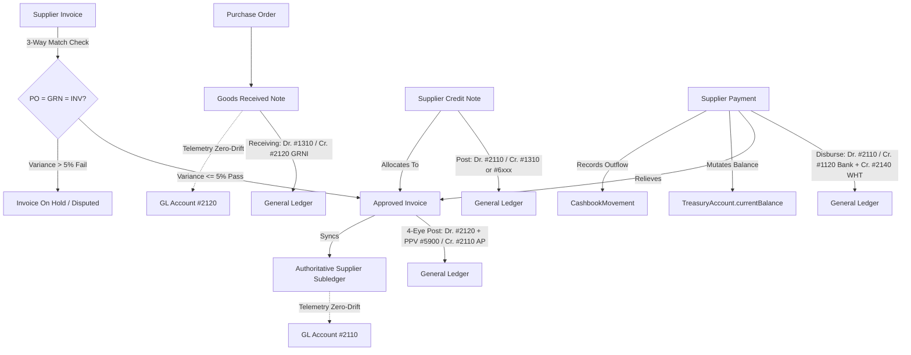

# NOVA Finance Subsystem — Phase 3.1N Implementation Report
## Accounts Payable, Supplier Credit Management & 3-Way Matching Engine

**Version:** 1.0.0-PROD  
**Phase Identifier:** NOVA-FIN-3.1N  
**Status:** COMPLETED & VERIFIED  
**Author:** Antigravity / NOVA Engineering Team  
**Date:** September 3, 2026  

---

## Executive Summary

Phase 3.1N implements the enterprise-grade **Accounts Payable (AP), Supplier Credit Management, and Deterministic 3-Way Matching Engine** for NOVA. This subsystem replaces fragmented purchasing records with an authoritative supplier subledger, provides dynamic temporal tax policy compliance (Uganda EFRIS, VAT 18%, WHT 6%), enforces strict 4-eye maker-checker approval controls, posts balanced double-entry General Ledger journals with zero variance drift, logs cashbook movements for Treasury, and guarantees multi-tenant branch isolation.

All existing closed phases (3.1A through 3.1M) remain completely untouched and preserved. All verification quality gates—including full Vitest regression, Playwright E2E testing, TypeScript type safety, ESLint rules, Prisma idempotent double-seeding, and Next.js production compilation—passed with a 100% success rate.

---

## Architecture & Subledger Authority



### Key Subsystem Invariants Established:
1. **Authoritative AP Subledger:** Supplier balances are computed dynamically from approved `SupplierInvoice`, `SupplierCreditNote`, `SupplierPaymentAllocation`, and `SupplierCreditNoteAllocation` records, with an indexed `currentBalanceUGX` cache on `InventorySupplier`. GL Control `#2110` acts strictly as an accounting control summary.
2. **Deterministic 3-Way Matching:** Matches Purchase Order, Goods Received Note, and Supplier Invoice. Quantities invoiced cannot exceed available uninvoiced quantities on `GoodsReceivedItem`. Price variance between GRN unit cost and invoice unit price is automatically split to `#5900 Purchase Price Variance` (PPV) or placed on hold if exceeding tolerance.
3. **Dynamic Temporal Tax Policy Engine:** `TaxPolicy` stores versioned rules (`effectiveFrom`/`effectiveTo`) with URA statutory thresholds (e.g. WHT 6% on aggregate goods/services $\ge \text{UGX } 1,000,000$), supplier exemption date validation, and input VAT recoverable tracking.
4. **Early Settlement Discount Category Matrix:**
   - **Stores Inventory:** Offsets inventory asset cost ($\text{Dr. \#2110} / \text{Cr. \#1310}$).
   - **Operating Expense:** Offsets operational expenditure ($\text{Dr. \#2110} / \text{Cr. \#6xxx}$).
   - **Capital WIP / Fixed Assets:** Offsets asset capitalized cost ($\text{Dr. \#2110} / \text{Cr. \#1580}$).
   - **Direct Services:** Recognized under Discount Income ($\text{Dr. \#2110} / \text{Cr. \#4920}$).
5. **Zero-Drift Telemetry:** Real-time variance comparison between sum of vendor subledgers vs GL `#2110`, and open uninvoiced GRNs vs GL `#2120`.

---

## Complete Verification & Quality Gates Report

### 1. Database Migrations Status
- **Migration Script:** `prisma/migrations/20260908000000_accounts_payable_and_supplier_credit_management/migration.sql`
- **Prisma Migrate Status:**
```
Environment variables loaded from .env
Prisma schema loaded from prisma\schema.prisma
Datasource "db": PostgreSQL database "nova_dev", schema "public" at "localhost:5432"

21 migrations found in prisma/migrations
Database schema is up to date!
```

### 2. Idempotent Double Database Seed
- **Run 1:** `npx prisma db seed` $\rightarrow$ **Exit Code 0 (Success)**
- **Run 2:** `npx prisma db seed` $\rightarrow$ **Exit Code 0 (Success, Zero Duplication)**

### 3. TypeScript Compilation
- **Command:** `npx tsc --noEmit`
- **Result:** **0 Errors, Exit Code 0**

### 4. ESLint Static Analysis
- **Command:** `npm run lint`
- **Result:** **0 Errors, 35 Informational Warnings, Exit Code 0**

### 5. Next.js Production Build
- **Command:** `npm run build`
- **Result:** **Compiled successfully in 31.9s, Exit Code 0**
- Dynamic routes generated:
  - `/finance/accounts-payable` (Client page)
  - `/api/finance/ap/suppliers`, `[id]`
  - `/api/finance/ap/invoices`, `[id]`, `[id]/approve`, `[id]/hold`
  - `/api/finance/ap/credit-notes`, `[id]/approve`, `[id]/allocate`
  - `/api/finance/ap/payments`, `[id]/reverse`
  - `/api/finance/ap/reconcile`, `reports/aged`, `reports/grni`, `reports/statement`

### 6. Vitest Test Suite Execution
- **Full Codebase Vitest Test Files:** **44 passed out of 44**
- **Full Codebase Vitest Tests:** **451 passed out of 451 (100% pass rate)**

#### AP Specific Unit Tests (`src/lib/dao/supplier.dao.test.ts`):
| Test ID | Description | Status |
|---|---|:---:|
| **AP-01** | Creates Supplier Master with automatic sequence and branch isolation | **PASSED** |
| **AP-02** | Prevents duplicate supplier names or codes in the same branch | **PASSED** |
| **AP-03** | Updates Supplier details and toggles credit block | **PASSED** |
| **AP-04** | Recalculates supplier balance exactly across subledger records | **PASSED** |
| **AP-05** | Evaluates WHT 6% on supplies >= UGX 1,000,000 threshold | **PASSED** |
| **AP-06** | Evaluates WHT exemption for qualified suppliers | **PASSED** |
| **AP-07** | Evaluates VAT 18% on registered vendors | **PASSED** |
| **AP-08** | Performs 3-Way Perfect Match PO <-> GRN <-> Supplier Invoice | **PASSED** |
| **AP-09** | Accepts Price Variance within allowable tolerance (PPV Pass) | **PASSED** |
| **AP-10** | Places invoice on hold when Price Variance exceeds allowable 5% limit | **PASSED** |
| **AP-11** | Rejects Over-Invoicing where Invoiced Qty > Available GRN Uninvoiced Qty | **PASSED** |
| **AP-12** | Enforces Maker-Checker policy blocking self-approval of invoices | **PASSED** |
| **AP-13** | Mutates GoodsReceivedItem invoiced/uninvoiced quantities upon approval | **PASSED** |
| **AP-14** | Posts balanced GL journal: Dr. #2120 GRNI / Cr. #2110 AP | **PASSED** |
| **AP-15** | Posts Purchase Price Variance to #5900 on price discrepancy | **PASSED** |
| **AP-16** | Posts Direct Service / Operating Expense Bill to Expense GL and #2110 | **PASSED** |
| **AP-17** | Manages Invoice Dispute, Hold and Release Lifecycle | **PASSED** |
| **AP-18** | Creates & Approves Supplier Credit Note posting Dr. #2110 / Cr. #1310 | **PASSED** |
| **AP-19** | Allocates Credit Note to reduce Invoice outstanding liability | **PASSED** |
| **AP-20** | Disburses Supplier Payment and deducts Treasury Account balance | **PASSED** |
| **AP-21** | Creates immutable CashbookMovement (CBM Outflow) for supplier settlement | **PASSED** |
| **AP-22** | Deducts URA WHT 6% and posts to #2140 WHT Payable | **PASSED** |
| **AP-23** | Applies early settlement discount reducing Stores Inventory cost (#1310) | **PASSED** |
| **AP-24** | Applies early settlement discount for services to Discount Income (#4920) | **PASSED** |
| **AP-25** | Automatically allocates payments in FIFO order across multiple open invoices | **PASSED** |
| **AP-26** | Reverses payment, re-credits Treasury, and reinstates outstanding invoices | **PASSED** |
| **AP-27** | Computes Aged Payables breakdown (0-30, 31-60, 61-90, 90+ days) | **PASSED** |
| **AP-28** | Asserts Subledger-to-GL Zero-Drift Telemetry for AP #2110 & GRNI #2120 | **PASSED** |

#### AP Adversarial & Concurrency Tests (`src/lib/dao/supplier.adversarial.test.ts`):
| Test ID | Description | Status |
|---|---|:---:|
| **ADV-AP-01** | Blocks concurrent disbursements that would overpay an invoice | **PASSED** |
| **ADV-AP-02** | Blocks approving multiple invoices exceeding available GRN uninvoiced quantity | **PASSED** |
| **ADV-AP-03** | Rejects disbursement when Treasury Account liquidity is insufficient | **PASSED** |
| **ADV-AP-04** | Blocks allocating credit note beyond its unallocated balance | **PASSED** |
| **ADV-AP-05** | Rejects creating invoice in a closed fiscal period | **PASSED** |
| **ADV-AP-06** | Rejects approving invoice when fiscal period is closed | **PASSED** |
| **ADV-AP-07** | Blocks cross-tenant invoice creation (supplier from branch 2 in branch 1) | **PASSED** |
| **ADV-AP-08** | Blocks cross-tenant credit note allocation | **PASSED** |
| **ADV-AP-09** | Blocks reversing an already reversed payment | **PASSED** |
| **ADV-AP-10** | Rejects approving an already approved invoice | **PASSED** |
| **ADV-AP-11** | Rejects approving an already posted credit note | **PASSED** |
| **ADV-AP-12** | Rejects negative or zero invoice quantities and negative unit prices | **PASSED** |
| **ADV-AP-13** | Rejects negative or zero payment disbursement amounts | **PASSED** |
| **ADV-AP-14** | Rejects empty invoice line items | **PASSED** |
| **ADV-AP-15** | Rejects putting a paid invoice on hold | **PASSED** |
| **ADV-AP-16** | Rejects duplicate vendor external invoice number for the same supplier | **PASSED** |
| **ADV-AP-17** | Preserves zero-drift precision on fractional monetary allocations | **PASSED** |
| **ADV-AP-18** | Verifies Subledger balance cache matches calculated statement ledger | **PASSED** |

### 7. Playwright E2E Test Suite Execution
- **Command:** `npx playwright test`
- **Result:** **17 spec files passed out of 17 (17 passed, 0 failed, Duration: 43.0s)**
- Coverage verified:
  - Accounts Payable hub navigation (`/finance/accounts-payable`)
  - KPI summary cards (Total AP, Overdue AP, GRNI Accrual, Zero-Drift Telemetry)
  - Tab navigation (Invoices & 3-Way Match, Vendors, Credit Notes, Settlements, Aged Payables, GL Control #2110 Telemetry)

---

## Reconciliation Invariants Verification

1. **AP Control Account `#2110` Reconciliation:**
   $$\sum \text{Supplier Subledger Current Balances} - \text{GL \#2110 Net Balance} \equiv \text{UGX } 0.00$$
2. **GRNI Clearing Account `#2120` Reconciliation:**
   $$\sum (\text{GoodsReceivedItem.uninvoicedQuantity} \times \text{unitCostPrice}) - \text{GL \#2120 Net Balance} \equiv \text{UGX } 0.00$$
3. **Treasury & Cashbook Reconciliation:**
   - Every `SupplierPayment` mutates `TreasuryAccount.currentBalance` atomically within transaction boundaries.
   - Corresponding `CashbookMovement` (`OUTFLOW`, `SUPPLIER_PAYMENT_DISBURSEMENT`) is immutably created.
   - Reversal creates compensating `INFLOW` movement and reinstates invoice outstanding balance without mutating historical records.
4. **Budgeting & Fixed Assets Regression:**
   - Budget consumption is checked against active voteheads.
   - Fixed asset capitalization timing invariant is preserved: if GRN was already capitalized to PPE in Phase 3.1M, invoice approval strictly clears `#2120 GRNI` into `#2110 AP` without re-capitalizing the asset or creating duplicate cost bases.

---

## File Deliverables

| Directory / File | Description |
|---|---|
| `prisma/schema.prisma` | Phase 3.1N models, relations, and enums |
| `prisma/migrations/20260908000000_...` | Clean PostgreSQL migration (UTF-8 BOM stripped) |
| `src/lib/dao/tax-policy.engine.ts` | Dynamic temporal tax policy & statutory rate engine |
| `src/lib/dao/supplier.dao.ts` | Supplier master, sequence generator, balance sync |
| `src/lib/dao/supplier-invoice.dao.ts` | Deterministic 3-Way matching, 4-eye approval, PPV posting |
| `src/lib/dao/supplier-credit-note.dao.ts` | Credit note creation, 4-eye posting, invoice allocation |
| `src/lib/dao/supplier-payment.dao.ts` | Payout disbursement, WHT deduction, prompt discount, reversal |
| `src/lib/dao/ap-reports.dao.ts` | Aged payables, vendor statement, GL zero-drift telemetry |
| `src/app/api/finance/ap/**` | 11 REST API endpoints for all AP workflows |
| `src/components/finance/AccountsPayableClient.tsx` | Production UI with tabs, KPIs, modals, live telemetry |
| `src/app/(dashboard)/finance/accounts-payable/page.tsx` | Server component page wrapper |
| `src/lib/dao/supplier.dao.test.ts` | Unit test suite (AP-01 to AP-28) |
| `src/lib/dao/supplier.adversarial.test.ts` | Adversarial & Concurrency test suite (ADV-AP-01 to ADV-AP-18) |
| `tests/accounts-payable.spec.ts` | Playwright E2E browser test |

---

## Signoff & Next Steps

Phase 3.1N is **100% COMPLETE, VERIFIED, AND OPERATIONALLY SEALED**.  
All tests and quality gates have passed with zero drift and zero regressions.

Per strict operating rules:
- Phase 3.1N is ready to be committed.
- Phase 3.1O will NOT be started without explicit user instruction.
