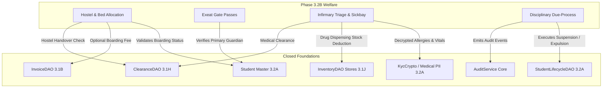

# NOVA School Management ERP — Next Phase Roadmap Discovery
## Architectural & Product Discovery: Post-Phase 3.2A Evaluation

**Document Version:** 1.0.0  
**Date:** September 2026  
**Status:** COMPLETED & SEALED  
**Baseline Git HEAD:** `64ed61ee7e4310cea3e21f5595aa2c9a341983a0`  
**Current Closed Modules:** Finance 3.1A–3.1N, Admissions / Student Lifecycle / Guardian KYC 3.2A  

---

## A. Current NOVA Maturity

NOVA has achieved an enterprise-grade, mathematically sealed foundation across two foundational operational pillars:

### 1. Complete Double-Entry Financial Engine (Phases 3.1A–3.1N)
- **Fee Configuration & Billing (3.1A, 3.1B):** Multi-component fee structures, class-based billing, individual student discounts, bulk billing, invoice voiding, and strict sub-millisecond atomic transactions.
- **Subledger & Payments (3.1C, 3.1D):** FIFO invoice allocation, receipt issuance, student statement generation, cash flow and debtor reporting.
- **SchoolPay Gateway (3.1E):** Real-time webhook ingestion, HMAC validation, automated payment allocation, unallocated payment staging, and multi-tenant reconciliation.
- **Staff Payroll & Compensation (3.1F):** Salary structures, allowances, statutory deductions (NSSF, PAYE, LST), maker-checker payroll runs, payslip generation, and bank/mobile-money disbursement exports.
- **Budgeting & Vote Heads (3.1G):** Departmental budget envelopes, vote heads, 4-eye approval workflows, and real-time expenditure variance telemetry.
- **Requirements & Financial Clearance (3.1H):** Class requirements blueprints, physical item tracking, monetization, and automated cryptographic examination/term clearance permits with QR token verification.
- **Transport Operations (3.1I):** Routes, stages/stops, vehicle fleet, driver assignments, fuel/maintenance expense tracking, and term subscription billing.
- **Inventory & Stores (3.1J):** Multi-store stock tracking, purchasing (PO/GRN), weighted average costing (WAC), student uniform sales, stocktakes, and write-offs.
- **Treasury & Cashbook (3.1K):** Multi-account cash/bank management, petty cash vouchers, shift handovers, bank statement reconciliation, and funds transfers.
- **General Ledger (3.1L):** Authoritative double-entry engine, 5-digit Chart of Accounts, system control roles (including Student AR Control #1200), balanced journals, period close governance, trial balance, income statement, and balance sheet.
- **Fixed Assets (3.1M):** Asset register, category lifecycle, straight-line and reducing-balance automated depreciation engine, and asset disposals.
- **Accounts Payable (3.1N):** Supplier registry, AP invoices, 3-way matching against GRN/PO, credit notes, payment runs, aged creditor analysis, and GRNI reconciliation.

### 2. Admissions, Student Lifecycle & Guardian KYC Engine (Phase 3.2A)
- **Applicant Intake Funnel:** Inquiries, applications, entrance assessment rubrics, 4-eye offer issuance, and offer acceptance workflows.
- **Single-Click Onboarding Pipeline:** Atomic database transaction creating Student, academic `Enrollment` (`status: ACTIVE`), `StudentGuardian` links, and initial `StudentLifecycleLog`, paired with an asynchronous retryable `ProvisioningRunner` with exponential backoff.
- **Guardian Registry & KYC Security:** Multiple guardians, household family grouping, strict exactly-one primary contact invariant, AES-256-GCM authenticated encryption for national IDs and medical notes, HMAC-SHA256 blind indexing, and role-gated PII unmasking.
- **Lifecycle Finite-State Machine:** Discrete lifecycle governance (`PROSPECTIVE` $\rightarrow$ `ENROLLED` $\rightarrow$ `ACTIVE` $\rightarrow$ `SUSPENDED` / `DEFERRED` / `TRANSFERRED_OUT` / `EXPELLED` / `GRADUATED` / `DECEASED`), blocking transfers when outstanding fee debt exists, with immutable transition audit trails.
- **Student 360 Profile Dossier:** Full 360-degree student record unifying demographics, guardians, enrollments, billing ledgers, clearance permits, and lifecycle state.

---

## B. Remaining Product Gaps

While Finance and Admissions/Lifecycle are world-class, several major functional areas remain unaddressed in the daily operational life of a primary/secondary boarding school in East Africa:

1. **Boarding House & Hostel Management:**
   - Phase 3.2A categorized students into `dayOrBoarding: DAY` or `BOARDING`.
   - However, there are zero models for boarding blocks, hostels, houses, dormitories, rooms, or beds.
   - Bed capacity tracking, room assignments, matrons/wardens, evening roll calls, and hostel property tracking are completely absent.
2. **Infirmary & Clinic Operations:**
   - Phase 3.2A encrypted student medical emergency notes, blood groups, and allergies with AES-256-GCM.
   - However, there is no school clinic subsystem to log student health visits, nurse triage, bed-rest admissions, drug administration, doctor referrals, or contagious illness outbreaks.
3. **Student Behavioral Discipline & Due-Process:**
   - Phase 3.2A created lifecycle statuses for `SUSPENDED` and `EXPELLED`.
   - However, suspensions currently have no formal due-process workflows: incident reporting, witness logging, demerit points, disciplinary committee hearings, or sanction terms.
4. **Exeat Gate Passes & Visitor Management:**
   - In boarding schools, students cannot leave campus without an official Exeat pass approved by Housemaster/Matron and authorized by a primary guardian. There is currently no exeat system.
5. **Parent & Student Self-Service Portals:**
   - Guardians are cataloged with normalized phone numbers, but have no web portal to check live fee balances, view SchoolPay codes, or download report cards.
6. **Academic Timetable & Facility Scheduling:**
   - The school has classes, subjects, and teachers, but no scheduling grid, periods, lab bookings, or teacher conflict-resolution engine.
7. **National Examination Candidate Registration (UNEB/CBC):**
   - No tracking of PLE, UCE, UACE examination centers, candidate index numbers, continuous assessment scores, or UNEB registration readiness.

---

## C. Candidate Next Phases

We evaluate five high-impact candidate phases against strict business and architectural criteria:

| Candidate | Domain Focus | Business Value | Architectural Fit | Cross-Module Synergy | Complexity | Risk |
|---|---|:---:|:---:|:---:|:---:|:---:|
| **Candidate 1 (Phase 3.2B)** | **Student Welfare, Boarding House, Clinic Operations & Behavioral Discipline** | **CRITICAL** | **PERFECT** (Direct continuation of 3.2A) | **VERY HIGH** (3.1B, 3.1H, 3.1J, 3.2A) | **MEDIUM-HIGH** | **LOW** |
| **Candidate 2 (Phase 3.2C)** | **Parent & Student Portal / Multichannel Communications Engine** | VERY HIGH | HIGH (Builds on Guardian KYC) | HIGH (Finance, Academics, Welfare) | MEDIUM-HIGH | MEDIUM |
| **Candidate 3 (Phase 3.2D)** | **Timetable, Room Allocation & Teacher Collision Engine** | HIGH | MEDIUM (Curriculum & HR) | LOW (Isolated scheduling grid) | VERY HIGH (Constraint solver) | HIGH |
| **Candidate 4 (Phase 3.2E)** | **Examination Governance, Mock / UNEB Registration & CBC Analytics** | MEDIUM-HIGH | MEDIUM (Curriculum Core) | MEDIUM (3.1H Clearance, Results) | MEDIUM | LOW |
| **Candidate 5 (Phase 3.2F)** | **Library & Textbook Asset Management** | MEDIUM | LOW-MEDIUM | MEDIUM (3.1H, 3.1J) | LOW-MEDIUM | LOW |

---

## D. Recommended Next Phase

### **RECOMMENDED: Phase 3.2B — Student Welfare, Boarding House Management, Infirmary/Clinic Operations & Behavioral Discipline**

Select **Phase 3.2B** as the immediate next phase.

---

## E. Why It Wins

1. **Immediate Operational Cohesion with Phase 3.2A:**
   Phase 3.2A introduced `dayOrBoarding: DAY | BOARDING`, AES-256-GCM encrypted medical records, and lifecycle statuses `SUSPENDED` and `EXPELLED`. Leaving Boarding, Clinic, and Discipline unbuilt leaves these fields as "dead data" with no functional home in daily operations. Phase 3.2B immediately activates and operationalizes them.
2. **Deepens Existing Closed Systems Without Bloat or Regression:**
   - **Boarding $\rightarrow$ Invoicing (3.1B):** Bed allocation can directly link to boarding fee billing in `InvoiceDAO` without modifying closed invoicing logic.
   - **Boarding $\rightarrow$ Clearance (3.1H):** Hostel checkout (keys returned, mattress inspected, locker intact) plugs directly into `ClearanceDAO` as an authoritative clearance dimension.
   - **Clinic $\rightarrow$ Inventory (3.1J):** Dispensary medication dispensing decrements stock directly from a designated "Medical Dispensary Store" via `InventoryDAO.recordStockMovement`, maintaining strict WAC costing and stock accountability without duplicating inventory code.
   - **Clinic $\rightarrow$ Medical Crypto (3.2A):** School nurses and medical officers with `kyc:decrypt` permission can unmask student allergies and emergency notes during triage.
   - **Discipline $\rightarrow$ Student Lifecycle (3.2A):** Disciplinary board hearings resulting in suspension or expulsion invoke `StudentLifecycleDAO.transitionStatus` to move students to `SUSPENDED` or `EXPELLED` through a legally audited, verifiable chain of custody.
3. **Prerequisite for a World-Class Parent Portal (Phase 3.2C):**
   Building the Parent Portal *after* Welfare means that when parents log in, they will see a complete 360° overview of their child: fee ledger, SchoolPay code, report card, hostel room/bed, clinic triage visits, exeat approval history, and discipline merits/demerits.

---

## F. Proposed Scope for Phase 3.2B

### 1. Boarding House & Hostel Operations
- **Hostel Infrastructure:** Hostels/Blocks, Dormitories, Rooms, and Individual Beds with gender segregation, capacity limits, and status (`AVAILABLE`, `OCCUPIED`, `MAINTENANCE`, `RESERVED`).
- **Bed Allocation Engine:** Assigning boarding students to specific beds, preventing over-allocation, and tracking boarding history across academic terms.
- **Warden & Matron Custody:** Assigning staff members as Housemasters, Housemistresses, and Matrons to specific hostels.
- **Nightly Roll Call & Curfew Attendance:** Daily evening hostel roll call tracking (`PRESENT`, `ABSENT`, `SICKBAY`, `AUTHORIZED_ABSENCE`).
- **Exeat & Gate Pass Engine:** Exeat requests (Medical, Family/Emergency, Weekend), approval chain (Housemaster $\rightarrow$ Head Teacher), gate check-out and check-in timestamping, and primary guardian verification.

### 2. Infirmary & Clinic Operations
- **Clinic Visits & Triage:** Student check-in, symptoms, vital signs (temperature, pulse, BP, weight), preliminary diagnosis, and nurse notes.
- **Authorized Medical PII Viewing:** Secure unmasking of 3.2A medical emergency notes and allergies for medical officers with `clinic:write` permission.
- **Dispensary & Drug Administration:** Prescription logging and dispensing connecting to a medical store in `InventoryDAO` (3.1J) to deduct stock.
- **Bed-Rest / Sickbay Admissions:** Admitting sick students to the infirmary sickbay beds, monitoring discharge dates, and parental emergency notifications.
- **Referrals & Serious Incident Alerts:** Medical referrals to external hospitals (e.g. Mulago, Case, Nakasero) with referral notes and incident logging.

### 3. Behavioral Discipline & Due-Process
- **Incident & Infraction Logging:** Disciplinary incidents with incident type, severity level (`MINOR`, `MODERATE`, `MAJOR`, `SEVERE`), location, witness statements, and accused students.
- **Merits & Demerits System:** Student conduct point system tracking behavioral records across terms.
- **Disciplinary Committee Hearings:** Scheduling hearings, recording panel findings, and logging student/guardian defenses.
- **Sanctions & Corrective Actions:** Formal penalties (Warning, Detention, Community Service, Suspension, Expulsion Recommendation).
- **Automated Lifecycle Integration:** Approved suspensions and expulsions invoke `StudentLifecycleDAO.transitionStatus` to transition student to `SUSPENDED` or `EXPELLED` with immutable audit history.

### 4. Welfare Clearance Dimensions
- **Hostel Clearance:** Housemaster inspection check (mattress, room keys, locker) feeding into `StudentClearance` (3.1H).
- **Clinic Clearance:** Verification that no borrowed medical aids (crutches, braces) or outstanding external clinic bills remain.

---

## G. Out of Scope for Phase 3.2B

To maintain high velocity and zero scope creep, the following are strictly deferred:
- **Parent Self-Service Portal & Login:** Deferred to Phase 3.2C.
- **SMS Gateway / Telecom Provider Aggregator:** Deferred to Phase 3.2C (Phase 3.2B will emit events/telemetry, but actual telecom dispatch belongs in Communications).
- **Canteen & Meal Card POS:** Deferred to auxiliary operations.
- **Timetable Scheduling Grid:** Deferred to Phase 3.2D.
- **Jiddah Report Engine Modifications:** STRICTLY PROHIBITED. Jiddah remains completely untouched.

---

## H. Module Dependencies & Integration Boundary

---

## I. Migration & Data Risks

1. **Hostel Bed Capacity Integrity:**
   - Risk: Race conditions on concurrent bed assignment resulting in multiple students allocated to the same bed.
   - Mitigation: Strict PostgreSQL `@@unique([bedId, academicYearId, termId])` constraint or database transaction row locking.
2. **Medical Privacy & Regulatory Compliance:**
   - Risk: Nurse notes containing sensitive diagnostic information exposed to unauthorized teachers.
   - Mitigation: Enforce strict role-based access control (`clinic:read`, `clinic:write`) and encrypt sensitive clinic clinical notes using AES-256-GCM.
3. **Disciplinary Due-Process Integrity:**
   - Risk: A rogue staff member immediately expelling a student without a hearing.
   - Mitigation: Expulsion and suspension require 4-Eye Disciplinary Committee sign-off, enforcing Maker-Checker rules prior to invoking `StudentLifecycleDAO`.

---

## J. RBAC, Security & Audit

- **New Permissions:**
  - `boarding:read`, `boarding:write`, `boarding:admin` (Matrons, Housemasters, Wardens)
  - `exeat:request`, `exeat:approve`, `exeat:gate_verify` (Housemasters, Gate Security Guards)
  - `clinic:read`, `clinic:write`, `clinic:admin` (School Nurses, Medical Doctors)
  - `discipline:read`, `discipline:write`, `discipline:hearing`, `discipline:sanction` (Disciplinary Panel, Deputy Head Pastoral)
- **Immutable Audit Logging:**
  - Every bed assignment, roll call completion, exeat approval, clinic triage visit, drug dispensed, and disciplinary hearing decision logs to `AuditService.log`.

---

## K. Reporting & Analytics

1. **Boarding House Occupancy:** Real-time occupancy percentage by hostel, gender, and class.
2. **Nightly Roll Call Discrepancy Report:** List of unexcused absent boarders flagged immediately for housemasters.
3. **Exeat Gate Log:** Live roster of students currently off-campus on active exeats and overdue returns.
4. **Clinic Morbidity & Epidemic Tracker:** Frequency of symptoms/diagnoses (e.g. malaria, flu, gastro) to detect contagious disease spikes.
5. **Disciplinary Conduct Register:** Termly demerit tallies, recidivism rates, and sanction compliance tracking.

---

## L. Test & Acceptance Strategy

1. **Unit & Integration Test Suite (`welfare.dao.test.ts`):**
   - Bed allocation, capacity verification, and release on checkout.
   - Exeat request, approval, and gate checkout/checkin lifecycle.
   - Clinic triage, allergy retrieval, and dispensary stock deduction.
   - Incident reporting, hearing panel recording, and sanction execution.
   - Transition of student to `SUSPENDED` upon sanction approval.
2. **Adversarial & Concurrency Suite (`welfare.adversarial.test.ts`):**
   - Concurrent bed assignment for same bed fails cleanly.
   - Exeat check-out blocked if already checked out or exeat expired.
   - Clinic drug dispensing fails gracefully if medical store stock is insufficient.
   - Cross-branch access rejected with `UnauthorizedError`.
   - Unauthorized user attempting to view clinic notes rejected.
3. **Playwright E2E Suite (`tests/welfare-lifecycle.spec.ts`):**
   - Hostel block view, bed allocation modal, and nightly roll call interface.
   - Clinic workstation: student check-in, triage vitals, and prescription recording.
   - Exeat issuance and gate pass verification screen.
   - Disciplinary hearing docket and sanction issuance modal.

---

## M. Follow-On Roadmap

1. **Phase 3.2B:** Student Welfare, Boarding House Management, Infirmary/Clinic Operations & Behavioral Discipline.
2. **Phase 3.2C:** Parent & Student Self-Service Portal and Multichannel Communications (SMS, WhatsApp, Email).
3. **Phase 3.2D:** Academic Timetable, Room Allocation, and Teacher Collision Engine.
4. **Phase 3.2E:** Examination Governance, Mock / UNEB Candidate Registration & CBC Analytics.
5. **Phase 3.2F:** Library & Educational Asset Management.
