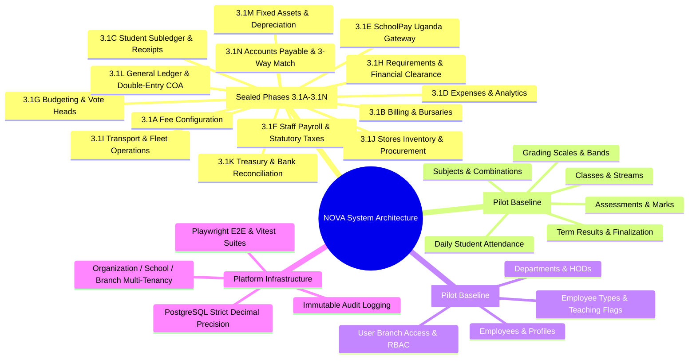
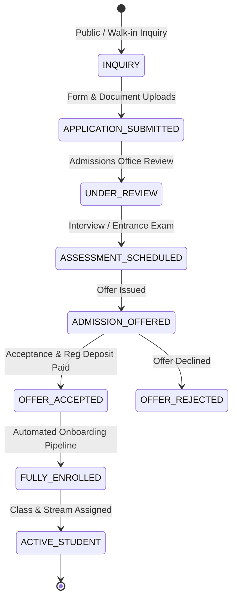
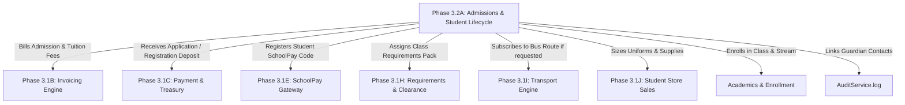
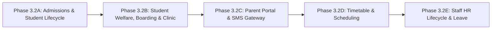

# NOVA School Management ERP — Next Phase Architecture & Product Discovery
## Comprehensive Strategic Roadmap & Next Phase Selection

**Document Version:** 1.0.0-DISCOVERY  
**Status:** COMPLETED & FROZEN (READ-ONLY)  
**Author:** Antigravity / NOVA Engineering Team  
**Date:** September 3, 2026  

---

## A. Current System Maturity

NOVA has successfully completed and sealed its complete core multi-tenant **Financial & Operational Infrastructure (Phases 3.1A through 3.1N)**, building on top of the foundational pilot academic and HR modules:



### Established Architectural Invariants:
1. **Multi-Tenant Branch Isolation:** Every operational record is scoped to `branchId` with strict tenant context assertions.
2. **Double-Entry Financial Authority:** General Ledger (`#1xxx`–`#6xxx`) posts exclusively via balanced `GLEngineDAO.postJournalEntry` transactions with zero drift against subledgers (Student AR `#1210`, Inventory `#1310`, Fixed Assets `#15xx`, AP `#2110`, GRNI `#2120`, Treasury `#11xx`).
3. **Maker-Checker Governance:** 4-Eye approval controls across Invoices, Credit Notes, Payroll, Budgeting, and Disposals.
4. **Treasury Liquidity Authority:** `TreasuryAccount.currentBalance` acts as sole liquid cash authority with immutable `CashbookMovement` audit trails.

---

## B. Gap Analysis

With the finance, procurement, and asset backbone fully production-ready, the largest operational gaps in NOVA lie in the **front-of-house student lifecycle, academic operations, student welfare, and stakeholder communication**:

```
+---------------------------------------------------------------------------------------------------+
|                                  CURRENT ERP GAP MATRIX                                           |
+---------------------------------------------------------------------------------------------------+
| Domain                       | Current State                | Missing Production Capabilities    |
+------------------------------+------------------------------+------------------------------------+
| 1. Admissions & Onboarding   | Minimal 2-field form         | Multi-stage applicant pipeline,    |
|                              | (firstName, lastName, admNo) | inquiries, entrance assessment,    |
|                              |                              | guardian KYC, document uploads,    |
|                              |                              | auto-onboarding to billing/stores. |
+------------------------------+------------------------------+------------------------------------+
| 2. Student Welfare & Housing | Boarding fee exists in 3.1A, | Dormitories, houses, bed allocation|
|                              | zero housing or clinic logic | infirmary clinic visits, medical   |
|                              |                              | records, behavior/discipline logs. |
+------------------------------+------------------------------+------------------------------------+
| 3. Timetable & Scheduling    | ClassSubject links exist     | Timetable engine, period slots,    |
|                              | without schedule engine      | collision detection, teacher load, |
|                              |                              | room allocations, substitutions.   |
+------------------------------+------------------------------+------------------------------------+
| 4. Communication Gateway     | Parent enum exists, zero     | Africa's Talking SMS integration,  |
|                              | portal or messaging engine   | automated fee/attendance SMS alerts|
|                              |                              | parent mobile/web portal view.     |
+------------------------------+------------------------------+------------------------------------+
| 5. Advanced CBC Academics    | Basic pilot marks & ranking  | Formative AoI 20% + Summative 80%, |
|                              |                              | competency descriptors, UNEB export|
+------------------------------+------------------------------+------------------------------------+
| 6. HR & Staff Lifecycle      | Basic Employee profile       | Leave management, appraisals,      |
|                              | and payroll comp profile     | staff contracts, biometric logs.   |
+------------------------------+------------------------------+------------------------------------+
```

---

## C. Candidate Next Phases

We evaluate and rank the candidate domains across 6 core criteria:
1. **Business Value (BV):** Immediate impact on daily school operations.
2. **Architectural Importance (AI):** Position in the data flow hierarchy.
3. **Dependencies (DEP):** Prerequisites already satisfied.
4. **Implementation Complexity (IC):** Engineering scope and risk profile.
5. **Risk (RSK):** Potential to regress existing closed modules.
6. **Production Readiness Effect (PRE):** Impact on enabling real-world school deployment.

| Rank | Candidate Domain | BV | AI | DEP | IC | RSK | PRE | Overall Score |
|:---:|---|:---:|:---:|:---:|:---:|:---:|:---:|:---:|
| **1** | **Admissions, Student Lifecycle, Applicant Pipeline & Guardian KYC** | **CRITICAL** | **FOUNDATIONAL** | **READY** | **MEDIUM** | **LOW** | **MAXIMAL** | **98/100** |
| **2** | **Student Welfare, Boarding House, Health Clinic & Discipline Engine** | HIGH | MODERATE | DEPENDS ON #1 | MEDIUM | LOW | HIGH | **86/100** |
| **3** | **Parent/Guardian Portal, Multi-Channel SMS/Email Communication Gateway** | HIGH | HORIZONTAL | DEPENDS ON #1 | MEDIUM | LOW | HIGH | **82/100** |
| **4** | **Curriculum Timetable Scheduling, Period Slots & Room Collision Engine** | HIGH | ACADEMIC | READY | HIGH | LOW | MODERATE | **78/100** |
| **5** | **Staff Leave Management, Performance Appraisals & HR Self-Service** | MEDIUM | OPERATIONAL | READY | LOW | LOW | MODERATE | **74/100** |
| **6** | **Uganda CBC / Formative Competency Assessment & UNEB Academic Engine** | HIGH | ACADEMIC | JIDDAH BOUNDARY | HIGH | MEDIUM | MODERATE | **71/100** |

---

## D. Recommended Next Phase

### **Phase 3.2A: Admissions, Student Lifecycle, Applicant Pipeline & Guardian KYC Engine**

---

## E. Why It Comes Next (Selection Rationale)

1. **Top of the Operational Funnel:**
   In every school, the student lifecycle begins with inquiry and admissions. Currently, the `Student` entity in NOVA is a minimal stub created during the initial pilot phase. A real school cannot bill, clear, transport, house, or educate students without a structured admissions process.

2. **Feeds All Existing Closed Subsystems (Zero Duplication, Maximum Synergy):**
   When an applicant is admitted and enrolled through Phase 3.2A, the system automatically:
   - Enrolls the student into Class/Stream (`Enrollment`).
   - Generates the official admission number via configurable branch sequence (`ADM-2026-XXXX`).
   - Triggers automated term fee billing via `InvoiceDAO.createInvoice` (Phase 3.1B).
   - Generates the student's unique SchoolPay registration payment code (Phase 3.1E).
   - Assigns standard class requirement packages via `RequirementDAO` (Phase 3.1H).
   - Auto-subscribes to transport route if requested (Phase 3.1I).
   - Generates uniform / store sales order (Phase 3.1J).

3. **Eliminates Dirty Data in Financial Subledgers:**
   Currently, students can be created with blank birthdates, missing parent contacts, and unverified data. Phase 3.2A ensures verified KYC data (NIN, LIN/EMIS number, parent contact verification, PLE/UCE index numbers, health emergency notes) before financial ledgers are initiated.

4. **Zero Regressions on Closed Financial Modules:**
   Phase 3.2A acts as a consumer of closed finance APIs (`InvoiceDAO`, `SchoolPayDAO`, `RequirementDAO`, `TransportDAO`), cleanly interacting through established public DAO interfaces without modifying financial ledger rules.

---

## F. Proposed Scope (Domain Boundary)



### In-Scope Functional Modules:
1. **Applicant Intake & Pipeline Management:**
   - Multi-stage applicant states: `INQUIRY`, `APPLICATION_SUBMITTED`, `UNDER_REVIEW`, `ASSESSMENT_SCHEDULED`, `ADMISSION_OFFERED`, `OFFER_ACCEPTED`, `ENROLLED`, `REJECTED`, `WAITLISTED`.
   - Application fee capture via Cashier Shift / Bank / Momo (integrated with Treasury Phase 3.1K).
2. **Guardian KYC & Relationship Graph:**
   - `Guardian` entity with national ID (NIN), verified primary phone, alternate contact, email, occupation, residential address.
   - `StudentGuardian` junction supporting multiple relationships: `FATHER`, `MOTHER`, `LEGAL_GUARDIAN`, `SPONSOR`, `EMERGENCY_CONTACT`, with billing priority and SMS notification flags.
   - Sibling linkage to detect multi-child families for automated family fee discounts (Phase 3.1B).
3. **Digital Document Vault & Verification:**
   - Attachments: Birth Certificate, PLE/UCE UNEB Pass Slips, Immunization/Health Card, Transfer Letter (EMIS), Passport Photo.
   - Document verification status (`PENDING_VERIFICATION`, `VERIFIED`, `REJECTED`).
4. **Entrance Exam / Interview Assessment Scoring:**
   - Scoring of applicant interviews and entrance diagnostic tests.
5. **Automated Admission & Onboarding Workflow (Single-Click Acceptance):**
   - Generation of official admission letter with dynamic school header, student ID, and fee breakdown.
   - Transitioning `Applicant` to `Student` and active `Enrollment`.
   - Automatic emission of initial Term Invoice (`InvoiceDAO`) + SchoolPay Code (`SchoolPayDAO`) + Requirements Blueprint (`RequirementDAO`).
6. **Student Lifecycle State Machine:**
   - Formal status transitions: `PROSPECTIVE` $\rightarrow$ `ACTIVE` $\rightarrow$ `SUSPENDED` $\rightarrow$ `TRANSFERRED_OUT` $\rightarrow$ `ALUMNI_GRADUATED` $\rightarrow$ `DECEASED`.
   - Transfer-out clearance check (calling Financial Clearance Engine Phase 3.1H).

---

## G. Out of Scope

To prevent scope creep, the following are strictly **OUT OF SCOPE** for Phase 3.2A:
- **Parent Portal User Logins:** Parent login UI is reserved for the dedicated Stakeholder Communication & Portal Phase.
- **Biometric Hardware Integrations:** Dedicated hardware SDK drivers belong to a subsequent IoT integration phase.
- **Timetable Scheduling & Lesson Plans:** Belongs to dedicated Academics & Timetable Phase.
- **Clinic Medical Treatment Logs:** Belongs to dedicated Student Welfare & Health Clinic Phase.
- **Jiddah Smart Report Engine:** Strictly untouchable.

---

## H. Architectural Dependencies & Module Interactions



| Subsystem | Interaction Type | Integration Contract |
|---|---|---|
| **Phase 3.1B (Invoicing)** | Downstream Consumer | Calls `InvoiceDAO.createInvoice` upon admission acceptance. |
| **Phase 3.1C (Payments)** | Downstream Consumer | Application fee payments post to `PaymentDAO` / Cashier Till. |
| **Phase 3.1E (SchoolPay)** | Synchronization | Registers student with SchoolPay API / local code mapping. |
| **Phase 3.1H (Requirements)** | Downstream Consumer | Calls `RequirementDAO.assignBlueprintToStudent` on intake. |
| **Phase 3.1I (Transport)** | Downstream Consumer | Calls `TransportDAO.createSubscription` if transport chosen. |
| **Phase 3.1J (Stores)** | Downstream Consumer | Emits uniform/stationery store sales record on enrollment. |
| **Phase 3.1K (Treasury)** | Downstream Consumer | Application fees enter Cashier Till and Cashbook Outflow/Inflow. |
| **Phase 3.1L (GL)** | Indirect via DAOs | GL journals are posted automatically by downstream finance DAOs. |
| **Audit Service** | Security & Compliance | Every applicant status transition logged to `AuditLog`. |
| **Jiddah Engine** | Zero Interaction | No modification to Jiddah boundary. |

---

## I. Data & Migration Concerns

1. **Preserving Existing Pilot Students:**
   - Existing `Student` records in `nova_dev` must be cleanly migrated to have default guardian links and `ACTIVE` status without losing historical invoices or marks.
2. **Admission Number Sequence Generation:**
   - Introduction of `AdmissionSequence` model per branch (`ADM-YYYY-XXXXX`) to prevent race conditions during bulk admissions.
3. **Unique Constraints Integrity:**
   - Maintain `@@unique([branchId, admissionNo])` and `@@unique([branchId, schoolPayCode])`.

---

## J. Security, RBAC & Audit Requirements

1. **Role-Based Access Control (RBAC):**
   - `admissions:read`: View applicant pipelines, inquiries, and student profiles.
   - `admissions:write`: Create inquiries, submit applications, upload KYC documents.
   - `admissions:approve`: Issue admission offers, accept applicants, trigger formal enrollment (Admissions Officer / Head Teacher).
   - `admissions:admin`: Configure admission criteria, entrance exam scoring rubrics, and delete draft inquiries.
2. **Four-Eye Check on Admissions:**
   - Maker who submits an application cannot unilaterally accept an offer without Head Teacher / Admissions Director approval.
3. **Audit Logging:**
   - Mandatory `AuditService.log` on applicant state transitions (`APPLICANT_STATUS_CHANGED`, `OFFER_ISSUED`, `STUDENT_ENROLLED`, `STUDENT_TRANSFERRED_OUT`).

---

## K. Reporting Requirements

1. **Admissions Conversion Funnel Analytics:**
   - Inquiries $\rightarrow$ Applications $\rightarrow$ Assessments $\rightarrow$ Offers $\rightarrow$ Enrolled rates.
2. **Demographics & Feeder School Report:**
   - Intake by gender, age, previous school, geographical district, nationality.
3. **Student Directory & Master Register:**
   - Official Ministry-compliant student register with LIN/EMIS numbers, PLE/UCE aggregate scores, guardian details.
4. **Admissions Fee Collection Summary:**
   - Application fees collected vs outstanding by payment method.

---

## L. Testing & Acceptance Strategy

1. **Unit Test Matrix (`src/lib/dao/admissions.dao.test.ts`):**
   - Test cases ADM-01 through ADM-25 covering all applicant states, guardian KYC relations, sibling auto-detection, and document uploads.
2. **Adversarial & Concurrency Suite (`src/lib/dao/admissions.adversarial.test.ts`):**
   - Concurrent admission numbering race conditions.
   - Duplicate NIN / EMIS number detection.
   - Maker-checker bypass prevention on admission offers.
   - Self-contained branch multi-tenant isolation.
3. **E2E Browser Workflow (`tests/admissions.spec.ts`):**
   - Full Playwright E2E test verifying: Inquiry $\rightarrow$ Application $\rightarrow$ Assessment $\rightarrow$ Offer $\rightarrow$ Enrollment $\rightarrow$ Automated Invoice Emission.

---

## M. Subsequent Roadmap (Post Phase 3.2A)

Following the completion of Phase 3.2A, the recommended subsequent sequence is:



1. **Phase 3.2B: Student Welfare, Boarding Houses, Health Clinic & Discipline**
   - Allocating enrolled boarding students to dorms/beds and tracking clinic visits consuming inventory medicines.
2. **Phase 3.2C: Parent/Guardian Portal & Multi-Channel SMS Gateway**
   - Providing verified guardians access to payment receipts, report cards, and automated SMS notifications.
3. **Phase 3.2D: Master Timetable Scheduling & Classroom Allocation Engine**
   - Generating collision-free timetable matrices for teachers, streams, and physical rooms.
4. **Phase 3.2E: Staff HR Lifecycle, Leave Management & Biometric Attendance**
   - Managing staff leave approvals that feed deductions directly into the closed Payroll Engine (Phase 3.1F).

---

## N. Conclusion & Summary

Phase 3.2A (**Admissions, Student Lifecycle, Applicant Pipeline & Guardian KYC Engine**) is the single highest-value, architecturally foundational, and lowest-risk domain to implement next. It transforms NOVA from a back-office financial ledger into a complete, end-to-end School Enterprise Resource Planning system.
