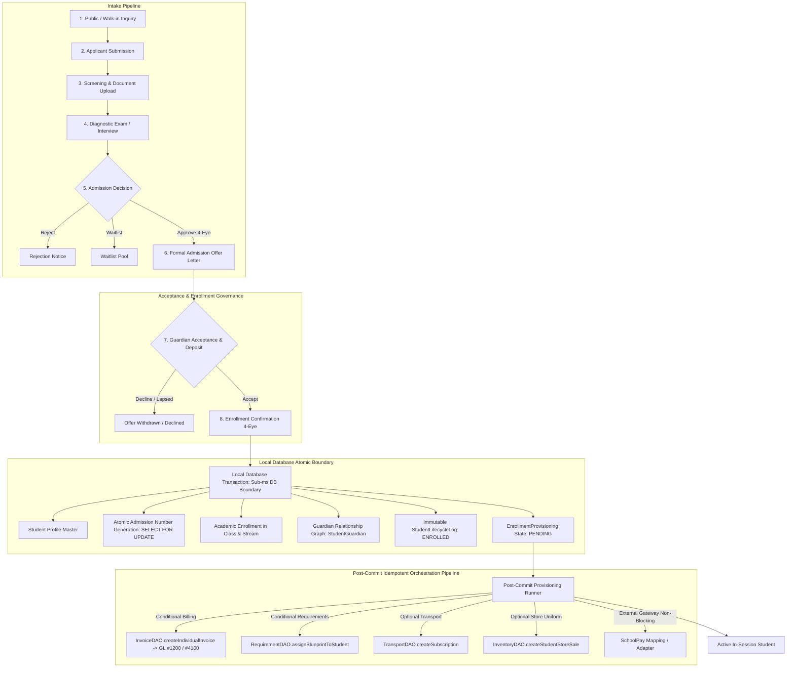
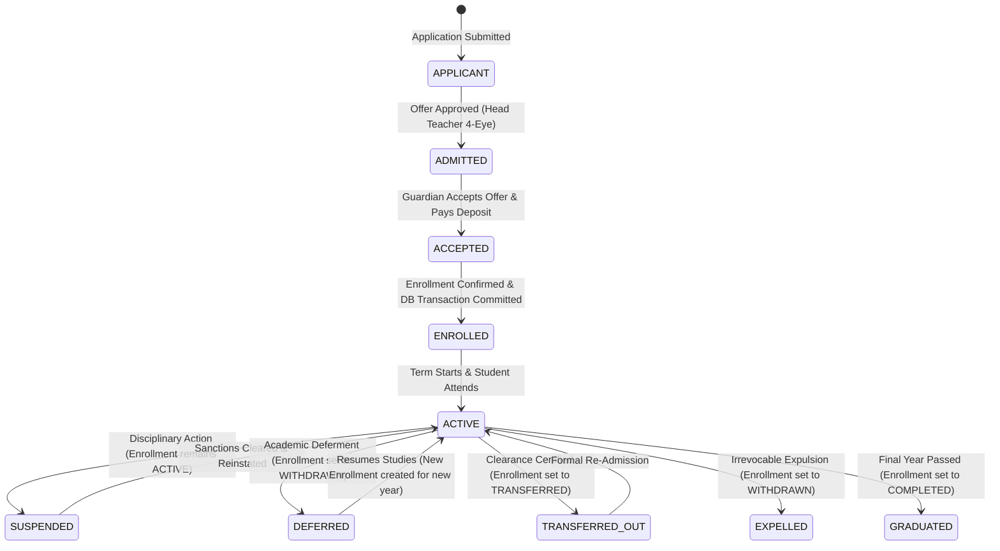

# NOVA — Phase 3.2A Architecture & Technical Design Document (Final Architecture Gate)
## Admissions, Student Lifecycle, Applicant Pipeline & Guardian KYC Engine

**Document Version:** 3.0.0-SEALED-DESIGN  
**Phase Identifier:** NOVA-CORE-3.2A  
**Status:** APPROVED ARCHITECTURE DESIGN (CORRECTIONS COMPLETE)  
**Author:** Antigravity / NOVA Engineering Team  
**Date:** September 3, 2026  

---

## 1. Executive Summary & Architectural Scope

Phase 3.2A establishes the enterprise-grade **Admissions, Student Lifecycle, Applicant Intake Pipeline, and Guardian KYC Network** for the NOVA School Management ERP. 

Having sealed the entire Financial, Treasury, Inventory, Fixed Asset, and General Ledger Subsystems (Phases 3.1A through 3.1N), Phase 3.2A defines the operational front-of-house domain. It governs how prospective students enter the school pipeline, undergo entrance evaluations, receive formal admission offers, clear KYC identity checks, transition into authoritative academic enrollments, link to multi-guardian family graphs, and progress through verified lifecycle states.



---

## 2. Authoritative Source-of-Truth Matrix

The following matrix establishes strict, unambiguous operational authority across all related domains:

| Domain Entity | Authoritative Model / DAO | Lifecycle Owner | Integration Boundary | Immutable History |
|---|---|---|---|---|
| **Applicant** | `Applicant` / `ApplicantDAO` | Admissions Office | Pre-admission intake pipeline | Status change audit log |
| **Admission Offer** | `Applicant` (`ADMISSION_OFFERED`) | Head Teacher / Principal | Formal Offer Letter generation | Signed offer decision snapshot |
| **Guardian Identity** | `Guardian` / `GuardianDAO` | Admissions & Registrar | Blind-indexed NIN / KYC check | Verified KYC audit history |
| **Student-Guardian Link** | `StudentGuardian` / `GuardianDAO` | Registrar Office | Contact & Emergency routing | Multi-guardian temporal links |
| **Student Profile** | `Student` / `StudentDAO` | Registrar Office | MoES EMIS / LIN / Demographics | `StudentLifecycleLog` (All transitions) |
| **Academic Enrollment** | `Enrollment` / `EnrollmentDAO` (Academic Core) | Director of Studies | Academic placement (Class/Stream/Year) | Historical term results & subject links |
| **Enrollment Provisioning** | `EnrollmentProvisioning` / `ProvisioningRunner` | System Orchestrator | Post-commit orchestration & retry | Downstream task error/retry logs |
| **Student Fee Receivable (AR)** | `Invoice` / `InvoiceDAO` (Phase 3.1B) | Bursar Office | **GL Control Account #1200 (`AR_STUDENT_CONTROL`)** | Posted `JournalEntry` (Immutable) |
| **SchoolPay Transactions** | `SchoolPayTransaction` / `SchoolPayDAO` (Phase 3.1E) | SchoolPay Gateway | Inbound Webhooks & `Student.schoolPayCode` | Inbound payload audit logs |
| **Class Requirements** | `StudentRequirementRecord` / `RequirementDAO` (Phase 3.1H) | Store Custodian | Class Requirement Blueprint | Physical handover logs |
| **Transport Fleet** | `StudentTransportSubscription` / `TransportDAO` (Phase 3.1I) | Fleet Manager | Transport Subsystem | Vehicle route assignment logs |
| **Store Sales** | `StudentStoreSale` / `InventoryDAO` (Phase 3.1J) | Store Manager | Stores Inventory Subsystem | Stock movement logs |

---

## 3. Student Lifecycle vs. Academic Enrollment

### 3.1 Clear Separation of Responsibilities
To eliminate domain confusion, NOVA strictly separates **Student Operational Lifecycle** from **Academic Enrollment**:

1. **Student Lifecycle (`StudentLifecycleStatus`):**
   Governs the institutional and legal standing of the student across their entire tenure at the institution.
   - States: `APPLICANT` $\rightarrow$ `ADMITTED` $\rightarrow$ `ACCEPTED` $\rightarrow$ `ENROLLED` $\rightarrow$ `ACTIVE` $\rightarrow$ `SUSPENDED` / `DEFERRED` / `TRANSFERRED_OUT` / `EXPELLED` / `GRADUATED` / `DECEASED`.
   - Authority: `StudentDAO` and `StudentLifecycleLog`.
2. **Academic Enrollment (`EnrollmentStatus`):**
   Governs academic placement into a specific `Class` and `Stream` for a specific `AcademicYear`.
   - States: `ACTIVE`, `TRANSFERRED`, `COMPLETED`, `WITHDRAWN`.
   - Authority: Existing Academic Core `Enrollment` model (`prisma/schema.prisma` lines 460–488), accessed via `EnrollmentDAO`.
   - Invariant: `@@unique([studentId, academicYearId])` guarantees exactly one enrollment per academic year.



### 3.2 State Transition Matrix & Impact on Academic Enrollment:

| Student Lifecycle State | Trigger / Event | Required RBAC Permission | Impact on Existing Academic `Enrollment` | Reversible? | Effective Date Rule |
|---|---|---|---|:---:|---|
| `APPLICANT` | Application Submitted | `admissions:write` | **None** (No enrollment exists) | N/A | Submission date |
| `ADMITTED` | Admission Offer Issued | `admissions:approve` | **None** (Candidate not yet enrolled) | Yes | Offer date |
| `ACCEPTED` | Deposit / Acceptance Received | `admissions:write` | **None** (Pre-enrollment state) | Yes | Acceptance date |
| `ENROLLED` | Enrollment Confirmation | `admissions:enroll` | **Creates `Enrollment`** with `status: ACTIVE` in target Class/Stream | No | Term start date |
| `ACTIVE` | Term Induction / Attendance | `students:write` | `Enrollment.status` remains `ACTIVE` | No | Term start date |
| `SUSPENDED` | Disciplinary Suspension | `students:lifecycle` | `Enrollment.status` remains `ACTIVE` (Student remains enrolled, suspended from campus) | Yes | Suspension date |
| `DEFERRED` | Academic Deferment Approved | `students:lifecycle` | Updates active `Enrollment.status` to `WITHDRAWN` (`endedAt = now()`) | Yes | Deferment date |
| `TRANSFERRED_OUT`| Transfer Clearance Certified | `students:lifecycle` | Updates active `Enrollment.status` to `TRANSFERRED` (`endedAt = now()`) | Yes (Re-admit) | Transfer date |
| `EXPELLED` | Board Expulsion Order | `students:lifecycle` | Updates active `Enrollment.status` to `WITHDRAWN` (`endedAt = now()`) | No | Expulsion date |
| `GRADUATED` | Final Year Completed | `students:lifecycle` | Updates active `Enrollment.status` to `COMPLETED` (`endedAt = now()`) | No | Graduation date |

---

## 4. Local Database Atomic Boundary vs. Post-Commit Orchestration

### 4.1 Synchronous Local Database Transaction (Sub-Millisecond DB Boundary)
The enrollment confirmation must **never** block on external network I/O, external APIs, or complex cascading billing rules. The local database transaction strictly executes:

1. **Student Master Creation / Update:** Inserts `Student` row with demographics, nationality, blind-indexed NIN, and medical emergency notes.
2. **Atomic Admission Number Generation:** Locks `AdmissionSequence` (`SELECT ... FOR UPDATE`), increments `lastValue`, and formats `ADM-{YYYY}-{00001}` without collision risk.
3. **Academic Enrollment Placement:** Inserts `Enrollment` row in target `Class` and `Stream` for active `AcademicYear` with `status: ACTIVE`.
4. **Guardian Relationship Linking:** Creates `StudentGuardian` junction rows with roles (`isPrimaryContact`, `isFinancialSponsor`, `hasPickupAuthorization`).
5. **Lifecycle Log:** Inserts `StudentLifecycleLog` row (`fromStatus: ACCEPTED`, `toStatus: ENROLLED`).
6. **Enrollment Provisioning Record:** Inserts `EnrollmentProvisioning` row with `overallStatus: PENDING`.

### 4.2 Post-Commit Orchestration & Provisioning Runner
Immediately after the local transaction commits, the `ProvisioningRunner` executes the downstream tasks within individual `try/catch` boundaries. If any step fails, the core `Student` and `Enrollment` **remain 100% valid and committed**.

```prisma
enum ProvisioningTaskStatus {
  PENDING
  SKIPPED
  COMPLETED
  FAILED_RETRYABLE
  FAILED_FATAL
}

model EnrollmentProvisioning {
  id                  String                 @id @default(cuid())
  branchId            String
  studentId           String
  enrollmentId        String                 @unique
  overallStatus       ProvisioningTaskStatus @default(PENDING)
  
  // Downstream task tracking
  billingStatus       ProvisioningTaskStatus @default(PENDING)
  billingInvoiceId    String?
  billingError        String?
  
  requirementsStatus  ProvisioningTaskStatus @default(PENDING)
  requirementsError   String?
  
  transportStatus     ProvisioningTaskStatus @default(PENDING)
  transportError      String?
  
  storeOrderStatus    ProvisioningTaskStatus @default(PENDING)
  storeOrderError     String?
  
  schoolPayStatus     ProvisioningTaskStatus @default(PENDING)
  schoolPayError      String?
  
  retryCount          Int                    @default(0)
  maxRetries          Int                    @default(5)
  nextRetryAt         DateTime?
  lastAttemptAt       DateTime?
  
  createdAt           DateTime               @default(now())
  updatedAt           DateTime               @updatedAt
  
  @@index([branchId, overallStatus])
  @@index([nextRetryAt])
}
```

### 4.3 Implementation-Safe Provisioning Architecture (No Imaginary Queues)
Because NOVA operates as a Next.js / PostgreSQL architecture without Redis or BullMQ:
1. **Direct Synchronous Execution:** The `ProvisioningRunner.run(ctx, provisioningId)` executes post-commit in the API route handler.
2. **Durable State Persistence:** Each step updates `EnrollmentProvisioning` immediately upon completion or failure.
3. **Administrative Retry Endpoint:** `POST /api/admissions/enrollments/[id]/retry-provisioning` allows the bursar/registrar to re-trigger failed downstream provisioning with updated parameters.
4. **Periodic Retry Worker:** A Next.js route `/api/cron/admissions-retry` (triggered by standard OS cron or platform timer) queries `WHERE overallStatus = 'FAILED_RETRYABLE' AND nextRetryAt <= NOW()` with exponential backoff ($2\text{m}, 10\text{m}, 30\text{m}, 2\text{h}, 6\text{h}$).

---

## 5. Authoritative Chart of Accounts & Financial Trigger Accounting

NOVA's General Ledger is strictly governed by the closed Phase 3.1L Chart of Accounts (`STANDARD_COA_TEMPLATE` in `src/lib/dao/gl-defaults.ts`). Admissions **never** invents new accounts or secondary AR authorities.

```
+---------------------------------------------------------------------------------------------------+
| AUTHORITATIVE GL ACCOUNT MAPPING FOR ADMISSIONS & ENROLLMENT                                      |
+---------------------------------------------------------------------------------------------------+
| ACCOUNT CODE | ACCOUNT NAME                           | CONTROL ROLE             | NORMAL BALANCE |
+--------------+----------------------------------------+--------------------------+----------------+
| #1200        | Accounts Receivable - Student Fees     | AR_STUDENT_CONTROL       | DEBIT          |
|              | (The SOLE authoritative Student AR)    |                          |                |
+--------------+----------------------------------------+--------------------------+----------------+
| #1210        | Staff Salary Advances Receivable       | None (Staff only, NOT AR)| DEBIT          |
+--------------+----------------------------------------+--------------------------+----------------+
| #1110        | Cashier Till Drawers                   | None (Liquid till cash)  | DEBIT          |
+--------------+----------------------------------------+--------------------------+----------------+
| #1120        | Commercial Bank Accounts               | CASH_BANK_CONTROL        | DEBIT          |
+--------------+----------------------------------------+--------------------------+----------------+
| #1130        | Mobile Money Merchant Float            | None (MoMo collections)  | DEBIT          |
+--------------+----------------------------------------+--------------------------+----------------+
| #2310        | Student Prepaid Fees & Advances        | AR_PREPAID_ADVANCES      | CREDIT         |
|              | (Unallocated deposits / registration)  |                          |                |
+--------------+----------------------------------------+--------------------------+----------------+
| #4100        | Tuition Fee Revenues                   | None (Operating revenue) | CREDIT         |
+--------------+----------------------------------------+--------------------------+----------------+
| #4200        | Boarding & Accommodation Fees          | None (Boarding revenue)  | CREDIT         |
+--------------+----------------------------------------+--------------------------+----------------+
| #4300        | Transport & Route Service Fees         | None (Transport revenue) | CREDIT         |
+--------------+----------------------------------------+--------------------------+----------------+
| #4500        | School Bookstore & Uniform Sales       | None (Store revenue)     | CREDIT         |
+--------------+----------------------------------------+--------------------------+----------------+
| #4600        | In-Kind Requirements Monetization Fees | None (Requirements fee) | CREDIT         |
+--------------+----------------------------------------+--------------------------+----------------+
| #4700        | Examination, Registration & Medical    | None (Application fee)   | CREDIT         |
+--------------+----------------------------------------+--------------------------+----------------+
| #4800        | Bursary & Scholarship Fee Reductions   | None (Contra-revenue)    | DEBIT          |
+---------------------------------------------------------------------------------------------------+
```

### 5.1 Financial Trigger Events & Exact DAO Contracts:

1. **Application / Inquiry Fee (Pre-Admission, Optional by Branch):**
   - *Trigger Event:* Applicant submits registration form requiring an upfront application fee.
   - *DAO Contract:* `PaymentDAO.createPayment(ctx, { studentId, amount, paymentMethod, ... })`
   - *Accounting:* Dr. `#1110` (Cashier Till) / Cr. `#4700` (Examination, Registration & Medical Fees).
2. **Admission Acceptance Deposit (Post-Offer Acceptance):**
   - *Trigger Event:* Guardian accepts admission offer and pays acceptance/commitment deposit.
   - *DAO Contract:* `PaymentDAO.createPayment(ctx, { studentId, amount, paymentMethod: BANK_TRANSFER, ... })`
   - *Accounting:* Dr. `#1120` (Commercial Bank) / Cr. `#2310` (Student Prepaid Fees & Advances).
3. **Standard Term Tuition Billing (Post-Enrollment Confirmation):**
   - *Trigger Event:* Enrollment is confirmed and active fee structure exists for target class.
   - *DAO Contract:*
     ```typescript
     InvoiceDAO.createIndividualInvoice(ctx, {
       studentId: student.id,
       enrollmentId: enrollment.id,
       academicYearId: enrollment.academicYearId,
       termId: activeTermId,
       feeStructureId: targetFeeStructureId,
       dueDate: termDueDate,
       notes: `Initial Enrollment Billing - Class ${className}`
     });
     ```
   - *Accounting (via `GLIntegrationService.postInvoiceBilling`):*
     - **Dr. #1200 (Accounts Receivable - Student Fees)** for Gross Amount
     - **Cr. #4100 (Tuition Fee Revenues)** for Tuition component
     - **Cr. #4200 (Boarding & Accommodation Fees)** if boarding student
     - **If Bursary/Discount:** Dr. `#4800` (Bursary Allowance) / Cr. `#1200` (Student AR).
4. **School Requirements Blueprint:**
   - *Trigger Event:* Enrollment confirmed.
   - *DAO Contract:* `RequirementDAO.assignBlueprintToStudent(ctx, blueprintId, student.id, enrollment.id)`
   - *Accounting:* In-kind tracking or monetized fee invoice via `InvoiceDAO` (Cr. `#4600`).
5. **Transport Fleet Route Subscription (Optional):**
   - *Trigger Event:* Guardian opts into transport service on intake wizard.
   - *DAO Contract:* `TransportDAO.createSubscription(ctx, { studentId, routeId, termId, academicYearId, pickupDropoffType })`
   - *Accounting:* Billed via `InvoiceDAO` line item (Cr. `#4300` Transport Revenue / Dr. `#1200` Student AR).
6. **Uniform / Bookstore Package (Optional):**
   - *Trigger Event:* Guardian selects uniform bundle during intake.
   - *DAO Contract:* `InventoryDAO.createStudentStoreSale(ctx, { studentId, storeId, items })`
   - *Accounting:* Dr. `#1200` Student AR / Cr. `#4500` Bookstore & Uniform Sales.

---

## 6. SchoolPay Uganda Gateway Integration Boundary

### 6.1 Existing Implementation Authority (Phase 3.1E)
Inspection of `SchoolPayDAO` (`src/lib/dao/schoolpay.dao.ts`) and `schema.prisma` confirms:
1. `Student` model has `schoolPayCode String?` with a strict unique constraint: `@@unique([branchId, schoolPayCode])`.
2. Inbound payments match against:
   - Tier 1: Exact match on `Student.schoolPayCode == transaction.schoolPayCode`.
   - Tier 2: Match on `Student.admissionNo == transaction.schoolPayCode` (Ugandan parents commonly use admission numbers at bank/MoMo counters).
3. There is **no** synchronous `registerStudent` blocking method in `SchoolPayDAO`.

### 6.2 Phase 3.2A SchoolPay Boundary Protocol:
- **Local Assignment (Deterministic):** Upon enrollment, `Student.schoolPayCode` is set to the generated `admissionNo` (or designated branch account code pattern).
- **External Adapter Sync (Asynchronous):** If the branch has active SchoolPay API credentials configured in `SchoolPayConfigDAO`, the `ProvisioningRunner` calls `schoolPayAdapter.syncStudentRoster(ctx, [student])` to upload the student name and code to SchoolPay's gateway.
- **Resilience:** If the external API is unreachable or fails, `EnrollmentProvisioning.schoolPayStatus` is marked `FAILED_RETRYABLE`. The student's enrollment and local billing remain 100% active, and incoming payments remain matchable via `admissionNo`.

---

## 7. KYC, Sensitive Data Protection & Encryption Model

### 7.1 Cryptographic Standards (`src/lib/security/crypto.ts`)
NOVA's established security library provides AES-256-GCM encryption with format `enc:<iv_hex>:<auth_tag_hex>:<ciphertext_hex>`:

1. **Encrypted at Rest:**
   - Student `nationalId` (NIN), `passportNumber`, `birthCertificateNumber`.
   - Guardian `nationalId` (NIN), `passportNumber`.
   - Student `medicalEmergencyNotes`, `allergies`, `specialNeeds`.
2. **Deterministic Blind Indexing (Queryable Salted HMAC):**
   - To query `WHERE ninLookupHash = ?` without decrypting all database rows, a blind index is computed:
     $$\text{ninLookupHash} = \text{HMAC-SHA256}(\text{normalizedNIN}, \text{branchKycSalt})$$
   - Allows deterministic uniqueness enforcement and duplicate detection while keeping plaintext encrypted.
3. **UI / API Masking by Default:**
   - Standard endpoints return masked strings: NIN `CM89******41K`, Phone `+256 700 *** *33`.
4. **Decryption RBAC & Audit Trail:**
   - Unmasking requires explicit permission: `kyc:decrypt` (Registrar/Admissions Director) or `students:medical:view` (School Nurse/Matron).
   - Every unmasking emits an audit event:
     `AuditService.log(ctx, 'pii.unmasked', 'Student', studentId, JSON.stringify({ field: 'nin', reason }))`.

---

## 8. Legacy Data Migration & Relationship Verifications

### 8.1 Actual Schema Inspection Findings:
1. **Existing `Student` Model (`prisma/schema.prisma` lines 367–406):**
   - Contains minimal fields: `id`, `branchId`, `admissionNo` (unique), `firstName`, `lastName`, `dateOfBirth`, `gender`, `status`, `classId`, `streamId`, `schoolPayCode`.
   - **Zero existing parent/guardian fields or relations exist on `Student`.**
   - **Foreign Keys to Preserve:** `DailyAttendanceRecord`, `Enrollment`, `Mark`, `StudentFeeDiscount`, `Invoice`, `StudentLedgerEntry`, `Payment`, `Receipt`, `SchoolPayTransaction`, `StudentRequirementRecord`, `StudentClearance`, `StudentTransportSubscription`, `StudentStoreSale`.
2. **Existing `Enrollment` Model (`prisma/schema.prisma` lines 460–488):**
   - Contains: `id`, `studentId`, `academicYearId`, `classId`, `streamId`, `status`, `createdAt`, `endedAt`.
   - **Foreign Keys to Preserve:** `EnrollmentSubject`, `TermResult`, `Invoice`, `StudentRequirementRecord`.
3. **Existing `User` Model (`prisma/schema.prisma` lines 158–225):**
   - Contains `userType: UserType` (`STAFF`, `PARENT`, `STUDENT`, `SUPER_ADMIN`).
   - **There are ZERO foreign keys linking `User` to `Student`.** A `User` with `userType: PARENT` is an isolated authentication account with no student association.

### 8.2 Exact Migration Rules:
1. **Non-Breaking Schema Expansion:**
   Add new profile fields to `Student` as **nullable** or with safe defaults:
   - `middleName`: String?
   - `nationality`: String @default("Ugandan")
   - `nin`: String? (Encrypted)
   - `ninLookupHash`: String? (Indexed)
   - `linEmisNo`: String?
   - `birthCertNo`: String?
   - `passportNo`: String?
   - `dayOrBoarding`: BoardingStatus @default(DAY)
   - `residentialAddress`: String?
   - `villageLCI`: String?
   - `district`: String?
   - `medicalEmergencyNotes`: String? (Encrypted)
   - `allergies`: String?
   - `bloodGroup`: String?
   - `previousSchoolName`: String?
   - `pleIndexNo`: String?
   - `pleAggregate`: Int?
   - `pleDivision`: String?
   - `uceIndexNo`: String?
   - `uceAggregate`: Int?
   - `familyGroupId`: String?
   - `lifecycleStatus`: StudentLifecycleStatus @default(ACTIVE)
   - `admissionDate`: DateTime @default(now())
2. **Existing Student State Backfill:**
   All current `Student` rows in `nova_dev` are automatically backfilled with:
   - `lifecycleStatus = ACTIVE`
   - `admissionDate = createdAt`
   - `dayOrBoarding = DAY`
   - `nationality = 'Ugandan'`
3. **Existing Enrollment Data:**
   100% of existing `Enrollment` rows remain untouched and fully linked to their historical invoices and term results.
4. **Guardian Backfill & Provenance:**
   - Because legacy `User` parent records have no relational links to `Student`, **no automatic blind linking is performed**.
   - A dedicated migration script scans for exact phone number matches between legacy `User` rows (`userType: PARENT`) and new student emergency contacts.
   - If a match is found, a `Guardian` record is created with `provenance: 'LEGACY_USER_MIGRATION'` and `isVerified: false` (Tier 2 Provisional).
   - Ambiguous matches are routed to an administrative queue for manual confirmation.

---

## 9. Digital Document Vault Architecture

### 9.1 Object Storage Separation (Metadata-Only in PostgreSQL)
Binary files are **never** stored directly in PostgreSQL or Prisma. They reside in private cloud object storage (S3 / Google Cloud Storage / Cloudflare R2):

1. **Pre-signed Upload Workflow:**
   - Admissions officer submits document metadata (`POST /api/admissions/documents`).
   - Server validates permissions (`admissions:write`) and returns a time-limited (15-minute) pre-signed PUT URL.
   - Client uploads binary file directly to object storage.
   - Client confirms upload (`POST /api/admissions/documents/[id]/confirm`).
   - Server performs `HeadObject` to verify size and MIME type, marking `verificationStatus: PENDING`.
2. **PostgreSQL Model (`StudentDocument` / `ApplicantDocument`):**
   - `id`, `branchId`, `studentId?`, `applicantId?`
   - `documentType`: `BIRTH_CERTIFICATE`, `PLE_RESULT_SLIP`, `UCE_RESULT_SLIP`, `TRANSFER_LETTER_EMIS`, `PASSPORT_PHOTO`, `IMMUNIZATION_CARD`, `NATIONAL_ID_NIN`, `LEGAL_GUARDIANSHIP_DOC`, `OTHER`
   - `storageKey`: Path in object storage (e.g., `docs/{branchId}/{studentId}/{uuid}.pdf`)
   - `fileSizeBytes`, `mimeType`, `sha256Checksum`
   - `verificationStatus`: `PENDING`, `VERIFIED`, `REJECTED`, `EXPIRED`
   - `verificationNotes?`, `verifiedById?`, `verifiedAt?`

---

## 10. Granular RBAC Permissions & Audit Event Catalog

### 10.1 RBAC Permissions:
- `admissions:read`: View applicant pipelines, intake dashboards, and inquiry records.
- `admissions:write`: Create inquiries, submit applicant files, upload document metadata.
- `admissions:assess`: Record and score entrance diagnostic examinations and interviews.
- `admissions:approve`: 4-Eye Approval of formal admission offers (Head Teacher / Principal).
- `admissions:enroll`: Execute single-click enrollment and trigger provisioning runner.
- `students:read`: View master student directory and class rosters.
- `students:write`: Update student demographic details and emergency contacts.
- `students:lifecycle`: Authorize suspensions, deferments, transfer certificates, and graduation.
- `kyc:decrypt`: Decrypt and view plaintext national IDs, passports, and legal documents.
- `students:medical:view`: Access sensitive medical emergency notes and dietary alerts.

### 10.2 AuditService Action Catalog:
```typescript
// Admissions Pipeline
'applicant.created'
'applicant.reviewed'
'applicant.assessed'
'applicant.rejected'
'applicant.waitlisted'
'offer.issued'
'offer.accepted'
'offer.rejected'
'offer.withdrawn'

// Enrollment & Provisioning
'enrollment.created'
'enrollment.confirmed'
'provisioning.completed'
'provisioning.partially_failed'
'provisioning.retried'

// Guardian & KYC
'guardian.created'
'guardian.linked'
'guardian.unlinked'
'identity.verified'
'document.uploaded'
'document.verified'
'document.rejected'
'pii.unmasked'

// Student Lifecycle Transitions
'student.suspended'
'student.reinstated'
'student.deferred'
'student.resumed'
'student.transferred_out'
'student.expelled'
'student.graduated'
'student.readmitted'
```

---

## 11. Comprehensive Testing & Quality Gates Matrix

### 11.1 Unit Test Suite (`src/lib/dao/admissions.dao.test.ts`):
- **ADM-01:** Creates applicant inquiry with sequential application number (`APP-2026-00001`).
- **ADM-02:** Enforces branch tenant isolation on applicant pipeline.
- **ADM-03:** Transitions applicant state machine through intake stages.
- **ADM-04:** Records entrance diagnostic examination scores and interview rubrics.
- **ADM-05:** 4-Eye Maker-Checker validation on admission offer issuance.
- **ADM-06:** Enforces offer expiration date validation and automatic withdrawal.
- **ADM-07:** Executes local atomic transaction creating `Student` and active `Enrollment`.
- **ADM-08:** Generates atomic sequential admission number via `AdmissionSequence`.
- **ADM-09:** Emits post-commit Term 1 invoice via `InvoiceDAO.createIndividualInvoice` (debiting GL `#1200`).
- **ADM-10:** Maps payment code with `SchoolPayDAO` via post-commit worker.
- **ADM-11:** Assigns class requirements package via `RequirementDAO` (Phase 3.1H).
- **ADM-12:** Subscribes student to transport fleet route via `TransportDAO` (Phase 3.1I).
- **ADM-13:** Generates uniform store sales order via `InventoryDAO` (Phase 3.1J).
- **ADM-14:** Creates Guardian master record with normalized phone and blind-indexed NIN.
- **ADM-15:** Links multiple guardians to a student with discrete relationship flags.
- **ADM-16:** Enforces exactly one primary guardian per student invariant.
- **ADM-17:** Automatically detects and groups siblings into `FamilyGroup`.
- **ADM-18:** Stores metadata-only document vault references with pre-signed URL validation.
- **ADM-19:** Validates document verification workflow (`PENDING` $\rightarrow$ `VERIFIED` / `REJECTED`).
- **ADM-20:** Updates student demographics and emergency medical health alert metadata.
- **ADM-21:** Authorizes student suspension with mandatory justification and audit logging.
- **ADM-22:** Authorizes student deferment and marks active `Enrollment` as `WITHDRAWN`.
- **ADM-23:** Enforces financial clearance requirement before certifying transfer-out.
- **ADM-24:** Executes student re-admission restoring historical identity and subledgers.
- **ADM-25:** Authorizes student graduation and marks final enrollment `COMPLETED`.
- **ADM-26:** Generates Admissions Conversion Funnel report metrics.
- **ADM-27:** Generates MoES-compliant Student Master Register by Class and Stream.
- **ADM-28:** Generates Demographic & Feeder School distribution report.
- **ADM-29:** Verifies PII masking on guardian national IDs and student health records in standard views.
- **ADM-30:** Preserves historical invoice and mark links on enrolled students.
- **ADM-31:** Verifies zero GL accounting drift across onboarding fee allocations to `#1200`.
- **ADM-32:** Validates provisioning retry queue worker on simulated downstream failure.

### 11.2 Adversarial & Concurrency Suite (`src/lib/dao/admissions.adversarial.test.ts`):
- **ADV-ADM-01:** High-concurrency applicant submissions race condition (zero sequence collisions).
- **ADV-ADM-02:** High-concurrency single-click enrollment race (zero duplicate admission numbers).
- **ADV-ADM-03:** Blocks duplicate active student NIN registration within the same branch.
- **ADV-ADM-04:** Blocks duplicate LIN/EMIS registration within the same branch.
- **ADV-ADM-05:** Blocks maker from self-approving admission offers (4-Eye governance).
- **ADV-ADM-06:** Blocks enrolling an applicant in a closed or locked academic year.
- **ADV-ADM-07:** Blocks enrolling an applicant whose offer has expired.
- **ADV-ADM-08:** Rejects setting multiple primary guardians on the same student.
- **ADV-ADM-09:** Blocks cross-tenant applicant enrollment (branch 2 applicant in branch 1).
- **ADV-ADM-10:** Blocks cross-tenant guardian linking.
- **ADV-ADM-11:** Blocks transfer-out transition when uncleared fee balance exists on ledger.
- **ADV-ADM-12:** Blocks enrolling already-enrolled applicant (idempotency check).
- **ADV-ADM-13:** Rejects invalid date of birth (future date or negative age).
- **ADV-ADM-14:** Rejects malformed phone numbers on guardian creation.
- **ADV-ADM-15:** Non-blocking failure test: failure in SchoolPay API preserves local enrollment and marks `PARTIALLY_PROVISIONED`.
- **ADV-ADM-16:** Rejects deleting an active student with financial subledger history.
- **ADV-ADM-17:** Concurrency lock on simultaneous guardian relationship mutations.
- **ADV-ADM-18:** Verifies immutable lifecycle audit log tampering prevention.
- **ADV-ADM-19:** Simulates replayed admission approval requests.
- **ADV-ADM-20:** Verifies blind index search performance under 10,000 encrypted NIN records.
- **ADV-ADM-21:** Enforces PII unmasking audit log emission on every decryption attempt.
- **ADV-ADM-22:** Rejects transition to ACTIVE before enrollment confirmation.

### 11.3 Playwright E2E Browser Suite (`tests/admissions.spec.ts`):
- Full end-to-end browser walkthrough: Inquiry creation $\rightarrow$ Document upload $\rightarrow$ Diagnostic exam score entry $\rightarrow$ 4-Eye Offer issuance $\rightarrow$ Guardian acceptance $\rightarrow$ Single-click enrollment $\rightarrow$ Provisioning status inspection $\rightarrow$ 360-degree Student Profile view.

---

## 12. Out-of-Scope Declarations (Scope Preservation)

The following modules are strictly **DEFERRED** to maintain project focus:
- **Parent / Student Self-Service Web Portal:** Reserved for Phase 3.2C.
- **External SMS / WhatsApp Telephony Gateways:** Reserved for Phase 3.2C.
- **Physical Dormitory Bed Mapping & Hostel Roster:** Reserved for Phase 3.2B.
- **Infirmary Clinic Triage & Prescription Dispensation:** Reserved for Phase 3.2B.
- **Timetable Period Generator & Lesson Planner:** Reserved for Phase 3.2D.
- **Staff Leave & Performance Appraisals:** Reserved for Phase 3.2E.
- **Jiddah Smart Report Engine:** Strictly untouchable.

---

## 13. Architectural Non-Regression Seal

Phase 3.2A introduces **ZERO breaking changes** to closed Phases 3.1A through 3.1N. It respects:
- Student AR Control `#1200` as the sole authority.
- `InvoiceDAO.createIndividualInvoice` as the authoritative billing entrypoint.
- Existing `Enrollment` model and invariants as the single academic placement authority.
- Synchronous local transaction boundaries with implementation-safe, non-blocking post-commit provisioning.

**PHASE 3.2A DESIGN IS COMPLETE, VERIFIED, AND SEALED FOR IMPLEMENTATION.**
