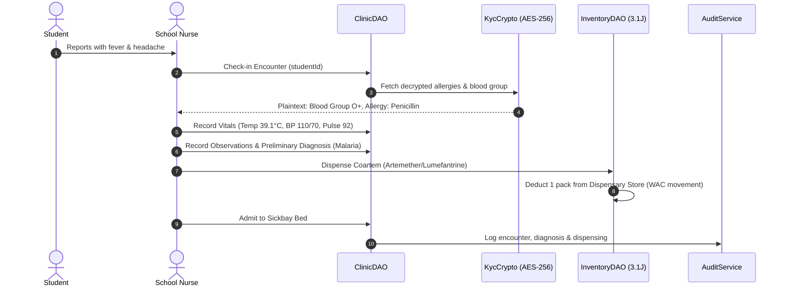
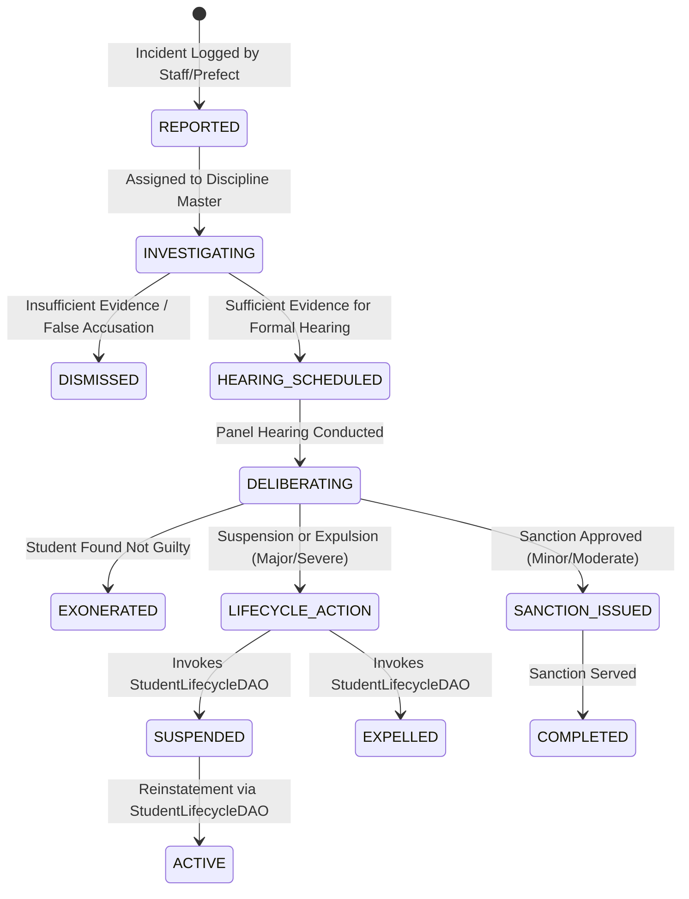

# NOVA School Management ERP — Phase 3.2B Authoritative Architecture & Technical Specification
## Student Welfare, Boarding House Management, Infirmary/Clinic Operations & Behavioral Discipline

**Phase Code:** PHASE-3.2B  
**Authoritative Status:** DESIGN CHECKPOINT (APPROVED FOR DESIGN ONLY)  
**Parent Foundation:** Phases 3.1A–3.1N (Finance Core), Phase 3.2A (Admissions, Student Lifecycle & Guardian KYC)  
**Target Git Branch:** `main` (Clean Working Tree, HEAD `64ed61ee7e4310cea3e21f5595aa2c9a341983a0`)  

---

## 1. Executive Summary & Architecture Overview

Phase 3.2B delivers the operational and pastoral backbone of the NOVA School Management ERP, designed specifically for Ugandan and East African primary and secondary boarding and day institutions.

Building directly on top of the identity and lifecycle foundations established in Phase 3.2A (`dayOrBoarding: DAY | BOARDING`, AES-256-GCM medical emergency notes, and `StudentLifecycleStatus.SUSPENDED` / `EXPELLED`), Phase 3.2B operationalizes four critical pastoral domains:
1. **Boarding House & Hostel Infrastructure:** Hostels, dormitories, rooms, beds, concurrency-safe bed allocation, room transfers, nightly roll calls, and property handover clearance.
2. **Infirmary & Clinic Operations:** Patient encounters, triage vitals, symptom observation, AES-256-GCM clinical notes, sickbay admissions, doctor referrals, and medication dispensing integrated directly with `InventoryDAO` (Phase 3.1J).
3. **Behavioral Discipline & Legal Due-Process:** Incident reporting, witness logging, demerit points, disciplinary hearings, and formal sanctions directly driving `StudentLifecycleDAO.transitionStatus` (Phase 3.2A) without duplicating student status authority.
4. **Exeat & Campus Gate-Pass Management:** Guardian-verified off-campus leave passes, gate checkout/checkin tracking, and real-time overdue alerts.

```mermaid
graph TD
    subgraph "Phase 3.2B Welfare Architecture"
        HOSTEL[Hostel & Bed Allocation Engine]
        EXEAT[Exeat & Gate-Pass Engine]
        CLINIC[Infirmary Triage & Sickbay Operations]
        DISC[Disciplinary Due-Process & Hearings]
    end

    subgraph "Existing Authoritative Foundations"
        STU[Student Master Model 3.2A]
        ENR[Enrollment Model Core]
        LIFE[StudentLifecycleDAO 3.2A]
        CRYPTO[KycCrypto AES-256-GCM 3.2A]
        GRD[Guardian Registry 3.2A]
        INV[InventoryDAO Stores 3.1J]
        BILL[InvoiceDAO 3.1B]
        CLEAR[ClearanceDAO 3.1H]
        AUDIT[AuditService Core]
    end

    HOSTEL -->|Locks & Allocates Bed| STU
    HOSTEL -->|Validates Academic Placement| ENR
    HOSTEL -->|Triggers Boarding Fee Invoicing| BILL
    HOSTEL -->|Hostel Handover Checks| CLEAR
    
    EXEAT -->|Validates Primary Contact & Authorization| GRD
    EXEAT -->|Logs Gate Security Event| AUDIT
    
    CLINIC -->|Unmasks Allergies & Vitals| CRYPTO
    CLINIC -->|Deducts Medicine Stock via WAC| INV
    CLINIC -->|Medical Clearance Status| CLEAR
    
    DISC -->|Executes Suspension & Expulsion| LIFE
    DISC -->|Publishes Due-Process History| AUDIT
```



---

## 2. Authoritative Source-of-Truth Matrix

| Domain Entity | Authoritative Model / DAO | Existing Authority | Financial Authority | Sensitive Data Boundary | Immutable History |
|---|---|---|---|---|---|
| **Hostel & Bed** | `Hostel`, `HostelBed` / `HostelDAO` | Facilities / Branch | Non-financial asset | None | Bed allocation logs |
| **Bed Allocation** | `BedAllocation` / `HostelDAO` | Housemaster / Matron | Triggers `InvoiceDAO` (3.1B) | None | Full audit trail |
| **Student** | `Student` / `StudentDAO` | Registrar (3.2A) | `InvoiceDAO` / `StudentLedger` | Encrypted PII (3.2A) | `StudentLifecycleLog` |
| **Academic Placement** | `Enrollment` / `EnrollmentDAO` | Director of Studies | Academic fee rate | None | Term result snapshots |
| **Clinic Encounter** | `ClinicEncounter` / `ClinicDAO` | School Nurse / Doctor | None (or fee via 3.1B) | **AES-256-GCM Clinical Notes** | Append-only encounter log |
| **Medicine Stock** | `InventoryItem` / `InventoryDAO` | Store Custodian (3.1J) | Store WAC Asset Valuation | None | `StockMovement` (3.1J) |
| **Disciplinary Incident** | `DisciplinaryIncident` / `DisciplineDAO` | Disciplinary Panel | None | Witness statements | Immutable incident record |
| **Disciplinary Hearing** | `DisciplinaryHearing` / `DisciplineDAO` | Panel Chair / Deputy Head | None | Hearing testimony | Signed panel findings |
| **Disciplinary Sanction** | `DisciplinarySanction` / `DisciplineDAO` | Head Teacher (Maker-Checker) | Fine via `InvoiceDAO` (if any)| None | Invokes `StudentLifecycleDAO` |
| **Exeat Gate Pass** | `ExeatPass` / `ExeatDAO` | Housemaster / Gate Security | None | None | Gate timestamp log |
| **Welfare Clearance** | `HostelClearanceRecord` / `ClearanceDAO` | Housemaster / Matron | Damages via `InvoiceDAO` (3.1B)| None | Linked to `StudentClearance` |

---

## 3. Boarding & Hostel Domain Architecture

### 3.1 Physical Infrastructure Hierarchy
1. **Hostel / House (`Hostel`):** Represents a physical residential building or pastoral house (e.g. "Lumumba House", "Nightingale Hostel", "St. Jude Block").
   - Attributes: `code`, `name`, `gender` (`MALE`, `FEMALE`, `MIXED`), `wardenId` (Staff), `matronId` (Staff), `capacity`, `branchId`, `isActive`.
2. **Hostel Room (`HostelRoom`):** Represents a room or dorm within a hostel.
   - Attributes: `hostelId`, `roomNumber`, `floorNumber`, `wing`, `roomType` (`STANDARD_DORM`, `CUBICLE`, `PREFECT_SUITE`, `SICK_BAY_RESERVE`), `capacity` (total beds allowed).
3. **Hostel Bed (`HostelBed`):** The atomic physical sleep unit.
   - Attributes: `roomId`, `bedNumber`, `bedCode` (e.g. `LUM-R10-B02`), `bedType` (`SINGLE`, `BUNK_LOWER`, `BUNK_UPPER`), `status` (`AVAILABLE`, `OCCUPIED`, `MAINTENANCE`, `RESERVED`).

### 3.2 Bed Allocation Concurrency & Row-Locking Strategy
- **Invariant:** A single physical bed can only be actively occupied by exactly **one** student in a specific `[academicYearId, termId]`. A student can only occupy **one** active bed at any given time.
- **Database Constraints:**
  - `@@unique([bedId, academicYearId, termId, status])` where status = `ACTIVE`.
  - `@@unique([studentId, academicYearId, termId, status])` where status = `ACTIVE`.
- **Concurrency Protection Strategy:**
  Allocation strictly executes inside an atomic `db.$transaction` using PostgreSQL row-level advisory locking:
  ```sql
  SELECT * FROM "HostelBed" WHERE id = $bedId AND "branchId" = $branchId FOR UPDATE;
  ```
  1. Inspect `bed.status`: If not `AVAILABLE`, immediately abort with `ConflictError("Bed is currently occupied or under maintenance.")`.
  2. Verify student's `dayOrBoarding === 'BOARDING'`. (If student is marked `DAY`, reject or execute formal status upgrade workflow).
  3. Verify gender compatibility: `student.gender === hostel.gender` (unless hostel is `MIXED`).
  4. Create `BedAllocation` record with `status: ACTIVE`.
  5. Update `HostelBed` record to `status: OCCUPIED`.
  6. Emit `bed.allocated` audit event.

### 3.3 Transfers, Room Changes & Vacancy
- **Room/Bed Transfer:**
  1. Lock current bed and target bed inside `db.$transaction`.
  2. Update current `BedAllocation` to `status: TRANSFERRED, releasedAt: now()`.
  3. Update current `HostelBed` to `status: AVAILABLE`.
  4. Create new `BedAllocation` on target bed with `status: ACTIVE`.
  5. Update target `HostelBed` to `status: OCCUPIED`.
- **Check-Out / Vacancy:**
  - At term end or upon withdrawal, `BedAllocation.status` transitions to `RELEASED`, releasing the bed back to `AVAILABLE`.

---

## 4. Boarding Financial Integration & Billing Rules

All financial effects strictly flow through the closed **Finance Invoicing Engine (`InvoiceDAO`, Phase 3.1B)** and GL Account #1200 (`AR_STUDENT_CONTROL`). No parallel ledger or billing mechanism exists.

### 4.1 Triggering Boarding Invoices
1. **Term-Start Invoicing:**
   - When a student is enrolled with `dayOrBoarding: BOARDING`, the boarding fee line item is included via the class fee structure in `InvoiceDAO.createIndividualInvoice` or `InvoiceDAO.generateBulkInvoices`.
2. **Mid-Term Day $\rightarrow$ Boarding Transition:**
   - If a day scholar converts to boarding mid-term:
     - `Student.dayOrBoarding` updated to `BOARDING`.
     - Invokes `InvoiceDAO.createIndividualInvoice` with an explicit pro-rata boarding line item (`notes: "Mid-Term Boarding Allocation - Pro-Rata [Term X]"`).
     - Pro-rata calculation rule:
       $$\text{Pro-Rata Fee} = \text{Boarding Term Rate} \times \left(\frac{\text{Remaining Term Weeks}}{\text{Total Term Weeks}}\right)$$
3. **Premium Room Upgrades:**
   - If a student moves to a premium cubicle or single room with an elevated boarding surcharge, an incremental charge is invoiced via `InvoiceDAO.addInvoiceLineItem`.
4. **Withdrawal / Deferment:**
   - If a boarder defers or transfers out, any eligible boarding fee refund or credit note is processed through `InvoiceDAO` and `StudentLedgerDAO` using credit notes/adjustments.

---

## 5. Hostel Property Handover & Clearance Integration

### 5.1 Clearance Integration via `ClearanceDAO` (Phase 3.1H)
End-of-term physical clearance requires a formal `HostelClearanceRecord` linked to `StudentClearance`:
- **Clearance Checklist Items:**
  1. `mattressReturned`: boolean (Inspected for water/tear damage)
  2. `roomKeysReturned`: boolean
  3. `lockerKeysReturned`: boolean
  4. `bunkConditionIntact`: boolean (No broken slats or frame damage)
  5. `damagesNoted`: boolean
  6. `damageCostUGX`: Decimal(12, 2)
  7. `inspectorStaffId`: string (Matron or Housemaster)
  8. `status`: `PENDING | CLEARED | REJECTED`

### 5.2 Financial Separation Invariant
- **Rule:** Physical inspection **never** directly alters ledger balances.
- If a mattress is torn or keys are lost:
  1. The Housemaster logs `damagesNoted: true, damageCostUGX: 50,000`.
  2. The system invokes `InvoiceDAO.createIndividualInvoice` (or creates a debit ledger charge) debited to Student AR #1200 with line item `"Hostel Damage Surcharge - Lost Room Keys"`.
  3. This automatically reflects as an outstanding balance on the student's subledger, causing `ClearanceDAO.evaluateStudentClearance` to block term clearance until the bursar receives payment.

---

## 6. Infirmary & Clinic Operations Architecture

The school clinic is a 24/7 primary healthcare station for students and resident staff.

### 6.1 Clinical Triage & Encounter Workflow


### 6.2 Clinic Data Models
1. **`ClinicEncounter`:**
   - Attributes: `studentId`, `academicYearId`, `termId`, `attendingStaffId` (Nurse), `checkInAt`, `checkOutAt`, `chiefComplaint`, `triagePriority` (`ROUTINE`, `URGENT`, `EMERGENCY`), `temperature`, `pulseRate`, `bloodPressure`, `respiratoryRate`, `weightKg`.
   - Sensitive Encrypted Fields: `symptomsEncrypted`, `clinicalNotesEncrypted`, `diagnosisEncrypted` (AES-256-GCM).
   - Non-Sensitive Classification: `diagnosticCategory` (`MALARIA`, `RESPIRATORY`, `GASTROINTESTINAL`, `DENTAL`, `TRAUMA`, `DERMATOLOGY`, `OTHER`).
2. **`SickbayAdmission`:**
   - Attributes: `encounterId`, `studentId`, `bedNumber`, `admittedAt`, `dischargedAt`, `dischargeCondition`, `attendingNurseId`.
3. **`MedicalReferral`:**
   - Attributes: `encounterId`, `studentId`, `externalFacilityName` (e.g. Mulago National Referral, Case Medical), `referralReason`, `ambulanceDispatched`, `escortStaffId`, `guardianNotifiedAt`, `guardianNotificationNotes`.

---

## 7. Medical Privacy & Cryptographic Security

Medical confidentiality is governed by strict statutory and ethical standards.

### 7.1 Security Classification
| Data Field | Classification | Storage Method | Permitted Roles |
|---|---|---|---|
| Blood Group, Weight, Vitals | Operational Medical | Plaintext (indexed) | `clinic:read`, `boarding:read` |
| Known Allergies | High-Alert Medical | Plaintext (high visibility) | `clinic:read`, `boarding:read`, `kitchen:read` |
| Symptoms & Clinical Observations | Confidential Health PII | **AES-256-GCM Encrypted** | `clinic:decrypt` (Nurse/Doctor only) |
| Doctor Diagnosis & Clinical Notes | Protected Health PII | **AES-256-GCM Encrypted** | `clinic:decrypt` (Nurse/Doctor only) |
| Prescribed Medication | Operational Dispensary | Plaintext Item ID | `clinic:write`, `inventory:read` |

### 7.2 Access Control & Decryption Rules
- General teachers, bursars, transport drivers, and system administrators cannot view clinical notes or diagnostic text.
- Medical officers and school nurses holding the explicit permission **`clinic:decrypt`** may decrypt the ciphertext into plaintext in the clinical workstation.
- Every decryption operation generates an immutable `pii.unmasked` audit record in `AuditService` capturing `userId`, `studentId`, `encounterId`, and `timestamp`.

---

## 8. Medicine & Dispensary Inventory Integration

The clinic does not maintain a separate inventory tracking system. The dispensary is an authoritative store location within the existing **`InventoryDAO` (Phase 3.1J)**.

### 8.1 Dispensary Stock Management
1. **Store Setup:**
   - Clinic Dispensary exists as `InventoryStore` (`storeType: OTHER`, `code: 'DISPENSARY'`).
2. **Stock Provisioning:**
   - Medical supplies and pharmaceuticals are transferred from Central Stores to Dispensary via standard `InventoryDAO.createTransfer` (`TRANSFER_OUT` $\rightarrow$ `TRANSFER_IN`).
3. **Medication Dispensing:**
   - When medication is administered to a student:
     - Invokes `InventoryDAO.recordStockMovement`:
       - `storeId`: Dispensary Store ID
       - `itemId`: Medical Inventory Item ID
       - `movementType`: `StockMovementType.ISSUE`
       - `quantity`: Quantity administered
       - `unitCost`: Current Weighted Average Cost (WAC)
       - `notes`: `"Administered in Clinic Encounter #${encounterId}"`
4. **Stock Exhaustion / Substitution:**
   - If stock is zero, the dispensary module rejects dispensing with `InsufficientStockError`, prompting the nurse to select an authorized generic substitute or request restock.
5. **Expired Pharmaceuticals:**
   - Expired items are discarded using `InventoryDAO.recordWriteoff` with `reason: EXPIRED_MEDICATION`, ensuring accurate balance sheet valuation of inventory assets.

---

## 9. Behavioral Discipline & Legal Due-Process Architecture

Discipline management provides legal defensibility, preventing arbitrary suspensions or expulsions while providing structured restorative and corrective actions.

### 9.1 Disciplinary Lifecycle & Due-Process Funnel


### 9.2 Discipline Data Models
1. **`DisciplinaryIncident`:**
   - Attributes: `branchId`, `incidentNumber` (`DISC-YYYY-00001`), `title`, `incidentDate`, `location`, `reportedById` (Staff), `category` (`BULLYING`, `SUBSTANCE_ABUSE`, `VANDALISM`, `THEFT`, `TRUANCY`, `INSUBORDINATION`, `FIGHTING`, `ACADEMIC_DISHONESTY`, `OTHER`), `severity` (`MINOR`, `MODERATE`, `MAJOR`, `SEVERE`), `description`, `witnessNotes`, `status` (`REPORTED`, `INVESTIGATING`, `HEARING_SCHEDULED`, `RESOLVED`, `DISMISSED`).
2. **`IncidentStudent` (Junction):**
   - Links multiple accused students to an incident with individual plea and involvement role (`PRIMARY_OFFENDER`, `ACCOMPLICE`, `BYSTANDER`).
3. **`DisciplinaryHearing`:**
   - Attributes: `incidentId`, `hearingDate`, `panelChairId`, `panelMembers` (JSON staff IDs), `studentPlea` (`GUILTY`, `NOT_GUILTY`), `guardianPresent` (boolean), `guardianId`, `hearingMinutes`, `findings`.
4. **`DisciplinarySanction`:**
   - Attributes: `hearingId`, `studentId`, `sanctionType` (`VERBAL_WARNING`, `WRITTEN_WARNING`, `DETENTION`, `COMMUNITY_SERVICE`, `LOSS_OF_PRIVILEGE`, `SUSPENSION`, `EXPULSION`), `startDate`, `endDate`, `terms`, `demeritPoints` (Int), `approvedById` (Maker-Checker Checker), `status` (`ACTIVE`, `SERVED`, `APPEALED`, `OVERTURNED`).

---

## 10. Student Lifecycle Integration & Maker-Checker Governance

### 10.1 Sole Authority Principle
- Disciplinary actions **never** create a competing student status authority.
- When an approved sanction dictates `SUSPENSION` or `EXPULSION`:
  1. The Disciplinary Committee approves the sanction.
  2. The system invokes **`StudentLifecycleDAO.transitionStatus`** (Phase 3.2A):
     ```typescript
     await StudentLifecycleDAO.transitionStatus(ctx, {
       studentId: sanction.studentId,
       targetStatus: StudentLifecycleStatus.SUSPENDED,
       reason: `Disciplinary Sanction #${sanction.id}: ${sanction.terms}`,
       effectiveDate: sanction.startDate
     });
     ```
  3. `StudentLifecycleDAO` cascades the transition to the student's active academic `Enrollment` record (`status: ACTIVE` for suspension, `WITHDRAWN` for expulsion) and records an immutable entry in `StudentLifecycleLog`.
  4. When the suspension duration elapses, the Head Teacher invokes `StudentLifecycleDAO.transitionStatus` to return the student from `SUSPENDED` to `ACTIVE`.

### 10.2 Disciplinary Maker-Checker Controls
- **Invariant:** The officer who reported or investigated an incident (`reportedById`, `investigatorId`) **cannot** be the sole approver of a suspension or expulsion sanction.
- Suspensions and Expulsions require a second authorized checker:
  - Suspensions: Approved by Deputy Head Teacher (Pastoral) or Head Teacher (`discipline:sanction`).
  - Expulsions: Approved by Head Teacher with Board of Governors confirmation (`discipline:expel`).

---

## 11. Exeat & Campus Gate-Pass Management

Exeat management governs the movement of boarding students off-campus, preventing unauthorized departures and child protection breaches.

### 11.1 Exeat Workflow & Authorization
1. **Exeat Request:**
   - Student or Housemaster initiates request: `studentId`, `exeatType` (`MEDICAL`, `FAMILY_EMERGENCY`, `OFFICIAL_SCHOOL_EVENT`, `WEEKEND_EXEAT`), `reason`, `intendedDeparture`, `expectedReturn`.
2. **Guardian Authorization:**
   - Primary guardian must be confirmed from `StudentGuardian` (Phase 3.2A). System logs `guardianConsentMethod` (`PHONE_CALL_RECORDED`, `IN_PERSON`, `SIGNED_LETTER`).
3. **Approval Chain:**
   - Housemaster verifies room condition $\rightarrow$ Deputy Head approves pass $\rightarrow$ System generates secure `ExeatPass` with unique serial code and QR verification token.
4. **Gate Security Check-Out:**
   - Security guard scans/enters Exeat Number at main gate:
     - Verifies pass is `APPROVED`.
     - Records `actualDeparture` timestamp, `gateOfficerId`, and accompanying adult name/ID.
     - Status transitions to `DEPARTED`.
5. **Gate Security Check-In:**
   - Student returns to campus:
     - Security guard scans pass, records `actualReturn` timestamp.
     - If `actualReturn > expectedReturn`, flag is raised: `isOverdue: true, overdueHours: X`.
     - Status transitions to `COMPLETED`.

---

## 12. Guardian & Emergency Notification Integration

- Integrates with the **Guardian Registry (Phase 3.2A)**:
  - Uses `StudentGuardian` to identify the student's **Primary Contact** (`isPrimaryContact: true`) and **Emergency Contact** (`isEmergencyContact: true`).
  - When an acute medical emergency occurs or a student is admitted to sickbay:
    - `EmergencyNotificationLog` created recording `contactedGuardianId`, `phoneDialed`, `notificationReason`, `staffCallerId`, and `guardianResponseNotes`.
  - Zero duplication of guardian records.

---

## 13. RBAC & Fine-Grained Permissions

| Permission Code | Target Role | Description |
|---|---|---|
| `boarding:read` | Housemasters, Matrons, Teachers | View hostels, rooms, bed rosters, and roll calls |
| `boarding:write` | Housemasters, Matrons | Log roll calls, record room checklists |
| `boarding:allocate` | Head of Boarding, Wardens | Allocate beds, execute bed transfers |
| `boarding:clear` | Matrons, Housemasters | Sign off on hostel property handover clearance |
| `exeat:request` | Housemasters, Class Teachers | Submit exeat gate pass requests |
| `exeat:approve` | Deputy Head, Senior Housemaster | Approve exeat leave passes |
| `exeat:gate_verify` | Campus Security Guards | Check out and check in students at school gates |
| `clinic:read` | School Nurses, Doctors | View clinic visits, vitals, non-sensitive categories |
| `clinic:write` | School Nurses, Doctors | Record patient triage, sickbay admissions, referrals |
| `clinic:decrypt` | Authorized Medical Doctors / Nurses | Decrypt and view sensitive clinical diagnosis/notes |
| `clinic:admin` | Senior Medical Officer | Manage sickbay bed capacity, clinical protocols |
| `discipline:report` | All Staff, Prefects | Report behavioral incidents and witness accounts |
| `discipline:hearing`| Disciplinary Committee Panel | Schedule hearings, record minutes and findings |
| `discipline:sanction`| Deputy Head, Head Teacher | Approve formal disciplinary sanctions |
| `discipline:expel` | Head Teacher, Board of Governors | Confirm expulsion orders and invoke lifecycle expulsion |

---

## 14. Reporting & Analytics Telemetry

1. **Boarding Occupancy & Capacity Dashboard:** Total capacity, occupied beds, vacant beds, maintenance beds by hostel, gender, and wing.
2. **Nightly Roll Call Audit:** Instant discrepancy alert showing boarders not marked `PRESENT` or `AUTHORIZED_ABSENCE`.
3. **Live Gate Roster (Exeat Telemetry):** Real-time list of all students currently off-campus, expected return dates, and overdue alerts.
4. **Clinic Morbidity & Epidemic Tracker:** Incident rates by diagnostic category (e.g. malaria spikes, viral outbreaks) by week and class.
5. **Pharmaceutical Consumption & Dispensary Stock Status:** Fast-moving drugs, stock levels, and WAC expenditure.
6. **Student Conduct & Demerit Register:** Termly demerit distribution by class, recidivism rates, and sanction fulfillment.

---

## 15. Migration & Data Safety Strategy

1. **Existing Student Data:**
   - 100% of existing `Student` rows have `dayOrBoarding: DAY | BOARDING`.
   - Existing boarding students will have unallocated bed states until assigned to new hostel structures via `HostelDAO.allocateBed`.
2. **Additive-Only Database Migration:**
   - New models: `Hostel`, `HostelRoom`, `HostelBed`, `BedAllocation`, `HostelRollCall`, `HostelClearanceRecord`, `ClinicEncounter`, `SickbayAdmission`, `MedicalReferral`, `ClinicDispensingRecord`, `DisciplinaryIncident`, `IncidentStudent`, `DisciplinaryHearing`, `DisciplinarySanction`, `ExeatPass`, `EmergencyNotificationLog`.
   - New Enums: `HostelGender`, `RoomType`, `BedType`, `BedStatus`, `AllocationStatus`, `RollCallStatus`, `TriagePriority`, `DiagnosticCategory`, `DisciplineCategory`, `IncidentSeverity`, `IncidentStatus`, `HearingPlea`, `SanctionType`, `SanctionStatus`, `ExeatType`, `ExeatStatus`.
3. **No Historical Finance Mutation:**
   - Closed phases 3.1A–3.1N remain completely untouched.
   - Jiddah Smart Report Engine remains **100% untouched and sealed**.

---

## 16. Comprehensive Test & Acceptance Strategy

### 16.1 Planned Unit & Integration Tests (`src/lib/dao/welfare.dao.test.ts`)
- **WEL-01:** Create hostel block with room and bed capacity hierarchy.
- **WEL-02:** Allocate bed to boarding student; verifies status changes to `OCCUPIED`.
- **WEL-03:** Enforce gender segregation (rejects male student allocation to female hostel).
- **WEL-04:** Reject bed allocation to student marked as `DAY` scholar.
- **WEL-05:** Execute room transfer: releases source bed, occupies target bed, logs transfer history.
- **WEL-06:** Term-end bed release: resets bed to `AVAILABLE` and marks allocation `RELEASED`.
- **WEL-07:** Nightly hostel roll call recording with status validation.
- **WEL-08:** Hostel clearance checklist sign-off creates valid `HostelClearanceRecord`.
- **WEL-09:** Hostel damage surcharge triggers `InvoiceDAO.createIndividualInvoice` debited to Student AR #1200.
- **WEL-10:** Check-in clinic encounter with triage vitals (temperature, pulse, BP).
- **WEL-11:** Retrieve patient triage with decrypted allergy warning via `KycCrypto`.
- **WEL-12:** Encrypt clinical notes and diagnosis with AES-256-GCM authenticated tag.
- **WEL-13:** Role-gated unmasking of clinical notes: authorized nurse unmasks, unprivileged staff denied.
- **WEL-14:** Admit sick student to sickbay bed; record discharge notes and timestamp.
- **WEL-15:** Record external medical referral with hospital name and escort staff.
- **WEL-16:** Medication dispensing creates stock movement in `InventoryDAO` with `StockMovementType.ISSUE`.
- **WEL-17:** Dispensary stock exhaustion: rejects dispensing when item stock is zero.
- **WEL-18:** Report behavioral incident with witness notes and accused students.
- **WEL-19:** Schedule disciplinary hearing with committee panel members.
- **WEL-20:** Record hearing minutes, student plea, and panel findings.
- **WEL-21:** Issue minor disciplinary sanction (detention, community service).
- **WEL-22:** Issue formal suspension sanction: invokes `StudentLifecycleDAO.transitionStatus` to `SUSPENDED`.
- **WEL-23:** Reinstatement from suspension: invokes `StudentLifecycleDAO.transitionStatus` to `ACTIVE`.
- **WEL-24:** Issue expulsion sanction: invokes `StudentLifecycleDAO.transitionStatus` to `EXPELLED`.
- **WEL-25:** Enforce maker-checker on suspension (reporting staff cannot self-approve suspension).
- **WEL-26:** Create exeat gate pass request with intended return date.
- **WEL-27:** Log guardian authorization consent for exeat request.
- **WEL-28:** Approve exeat pass; generates unique exeat verification serial.
- **WEL-29:** Gate security checkout stamps `actualDeparture` and transitions pass to `DEPARTED`.
- **WEL-30:** Gate security checkin stamps `actualReturn` and transitions pass to `COMPLETED`.
- **WEL-31:** Flag overdue exeat return when `actualReturn > expectedReturn`.
- **WEL-32:** Emergency acute illness workflow logs emergency guardian notification.

### 16.2 Planned Adversarial, Boundary & Concurrency Tests (`src/lib/dao/welfare.adversarial.test.ts`)
- **ADV-WEL-01:** Concurrent bed allocation on same bed: exactly one succeeds, others fail with `ConflictError`.
- **ADV-WEL-02:** Attempt to allocate student to two active beds simultaneously rejected.
- **ADV-WEL-03:** Bed allocation exceeding room capacity rejected atomically.
- **ADV-WEL-04:** Cross-tenant hostel access rejected with `UnauthorizedError`.
- **ADV-WEL-05:** Cross-tenant clinic encounter access rejected with `UnauthorizedError`.
- **ADV-WEL-06:** Tampered clinic ciphertext throws or handles decryption gracefully.
- **ADV-WEL-07:** Unprivileged user attempting to decrypt clinical notes rejected.
- **ADV-WEL-08:** Concurrent medicine dispensing serializes and prevents negative inventory balance.
- **ADV-WEL-09:** Attempt to dispense expired medication rejected.
- **ADV-WEL-10:** Disciplinary sanction approval by incident reporter rejected (Maker-Checker violation).
- **ADV-WEL-11:** Direct lifecycle transition attempt without hearing record rejected.
- **ADV-WEL-12:** Exeat checkout of unapproved exeat pass rejected.
- **ADV-WEL-13:** Exeat checkout of already departed student rejected.
- **ADV-WEL-14:** Exeat checkin of pass never checked out rejected.
- **ADV-WEL-15:** Concurrent exeat checkout requests serialize safely.
- **ADV-WEL-16:** Surcharge invoice creation on hostel damage is idempotent on retry.

### 16.3 Planned Playwright End-to-End Tests (`tests/welfare-lifecycle.spec.ts`)
- **Test 1: Hostel Management & Bed Allocation Hub:** Navigate to hostels, view rooms, allocate bed to boarder, verify bed turns occupied, execute room change.
- **Test 2: Clinic & Infirmary Workstation:** Check in patient, record triage vitals, view allergy alert, record encrypted clinical diagnosis, dispense medication, admit to sickbay.
- **Test 3: Exeat Gate-Pass Lifecycle:** Submit exeat request, approve pass, verify gate checkout at security terminal, verify student appears on active off-campus roster, stamp return.
- **Test 4: Disciplinary Committee & Suspension Governance:** Report incident, record hearing docket, approve suspension sanction, verify student profile displays `SUSPENDED` status and lifecycle audit trail.

---

## 17. Out of Scope for Phase 3.2B

The following domains are explicitly deferred to subsequent phases to maintain strict operational focus:
1. **Parent & Student Self-Service Web Portal:** (Deferred to Phase 3.2C).
2. **Direct Telecom SMS Gateway / WhatsApp Dispatch:** (Deferred to Phase 3.2C).
3. **Academic Timetable & Classroom Collision Engine:** (Deferred to Phase 3.2D).
4. **Canteen / Cafeteria POS & Meal Scanning:** (Deferred to auxiliary operations).
5. **Jiddah Smart Report Engine:** **STRICTLY PROHIBITED FROM MODIFICATION**.

---

## 18. Remaining Unresolved Decisions

All primary architectural decisions for Phase 3.2B have been resolved and aligned with closed foundations:
- Bed allocation concurrency $\rightarrow$ Resolved via PostgreSQL row locks (`SELECT ... FOR UPDATE`).
- Boarding fee billing $\rightarrow$ Resolved via direct calls to `InvoiceDAO` (3.1B) and Student AR #1200.
- Clinic stock tracking $\rightarrow$ Resolved via direct calls to `InventoryDAO` (3.1J) with WAC costing.
- Medical privacy $\rightarrow$ Resolved via `KycCrypto` AES-256-GCM and `clinic:decrypt` permissions.
- Disciplinary status authority $\rightarrow$ Resolved via direct calls to `StudentLifecycleDAO` (3.2A).
- Hostel clearance $\rightarrow$ Resolved via `ClearanceDAO` (3.1H) integration.

---

## 19. Ready for Implementation Assessment

**READY FOR IMPLEMENTATION = YES**  
(Pending explicit user approval to commence implementation).
